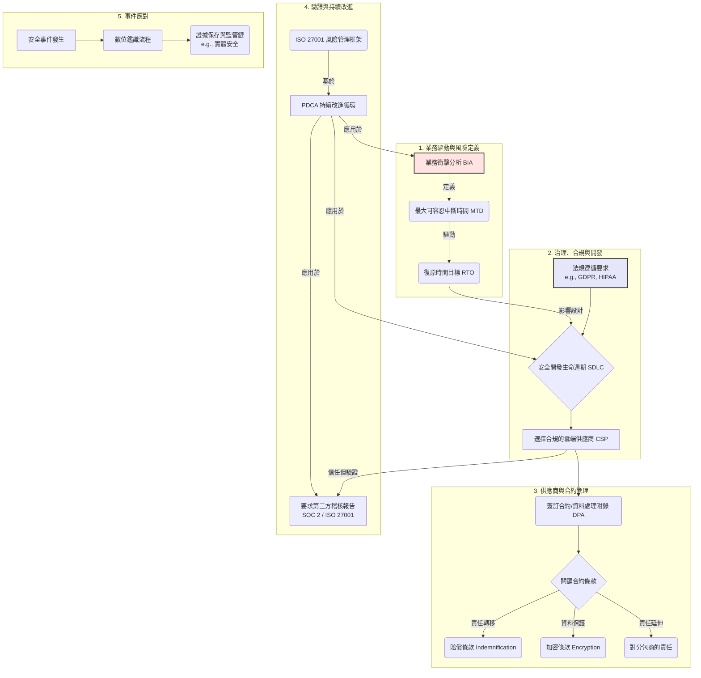

# CCSP Domain 6: 弱點領域強化學習指南

## 📊 核心觀念關聯圖

這張圖描繪了 Domain 6 中各個核心觀念的相互關聯性，從業務需求出發，貫穿風險管理、合規、供應商管理，直到持續改進與事件應對。

---

## 🏢 主題一：供應鏈、廠商與合約管理

### 💡 核心觀念

在雲端環境中，您將部分的控制權轉移給了 CSP，因此，**合約是您唯一能用來約束、管理並確保供應商履行安全責任的法律工具**。「信任但驗證」(Trust but Verify) 是此領域的最高指導原則。

### 📋 重點題目分析

#### Q2, Q58, Q99: 供應鏈風險與合規驗證

**核心觀念：** ISO 27036, 第三方評估/稽核

**為什麼重要：**

- 您的安全防護能力取決於供應鏈中最薄弱的一環
- CSP 的安全聲明不能只聽信其片面之詞，必須有客觀證據

**關鍵行動與知識點：**

- **ISO 27036：** 專門針對「供應商關係資訊安全」的國際標準
  - 在合約中引用此標準，代表要求 CSP 遵循業界公認的最佳實踐
- **驗證方法 (由弱到強)：**
  - 問卷調查 (e.g., CAIQ)
  - 要求第三方稽核報告 (e.g., SOC 2, ISO 27001) ← **最佳且最客觀**
- **您必須學會解讀這些報告，確認其稽核範圍與您的業務相關**

#### Q12, Q36, Q84: 雲端合約的關鍵法律條款

**核心觀念：** 賠償 Indemnification, 加密 Encryption, 資料處理附錄 DPA

**為什麼重要：**

- 合約定義了發生安全事件或違規時，雙方的權利、義務與責任歸屬
- 是事後追究的法律基礎

**關鍵條款解析：**

- **賠償條款 (Indemnification)：** 「責任轉移」條款
  - 若因 CSP 的疏失導致您產生損失，可據此要求 CSP 賠償
  - 是關鍵的法律防火牆
- **加密條款 (Encryption Clause)：**
  - 應明確要求資料在**傳輸中 (In-transit)** 與**靜態時 (At-rest)** 都必須加密
  - 延伸議題：誰管理金鑰 (BYOK, HYOK)？
- **資料處理附錄 (DPA)：** GDPR 下的法律要求
  - 如果 CSP 再委託下游廠商 (Sub-processor)，CSP 有責任確保其也遵守相同標準並對其行為負責

---

## ⚖️ 主題二：風險管理與業務持續性

### 💡 核心觀念

風險管理是一個**持續的生命週期**，而不是一次性的活動。業務需求應驅動安全決策，而不是反過來。

### 📋 重點題目分析

#### Q28: 風險管理框架的持續改進

**核心觀念：** ISO 27001, PDCA

**為什麼重要：**

- 威脅、漏洞和業務環境都在不斷變化
- 資訊安全管理系統 (ISMS) 必須隨之調整才能保持有效

**關鍵行動與知識點：**

- **ISO 27001：** 建立 ISMS 的國際標準，其核心精神就是 **PDCA 循環**
  - **Plan (規劃):** 風險評鑑、定義政策
  - **Do (執行):** 部署控制措施
  - **Check (檢查):** 監控、稽核有效性
  - **Act (行動):** 採取矯正措施，持續改進

#### Q59: 業務衝擊分析 (BIA)

**核心觀念：** MTD (最大可容忍中斷時間)

**為什麼重要：**

- BIA 是制定災難備援 (DR) 與業務連續性計畫 (BCP) 的基礎
- 它回答了「什麼最重要？」以及「我們能忍受中斷多久？」

**關鍵指標的關係：**

- BIA 識別關鍵業務流程，並由業務部門決定 **MTD**
- 為滿足 MTD，IT 部門必須設定技術復原目標 **RTO**
- **核心公式：RTO ≤ MTD**
- **RPO (復原點目標)** 則定義了可容忍的資料損失量

---

## 📜 主題三：法規遵循與數位鑑識

### 💡 核心觀念

將業務遷移上雲，不代表將法律責任也轉移出去。身為雲端客戶，您始終對資料的合規性負有**最終責任**。

### 📋 重點題目分析

#### Q78: SDLC 中的法規遵循

**核心觀念：** HIPAA

**為什麼重要：**

- 「安全左移 (Shift Left)」或「安全始於設計 (Security by Design)」
- 意即在開發生命週期 (SDLC) 的最早階段就應納入合規要求

**關鍵行動與知識點：**

- **HIPAA (健康保險流通與責任法案):** 保護個人健康資訊 (PHI) 的美國法律
- **合規的基礎：** 要開發符合 HIPAA 的應用，最根本的第一步是選擇一個本身就符合 HIPAA 規範的雲端環境
- CSP 會提供必要的基礎設施安全和業務夥伴協議 (BAA)

#### Q85: 數位鑑識的證據保全

**核心觀念：** 實體安全

**為什麼重要：**

- 數位證據非常脆弱
- 若證據的完整性與監管鏈 (Chain of Custody) 遭到破壞，將失去法律效力

**關鍵行動與知識點：**

- **鑑識流程：** 識別 → 保存 (Preservation) → 收集 → 分析 → 呈現
- **證據保存：** 不論證據儲存在何處 (雲端或地端)，確保儲存媒介的實體安全（例如，放在安全的儲存櫃、限制存取權限），都是防止證據被破壞或竄改的第一道防線，是維持監管鏈完整性的基礎

---

## 🎯 總結與學習建議

### 🔄 思維轉換

Domain 6 的核心是「**風險與責任**」，而非純技術。對於每個場景，都要問：

- 誰負責？
- 法律依據是什麼？
- 如何驗證？

### 📄 合約是王道

在雲端環境，SLA、合約條款、DPA 是最重要的管理工具。務必熟悉關鍵條款的意義。

### 📚 理解標準與法規的「目的」

| 類型               | 目的                                     | 範例                 |
| ------------------ | ---------------------------------------- | -------------------- |
| **ISO 系列**       | 提供「如何做」的管理框架 (Framework)     | ISO 27001, ISO 27036 |
| **SOC 報告**       | 提供「做得好不好」的獨立驗證 (Assurance) | SOC 2 Type I/II      |
| **GDPR, HIPAA 等** | 提出「必須遵守」的法律要求 (Requirement) | GDPR, HIPAA, SOX     |

### 🔗 串連知識點

使用上面的 Mermaid 圖，將所有概念串連成一個完整的治理藍圖，從而建立系統性的知識結構。

---

## 📝 快速複習清單

### ✅ 必記關鍵詞

- **MTD** (最大可容忍中斷時間)
- **RTO** (復原時間目標)
- **RPO** (復原點目標)
- **BIA** (業務衝擊分析)
- **PDCA** (持續改進循環)
- **DPA** (資料處理附錄)
- **ISO 27036** (供應商關係資訊安全)
- **SOC 2** (服務組織控制報告)

### 🎯 考試重點

1. **合約條款的重要性** - 雲端環境中的法律保護
2. **信任但驗證** - 第三方稽核的必要性
3. **業務驅動** - 安全決策應基於業務需求
4. **持續改進** - 風險管理的生命週期觀點
5. **責任歸屬** - 雲端客戶的最終責任
