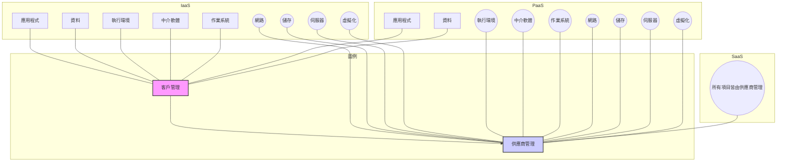
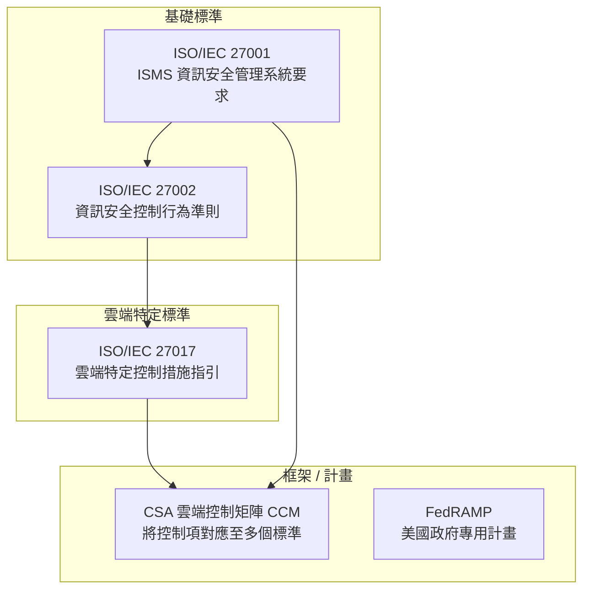
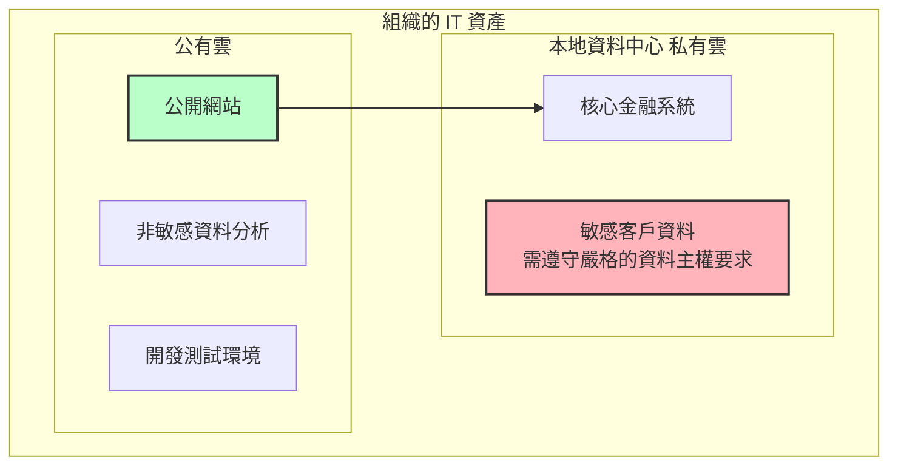
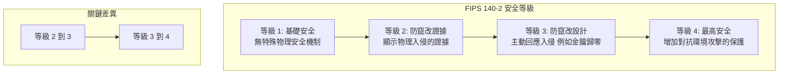

# CCSP 領域一：雲端概念、架構與設計 - 錯誤題目複習總整理

本文件詳細解析了 CCSP 領域一的相關問題。其中有幾題您選擇的答案是正確的，但被測驗應用程式誤判為錯誤；本文件的解析將會加強說明為何您選擇的答案是正確的。

## 主題一：雲端服務模型 (IaaS, PaaS, SaaS)

### 問題 4/28: 客戶控制權的最高級別

**問題：** 哪一種雲端服務模型在虛擬化運算環境（包含作業系統、儲存和網路組態）中，提供客戶最高級別的控制權？

- **您的答案 (正確，但被標示為錯誤):** 基礎設施即服務 (IaaS)
- **正確答案：** 基礎設施即服務 (IaaS)

**詳細解析：**

您的答案是正確的。IaaS 提供了雲端運算的基礎建構模塊。在 IaaS 模型中，雲端供應商管理實體基礎設施（伺服器、實體儲存、實體網路硬體），但客戶幾乎負責所有其他層面的管理。這包括作業系統、中介軟體、執行環境、資料和應用程式。此模型提供了對環境最高的靈活性和管理控制權，因此是正確答案。

- **PaaS (平台即服務):** 供應商管理作業系統和中介軟體，將其從客戶面前抽象化。客戶的控制權低於 IaaS。
- **SaaS (軟體即服務):** 供應商管理包含應用程式在內的整個技術堆疊。客戶的控制權最低。

### 問題 5/28: SaaS 的主要優勢

**問題：** 與平台即服務 (PaaS) 和基礎設施即服務 (IaaS) 相比，使用軟體即服務 (SaaS) 的主要好處是什麼？

- **您的答案 (正確，但被標示為錯誤):** 減少應用程式更新與維護的需求
- **正確答案：** 減少應用程式更新與維護的需求

**詳細解析：**

您的答案是正確的。SaaS 的核心價值主張是將所有管理責任轉嫁給雲端供應商。供應商處理從硬體採購到應用程式修補、更新和安全的所有事務。這大大減輕了客戶的營運負擔，讓他們可以專注於使用軟體，而無需擔心底層基礎設施或應用程式的維護。這是相對於 PaaS 和 IaaS 的顯著優勢，因為在後兩者模型中，客戶仍需負責維護和更新自己的應用程式。

### 問題 22/28: 選擇服務模型的最關鍵因素

**問題：** 一家跨國公司正計劃將其核心業務應用程式遷移到雲端。在為其策略選擇 SaaS、PaaS 和 IaaS 雲端服務模型時，該組織需要考慮的最關鍵因素是什麼？

- **您的 (錯誤) 答案：** 安全責任的劃分
- **正確答案：** 對基礎設施的控制程度

**詳細解析：**

雖然安全責任的劃分是選擇服務模型後的一個重要結果，但對基礎設施的控制程度是更根本、更首要的決定因素。組織需要的控制級別直接決定了哪種服務模型是合適的。這個選擇接著定義了安全責任的劃分。因此，評估所需的控制程度是最初且最關鍵的策略性決策。

### Mermaid 視覺化圖表：雲端服務模型 - 控制權與責任

此圖表展示了不同服務模型在控制權與責任上的根本差異。

## 主題二：雲端安全標準與框架

### 問題 7/28: 雲端運算安全控制的指引標準

**問題：** 哪一項標準為適用於雲端運算的資訊安全控制提供了指引？

- **您的答案 (正確，但被標示為錯誤):** ISO/IEC 27017
- **正確答案：** ISO/IEC 27017

**詳細解析：**

您的答案是正確的。ISO/IEC 27017:2015 是一套行為準則（code of practice），專門為雲端運算環境的資訊安全控制提供指引。它作為 ISO/IEC 27002 中所列控制措施的實施指南，並為雲端服務客戶和供應商雙方提供了額外的雲端特定控制措施和建議。

- **雲端安全聯盟 (CSA) 雲端控制矩陣 (CCM):** 這是一個安全控制框架，而非像 ISO 那樣的正式標準。它非常有價值，並將其控制項對應到多個標準（包括 ISO/IEC 27017），但 27017 本身才是 ISO 標準。
- **FedRAMP:** 這是美國政府用來評估和授權雲端產品與服務的特定計畫。
- **NIST SP 800-53:** 這是一份適用於所有美國聯邦資訊系統的安全與隱私控制的綜合目錄，並非專為雲端設計。

### 問題 6/28: 評估雲端安全態勢的框架

**問題：** 哪一個雲端安全框架旨在幫助組織評估其雲端安全狀況，並已對應到如 ISO/IEC 27001、PCI DSS 和 NIST 等其他標準？

- **您的 (正確) 答案：** 雲端安全聯盟 (CSA) 雲端控制矩陣 (CCM)

**詳細解析：**

您的答案是正確的。CSA 的雲端控制矩陣 (CCM) 是專為評估雲端安全而設計的控制框架。它的最大特點之一就是提供了控制項與其他主流標準（如 ISO 27001, PCI DSS, NIST 等）的對應關係。這使得組織可以使用 CCM 作為一個中心工具，來同時滿足多種合規性要求，從而全面性地評估與確保其雲端安全態勢。

### Mermaid 視覺化圖表：安全標準與框架的關係

## 主題三：雲端部署與風險管理

### 問題 25/28: 資料主權與公有雲服務

**問題：** 對於一個需要遵守嚴格的資料主權（data sovereignty）合規性，並要求資料留存於其國家境內，但同時又希望利用一些公有雲服務來處理非敏感工作負載的組織來說，哪種雲端部署模型最適合？

- **您的 (正確) 答案：** 混合雲 (Hybrid cloud)

**詳細解析：**

混合雲模型是正確答案，因為它明確地結合了私有雲（用於需要主權要求的敏感資料）和公有雲（用於非敏感工作負載）。這使得組織能夠滿足嚴格的法規要求，同時又能享受到公有雲的擴展性和成本效益。

### 問題 24/28: 金融機構的需求

**問題：** 一家金融機構希望使用雲端服務來支持其面向客戶的應用程式，同時為了符合法規，需要對本地的敏感資料維持嚴格的安全控制。哪種雲端部署模型最能滿足該組織的營運需求和安全要求？

- **您的 (正確) 答案：** 混合雲 (Hybrid cloud)

**詳細解析：**

這是另一個混合雲的典型應用案例。金融機構可以在公有雲上運行其需要高擴展性的客戶應用程式，同時將敏感的金融資料安全地保存在本地的私有雲中，以確保符合法規。

### Mermaid 視覺化圖表：混合雲模型

### 問題 27/28: 應對影子 IT 的最有效策略

**問題：** 一家大型企業正苦於員工使用未經授權的雲端服務（影子 IT）。在雲端安全控制框架中，以下哪項是應對其雲端環境中這些影子 IT 風險的最有效策略？

- **您的 (正確) 答案：** 部署雲端存取安全代理 (CASB) 解決方案

**詳細解析：**

雲端存取安全代理 (CASB) 是應對影子 IT 最直接、最有效的技術控制手段。雖然制定政策和成立委員會很重要，但 CASB 提供了必要的可視性和強制執行能力。它能發現員工正在使用的所有雲端服務、評估其風險，並強制執行安全政策（如阻止高風險應用或要求多因素驗證），從而直接解決影子 IT 問題。

### 問題 26/28: 整合物聯網 (IoT) 與 ISO 31000

**問題：** 一家大型企業正在將物聯網 (IoT) 設備與其雲端服務整合，以提高營運效率，同時需要維持對 ISO 31000 的合規性。哪種方法最符合為此專案調整組織風險管理流程的作法？

- **您的 (正確) 答案：** 建立具有自動化事件應變能力的即時監控系統

**詳細解析：**

ISO 31000 強調風險管理應是動態、迭代且能應對變化的。大量 IoT 設備的引入帶來了一個動態且顯著擴大的攻擊面。因此，靜態的管理方法是不夠的。具有自動化應變能力的即時監控對於以機器速度偵測和應對威脅至關重要，這與管理像 IoT 這樣龐大且動態的風險環境的原則完全一致。

## 主題四：其他關鍵雲端安全概念

### 問題 11/28: Sidecar 模式的主要優點

**問題：** 在基於微服務的應用程式中，以下哪項最能描述使用 Sidecar 模式來實施日誌記錄和監控，而無需修改核心服務程式碼的主要好處？

- **您的 (正確) 答案：** 改善橫切關注點 (cross-cutting concerns) 的模組化與維護便利性

**詳細解析：**

您的答案是正確的。Sidecar 模式將一個輔助容器（"sidecar"）附加到主應用程式容器上，用來處理日誌、監控、安全等輔助性任務，這些任務被稱為橫切關注點。其主要好處正是改善模組化與維護便利性。這將核心業務邏輯與輔助功能分離，使得日誌監控組件可以獨立於主應用程式進行更新、修補或替換，大大提高了可維護性。

### 問題 21/28: 展現當責性 (Accountability)

**問題：** 在雲端安全管理中，哪一種類型的文件最能有效地證明對安全相關行為的當責性？

- **您的 (正確) 答案：** 全系統的稽核軌跡 (System-wide audit trails)

**詳細解析：**

全系統的稽核軌跡是證明當責性最有效的文件。當責性是將一個行為追溯到特定個人或實體的能力。稽核軌跡提供了按時間順序排列的事件記錄，詳細說明了誰、在何時、執行了何種操作以及結果是什麼。這種詳細且通常不可變的記錄提供了具體的證據，對於事後調查和追究責任至關重要。

### 問題 16/28: 多雲環境中量化風險評估的挑戰

**問題：** 一位雲端安全架構師正在為一家遷移到多雲環境的大型企業進行量化風險評估。在跨不同雲端服務模型（IaaS、PaaS、SaaS）準確量化和比較風險時，哪個因素構成了最重大的挑戰？

- **您的 (正確) 答案：** 安全控制實施與責任的可變性

**詳細解析：**

量化風險評估依賴於為風險賦予數值（通常是貨幣價值）。在多雲和多服務模型的環境中，最大的挑戰正是安全控制實施與責任的可變性。每個雲端供應商的控制措施都不同，且在 IaaS、PaaS、SaaS 之間，客戶的責任範圍劇烈變化。這種可變性使得建立一個一致的基準進行量化分析變得極其困難，難以進行有意義的、同等標準的風險比較。

### 問題 12/28 & 28/28: FIPS 140-2 安全等級

**問題 12/28：** 從 FIPS 140-2 安全等級 2 到等級 3 的關鍵進步是什麼？

- **您的 (錯誤) 答案：** 增強對未授權存取的保護
- **正確答案：** 要求具備防物理竄改的設計 (例如偵測到入侵時將金鑰歸零)

**問題 28/28：** FIPS 140-2 安全等級 4 的挑戰與好處是什麼？

- **您的 (正確) 答案：** 提供最高級別的安全性，但可能有效能上的權衡

**詳細解析：**

- **從等級 2 到等級 3：** 關鍵的進步是從「防竄改證據 (tamper-evident)」轉變為「防竄改設計 (tamper-resistant)」。等級 2 只要求有被動的證據（如防拆封條），而等級 3 要求模組能主動回應物理入侵企圖，例如自動將關鍵金鑰歸零。
- **等級 4：** 這是最高安全級別，在等級 3 的基礎上增加了對抗環境攻擊（如電壓、溫度變化）的保護。其挑戰在於，這些嚴格的保護措施會帶來顯著的效能開銷和延遲，並且在虛擬化的雲端環境中實施極為複雜。

### Mermaid 視覺化圖表：FIPS 140-2 等級演進

