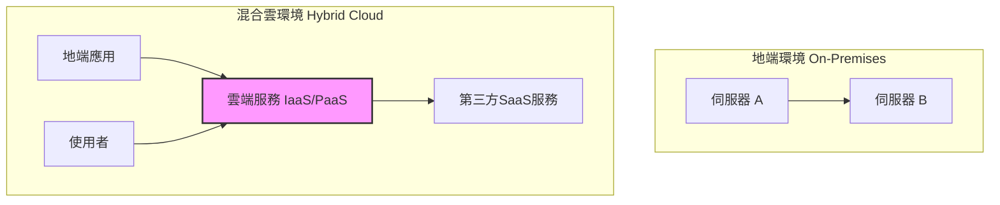
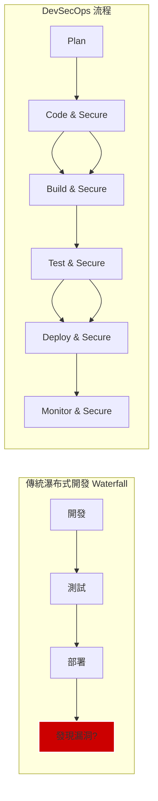
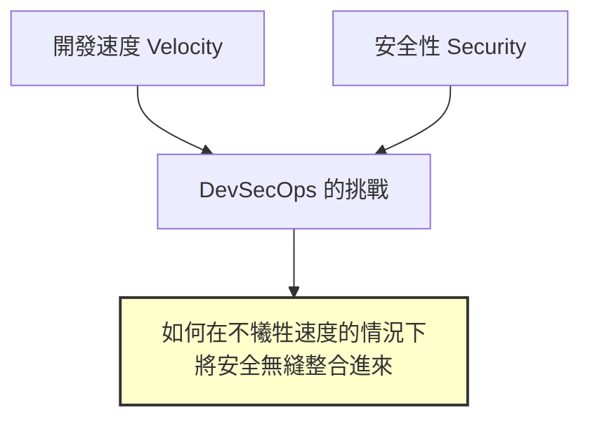
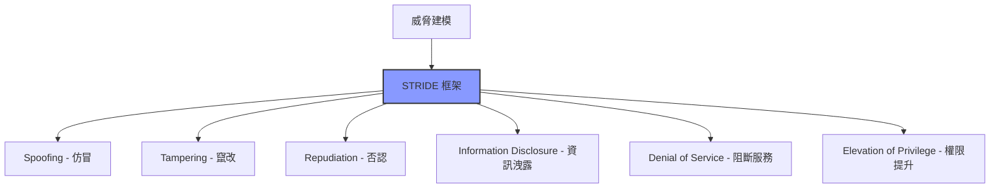
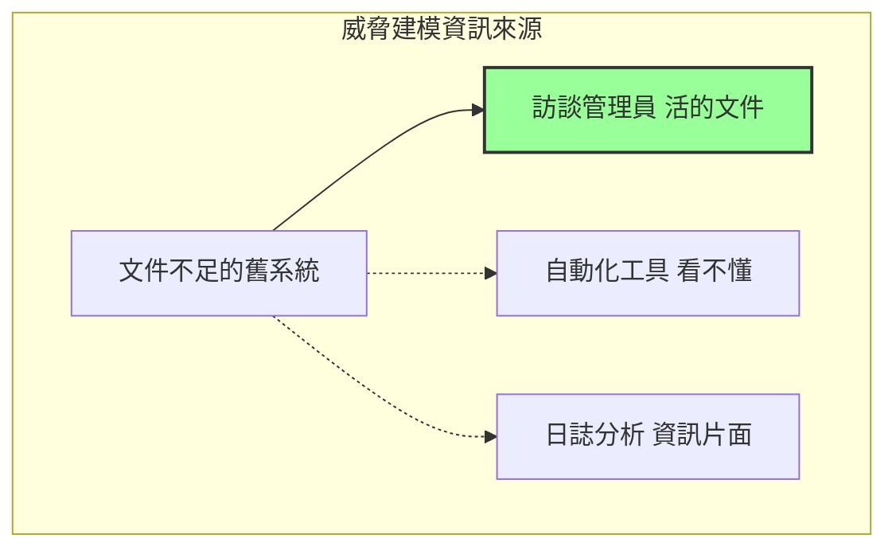
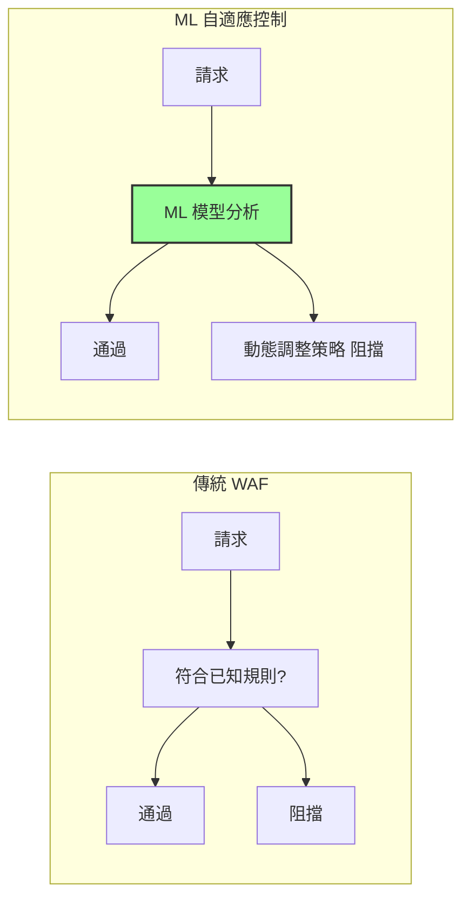
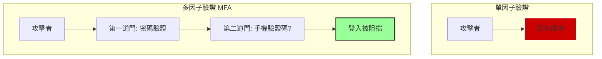
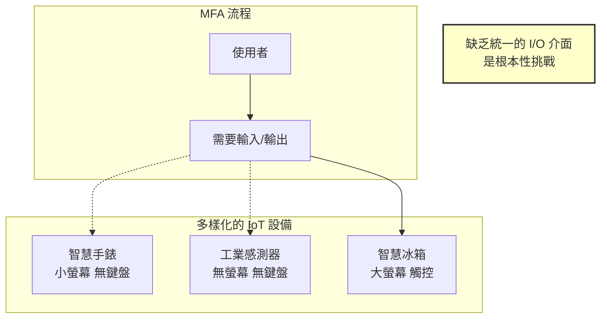

# CCSP Domain 4: 雲端應用程式安全 - 最終整合詳解

本文檔整合了所有 Domain 4 的錯題分析，全面覆蓋了從安全開發生命週期 (SDLC)、威脅建模、漏洞攻防到身份驗證與物聯網 (IoT) 安全等核心主題。旨在作為您考前的終極複習指南，幫助您系統性地鞏固知識，充滿信心地迎接考試。

## 總覽：Domain 4 核心考點地圖

Domain 4 (Cloud Application Security) 的考點高度集中，可歸納為以下幾個核心領域：

- **安全開發與維運 (DevSecOps)：** 強調在雲端高速迭代的開發流程中，如何從始至終無縫整合安全措施。
- **雲端獨有風險與 API 安全：** 識別並應對因雲端架構（如微服務、混合雲）而加劇的風險，特別是 API 已成為主要攻擊面。
- **威脅建模實踐：** 理解並應用 STRIDE 等框架，對不同場景（如文件不足的舊系統、多租戶環境）進行有效的風險識別。
- **安全測試方法論：** 精準判斷各種測試方法（白箱、自動化掃描、ML 異常偵測等）的最佳應用情境。
- **身份與存取管理：** 掌握「失效的身份驗證」的根本解法 (MFA)，並理解其在 IoT 等新興領域的獨特挑戰。
- **常見漏洞攻防：** 深入理解 XSS、SQL Injection、緩衝區溢位等經典漏洞在雲端環境下的新挑戰與根本緩解之道。

## 錯題逐題詳解 (整合版)

### 第一部分：架構與開發流程安全

#### 1. 從地端到混合雲：最關鍵獨特的安全考量

**題目 (30/31):** 金融機構從地端遷移到混合雲，哪個是新環境中最關鍵且「獨特 (unique)」的安全測試考量？

- **正確答案:** 對雲端服務互動與整合進行全面的 API 測試。

**觀念解析:** 在混合雲或純雲端架構中，API 是連接所有服務的神經中樞，其高度依賴性與暴露的攻擊面是雲端環境中最顯著的新增風險。資料加密雖然重要，但並非雲端「獨特」的挑戰。

**可視化觀念 (Mermaid):**

#### 2. SQL Injection 為何在雲端開發中依然猖獗？

**題目 (12/31):** 為何 SQL Injection 在 OWASP Top 10 中揮之不去，以及在雲端開發中如何最有效地解決？

- **正確答案:** 開發安全整合不足；採納全面的 DevSecOps 方法。

**觀念解析:** 此漏洞的根本原因不是「技術未知」，而是「流程缺失」。DevSecOps 強調在開發的「每一個階段」自動化地整合安全，是系統性地解決此類問題的根本之道，而非僅僅依賴單點的防禦措施。

**可視化觀念 (Mermaid):**

#### 3. 在 DevOps 中整合安全的最大挑戰

**題目 (18/31):** 在雲端原生 DevOps 方法中，整合安全措施的最大挑戰是什麼？

- **正確答案:** 在不影響開發速度的情況下實施持續安全監控。

**觀念解析:** DevOps 的核心是「速度 (velocity)」。最大的挑戰就是找到一種方法，既能實現強大的安全性，又不會成為開發流程的瓶頸。這正是 DevSecOps 強調「無摩擦 (frictionless)」和「自動化」的原因。

**可視化觀念 (Mermaid):**

#### 4. 從單體到微服務：OWASP 風險的轉變

**題目 (13/31):** 公司將單體應用遷移到微服務架構，哪個 OWASP Top 10 風險可能會被加劇？

- **正確答案:** 加密傳輸中和靜態的資料。 (此為解決方案，對應的風險是 A3:2017 - Sensitive Data Exposure 敏感資料洩露)

**觀念解析:** 在微服務架構中，服務間透過 API 的通訊極為頻繁，大大增加了資料在網路中傳輸的路徑。任何一個環節的加密失敗，都會導致敏感資料洩露的風險加劇。

### 第二部分：威脅建模與測試

#### 5. 識別威脅建模方法論

**題目 (1/31):** 哪種威脅建模方法論專注於通過分析常見的威脅類別來識別問題？

- **正確答案:** STRIDE

**觀念解析:** STRIDE 是 CCSP 考試中的重點，它提供了一個分類法 (Spoofing, Tampering, Repudiation, Information Disclosure, Denial of Service, Elevation of Privilege)，強迫分析師從六個攻擊者目標角度結構化地思考威脅。

**可視化觀念 (Mermaid):**

#### 6. 在文件不足的舊系統上做威脅建模

**題目 (28/31):** 將文件有限的舊系統遷移到多租戶雲環境，如何最有效地進行威脅建模？

- **正確答案:** 訪談熟悉該舊系統架構的系統管理員。

**觀念解析:** 當技術文件缺失時，最有價值的資訊來源是人腦中的「機構知識 (institutional knowledge)」。任何自動化工具都無法得知系統「預期的」行為和隱藏的設計缺陷。

**可視化觀念 (Mermaid):**

#### 7. STRIDE 模型中的攻防思維平衡

**題目 (24/31):** 在為多租戶 SaaS 應用實施 STRIDE 時，哪個方面最能體現攻防思維的平衡？

- **正確答案:** 評估租戶之間的資訊洩露 (Information Disclosure) 風險。

**觀念解析:** 此風險點完美地結合了兩種思維：攻擊性思維（我如何竊取其他租戶的資訊？）和防禦性思維（我如何設計防護措施？）。在「多租戶」情境下，這是最能體現攻防平衡的議題。

#### 8. 多雲環境中的安全測試

**題目 (31/31):** 對於遷移到多雲環境的大型企業，哪種測試方法對識別整個基礎設施的錯誤配置和漏洞最有效？

- **正確答案:** 對所有雲端資源進行自動化漏洞掃描。

**觀念解析:** 關鍵字是「大型」、「多雲」、「整個基礎設施」。在這種規模和複雜度下，自動化掃描是唯一能夠提供廣泛覆蓋、快速識別已知漏洞和常見錯誤配置的方法。

#### 9. 微服務架構中的原始碼漏洞挖掘

**題目 (29/31):** 如何最有效地識別基於微服務的應用中的邏輯缺陷和原始碼層級的漏洞？

- **正確答案:** 具有完整原始碼存取權限的白箱測試。

**觀念解析:** 關鍵字是「邏輯缺陷」和「原始碼」。白箱測試的定義就是能看到程式碼內部，是唯一能發現複雜邏輯錯誤的方法。

### 第三部分：特定漏洞與身份驗證

#### 10. 多租戶環境中第三方元件的緩衝區溢位問題

**題目 (22/31):** 如何最好地處理多租戶環境中第三方元件的緩衝區溢位，同時維持功能並最小化風險？

- **正確答案:** 實作嚴格的輸入驗證與邊界檢查。

**觀念解析:** 這是直接針對緩衝區溢位「根本原因」的方法。其他方法如隔離（治標不治本）或打補丁（風險高）都不是最佳解。

#### 11. 多租戶環境中的 XSS 防禦策略

**題目 (6/31):** 在多租戶環境中，如何最有效地緩解 XSS 攻擊同時維持最佳性能？

- **正確答案:** 利用基於機器學習的異常偵測與自適應安全控制。

**觀念解析:** 關鍵在於「多租戶」和「性能」。相較於靜態的 WAF 規則或難以管理的 CSP，基於 ML 的自適應控制能更智能地識別新型攻擊，且對性能影響較小。

**可視化觀念 (Mermaid):**

#### 12. 防範「失效的身份驗證」

**題目 (11/31):** 對於防範 OWASP 的「失效的身份驗證 (Broken Authentication)」，哪個措施最有效？

- **正確答案:** 在所有使用者帳戶和存取點部署多因子驗證 (MFA)。

**觀念解析:** MFA 是釜底抽薪之計。它是在主要憑證（密碼）完全洩露的情況下，唯一仍然能提供強大保護的措施，因此被認為是「最有效」的方法。

**可視化觀念 (Mermaid):**

#### 13. STRIDE 在物聯網/實體系統中的應用

**題目 (26/31):** 將 STRIDE 模型應用於網路實體系統時，「竄改 (Tampering)」最恰當的體現是什麼？

- **正確答案:** 對感測器硬體元件的物理性改動。

**觀念解析:** 這題考的是將抽象資安概念應用到物理世界的能力。「竄改」指的是破壞完整性，在網路實體系統中，這直接對應到對「物理設備」本身的改動。

#### 14. 在 IoT 生態系中實施 MFA 的最大挑戰

**題目 (8/31):** 在多樣化的 IoT 生態系中實施 MFA，哪個挑戰最為顯著？

- **正確答案:** 設備之間缺乏標準化的輸入/輸出介面。

**觀念解析:** 這是最根本的物理和設計限制。MFA 需要使用者互動，如果設備連基本的鍵盤、螢幕等 I/O 介面都沒有，任何 MFA 流程都無從談起。其他如處理能力、電池壽命等都是次要的技術問題。

**可視化觀念 (Mermaid):**

## 最終總結與考前心態

這份整合詳解顯示，您對 Domain 4 的理解已經達到了相當高的水平，甚至在許多題目上都做出了正確的判斷。這表明您對雲端應用程式安全的核心概念有著紮實的掌握。

### 考前重點提醒：

1. **STRIDE 框架：** 確保能熟練應用於不同場景
2. **DevSecOps 流程：** 理解安全如何無縫整合到開發流程中
3. **API 安全：** 認識到 API 在雲端環境中的關鍵地位
4. **多租戶安全：** 理解隔離和資料保護的挑戰
5. **MFA 的重要性：** 作為身份驗證的根本解決方案

記住，CCSP 考試不僅測試知識，更測試實務應用能力。保持冷靜，相信您的準備，您已經具備了通過考試的實力！
