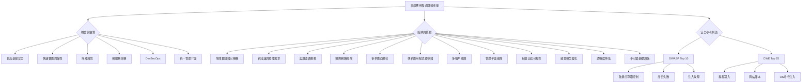

雲端應用程式開發：機會、陷阱與挑戰
在準備 CCSP (Certified Cloud Security Professional) 考試的領域 4 (Domain 4) 中，理解雲端應用程式開發的相關議題至關重要
。雲端運算為應用程式開發帶來了許多益處，但也伴隨著顯著的複雜性和新的風險
。
雲端開發的益處與機會
雲端環境提供了一系列獨特的優勢，可以顯著提升應用程式的開發、部署與安全性：
• 快速啟動與平台即服務 (PaaS)：您可以簡單地註冊一個平台即服務 (PaaS) 提供商，並在數分鐘內開始編碼，無需花費大量時間設置和管理基礎設施
。
• 更高基線安全 (Higher Baseline Security)：主要的雲端供應商是大型公司，擁有龐大且高技能的安全專業團隊。由於其規模和專業知識範圍，他們更容易提供比一般中小型企業更高的基線安全水平。在雲端建構應用程式時，您可以利用這一優勢
。
• 響應性與彈性 (Responsiveness & Elasticity)：雲端提供了多種方式來提升應用程式的響應性，包括快速彈性 (rapid elasticity) 和 自動擴展 (automatic scaling)
。這使得建立高度響應和可擴展的應用程式相對容易，能夠輕鬆處理需求高峰並隨著業務需求擴展
。
• 隔離環境 (Isolated Environments)：虛擬基礎設施的部署成本低廉且相對容易，這使得在雲端中創建隔離環境變得簡單
。透過微區段 (micro-segmentation) 和類似技術，我們可以以精細的粒度相對容易地隔離環境、網路區段、實例、儲存等，提供高度的安全性
。
• 微服務架構 (Microservices Architecture)：與傳統的單體架構 (monolithic architectures) 不同，微服務允許我們將應用程式分解為更小、獨立的模組化部分
。這使得在不破壞整個應用程式的情況下進行更改變得更容易，也更容易創建更具彈性和可擴展性的應用程式，儘管會增加一些複雜性
。
• DevOps 與 DevSecOps：DevOps 是一種整合軟體開發與營運的方法，可以更快地迭代和發布新軟體
。當將安全性納入其中時，我們稱之為 DevSecOps 或 SecOps。在雲端中，實施 DevSecOps 流程可能更容易
。
• 統一管理介面 (Unified Management Interface)：雲端服務透過管理平面 (management plane) 進行控制，這是一個統一的管理介面
。您幾乎可以透過管理平面控制雲端的每個方面，這可以為您提供所有基礎設施的「單一視窗 (single pane of glass)」視圖，使管理更加容易
。
雲端開發的陷阱與挑戰
儘管有諸多優勢，雲端應用程式開發也帶來了需要注意的陷阱和挑戰：
• 地端實踐難以轉移：您在地端系統和開發實踐中運作良好的方法，可能不適用於雲端
。雲端本身具有不同的風險，需要採用不同的控制措施來減輕這些風險
。
• 新知識與技能需求：在雲端中開發應用程式需要新的知識和技能，才能有效管理和保護您的系統
。
• 合規挑戰 (Compliance Challenges)：雲端帶來了各種新的風險，包括合規挑戰
。例如，將資料儲存在違反法規要求的位置可能很容易
。
• 網際網路曝險：雲端應用程式通常暴露在網際網路上，這意味著您無法將它們深埋在內部網路中，並用層層安全控制保護它們
。這種程度的曝險表示您需要非常謹慎地實施安全機制，並考慮採用零信任 (zero trust) 等策略
。
• 多供應商整合複雜性：雲端軟體通常涉及來自多個供應商的高度整合
。例如，您可能使用一家供應商的身份和存取服務，另一家供應商的資料庫服務等等。當您的雲端軟體由如此多來自不同供應商的部分組成時，整合它們並使其適當且充分地安全運行可能是一個挑戰
。
• 傳統應用程式遷移困難：傳統應用程式可能很難遷移到雲端
。將這些系統遷移到雲端供應商後，可用性可能會比保留在地端時更低，且許多傳統系統可能無法在雲端中愉快地運行，甚至根本無法運行
。
• 多租戶風險 (Multi-tenancy Risks)：公共雲端服務本質上是多租戶的，這意味著許多雲端客戶使用相同的底層物理硬體和基礎設施
。儘管它們是邏輯上隔離的，但如果實施不當，存在客戶可能存取彼此資料的風險。因此，您不應將公共雲用於高度敏感的資料和應用程式
。
• 管理平面風險：管理平面雖然提供強大的控制和統一視圖，但其巨大的權力和存取級別也使其成為一個巨大的風險
。它必須非常謹慎地保護，因為如果攻擊者成功入侵管理平面，您的應用程式幾乎就「完了」
。
• 有限日誌可見性 (Limited Logging Visibility)：如果您在 PaaS 或 IaaS 環境中開發，您對底層基礎設施的控制權不如在自己的硬體環境中開發時多
。這限制了您可以記錄的內容，因此您可能無法獲得所需的基礎設施可見性
。
• 不斷變化的威脅模型：雲端服務面臨與地端系統不同的威脅
。遷移到雲端時，會引入新的風險，您需要確保適當地減輕它們
。
• 透明度降低 (Reduced Transparency)：當您使用雲端服務時，不一定能完全了解供應商的「內部運作」
。對於 SaaS (軟體即服務)，透明度特別低，但隨著您轉向 PaaS (平台即服務) 和 IaaS (基礎設施即服務)，透明度會提高。您需要了解遷移到雲端時可能不再擁有的可見性，並確保您對此降低的透明度感到滿意或已採取適當的緩解控制措施
。
• 不可變基礎設施 (Immutable Infrastructure)：不可變基礎設施是指不能更改的基礎設施
。一方面，這使其非常安全和一致，但這也意味著如果您需要更新它，您必須用包含所需更改的新映像完全替換它。因此，不可變基礎設施雖然有許多好處，但也意味著您必須徹底改變管理基礎設施的方式
。
重要的安全參考列表
在開發雲端應用程式時，以下兩個清單對於確保應用程式安全至關重要：
• OWASP Web Application Top 10：這是開放全球應用程式安全專案 (Open Worldwide Application Security Project) 的一個項目，列出了最常見的網路應用程式漏洞，您需要特別注意
。最常見的漏洞包括：
    ◦ 破損的存取控制 (Broken Access Control)
    ◦ 密碼編譯失敗 (Cryptographic Failures)
    ◦ 各種注入 (Injection) 類型，如 SQL 注入
• CWE Top 25 Most Dangerous Software Errors：這是另一個您應該了解的實用清單，包括：
    ◦ 越界寫入 (Out-of-bounds Write)
    ◦ 跨站點腳本 (Cross-site Scripting)
    ◦ OS 命令注入 (OS Command Injection)
 在開發應用程式時，應確保其不包含這些清單中的任何頂級漏洞。CWE 代表「常見弱點列舉 (Common Weakness Enumeration)」
。
雲端應用程式開發考量 (Mermaid 圖)

