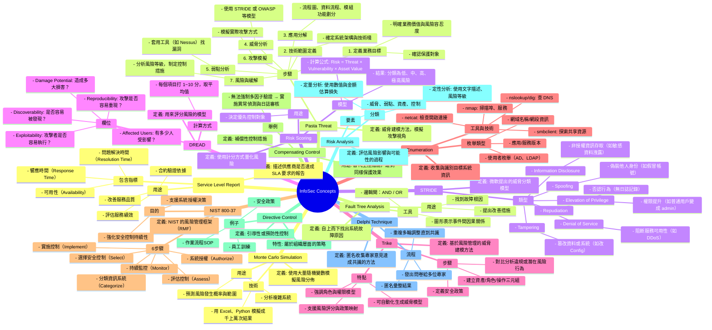

```mermaid
mindmap
  root((InfoSec Concepts))
    SLR(Service Level Report)
      定義: 描述供應商是否達成 SLA 要求的報告
      包含指標
        - 可用性（Availability）
        - 響應時間（Response Time）
        - 問題解決時間（Resolution Time）
      用途
        - 評估服務績效
        - 改善服務品質
        - 合約驗證依據
    Pasta Threat
      定義: 威脅建模方法，模擬攻擊視角
      步驟
        1. 定義業務目標
          - 確認保護對象
          - 明確業務價值與風險容忍度
        2. 技術範圍定義
          - 確定系統架構與技術棧
        3. 應用分解
          - 流程圖、資料流程、模組功能劃分
        4. 威脅分析
          - 使用 STRIDE 或 OWASP 等模型
        5. 弱點分析
          - 套用工具（如 Nessus）找漏洞
        6. 攻擊模擬
          - 模擬實際攻擊方式
        7. 風險與緩解
          - 分析風險等級，制定控制措施
    STRIDE
      定義: 微軟提出的威脅分類模型
      類型
        - Spoofing
          - 偽裝他人身份（如假冒帳號）
        - Tampering
          - 篡改資料或系統（如改Config）
        - Repudiation
          - 否認行為（無日誌記錄）
        - Information Disclosure
          - 非授權資訊存取（如敏感資料洩露）
        - Denial of Service
          - 阻斷服務可用性（如 DDoS）
        - Elevation of Privilege
          - 權限提升（如普通用戶變成 admin）
    DREAD
      定義: 用來評分風險的模型
      欄位
        - Damage Potential: 造成多大損害？
        - Reproducibility: 攻擊是否容易重現？
        - Exploitability: 攻擊者是否容易執行？
        - Affected Users: 有多少人受影響？
        - Discoverability: 是否容易被發現？
      計算方式
        - 每個項目打 1~10 分，取平均值
    Trike
      定義: 基於風險管理的威脅建模方法
      特點
        - 強調角色與權限模型
        - 支援風險評分與政策映射
        - 可自動化生成威脅模型
      步驟
        - 建立資產/角色/操作三元組
        - 定義安全政策
        - 對比分析違規或潛在風險行為
    Enumeration
      定義: 收集與識別目標系統資訊
      工具與技術
        - nmap: 掃描埠、服務
        - netcat: 檢查開啟連接
        - nslookup/dig: 查 DNS
        - smbclient: 探索共享資源
      枚舉類型
        - 使用者枚舉（AD、LDAP）
        - 網域名稱/網段資訊
        - 應用/服務版本
    NIST 800-37
      定義: NIST 的風險管理框架（RMF）
      6步驟
        - 分類資訊系統（Categorize）
        - 選擇安全控制（Select）
        - 實施控制（Implement）
        - 評估控制（Assess）
        - 系統授權（Authorize）
        - 持續監控（Monitor）
      目的
        - 支援系統授權決策
        - 強化安全控制持續性
    Compensating Control
      定義: 補償性控制措施
      用途: 替代主控措施，達到同樣保護效果
      舉例
        - 無法強制多因子驗證 → 實施異常偵測與日誌審核
    Directive Control
      定義: 引導性或預防性控制
      特性: 屬於組織層面的策略
      例子
        - 安全政策
        - 員工訓練
        - 作業流程SOP
    Risk Analysis
      定義: 評估風險影響與可能性的過程
      分類
        - 定性分析: 使用文字描述、風險等級
        - 定量分析: 使用數值與金額估算損失
      要素
        - 威脅、弱點、資產、控制
    Delphi Technique
      定義: 匿名收集專家意見達成共識的方法
      流程
        - 發出問卷給多位專家
        - 匿名彙整結果
        - 重複多輪調整直到共識
    Monte Carlo Simulation
      定義: 使用大量隨機變數模擬風險分佈
      用途
        - 預測風險發生概率與範圍
        - 分析複雜系統
      技術
        - 用 Excel、Python 模擬成千上萬次結果
    Fault Tree Analysis
      定義: 自上而下找出系統故障原因
      工具
        - 邏輯閘：AND / OR
        - 圖形表示事件間因果關係
      用途
        - 找到故障根因
        - 提出改善措施
    Risk Scoring
      定義: 使用計分方式量化風險
      模型
        - 計算公式: Risk = Threat × Vulnerability × Asset Value
        - 結果: 分類為低、中、高、極高風險
      用途
        - 決定優先控制對象

```

```mermaid
graph TD
  A[InfoSec Concepts]

  A --> B1[SLR]
  B1 --> B1a[定義：SLA報告]
  B1 --> B1b[指標：可用性/響應時間]
  B1 --> B1c[用途：績效與合約依據]

  A --> B2[Pasta Threat]
  B2 --> B2a[步驟1：定義業務]
  B2 --> B2b[步驟2：技術範圍]
  B2 --> B2c[步驟3：應用分解]
  B2 --> B2d[步驟4：威脅分析]
  B2 --> B2e[步驟5：弱點分析]
  B2 --> B2f[步驟6：模擬攻擊]
  B2 --> B2g[步驟7：風險與緩解]

  A --> B3[STRIDE]
  B3 --> B3a[Spoofing：偽冒身份]
  B3 --> B3b[Tampering：篡改資料]
  B3 --> B3c[Repudiation：否認操作]
  B3 --> B3d[Info Disclosure：洩漏資訊]
  B3 --> B3e[DoS：阻斷服務]
  B3 --> B3f[Privilege Escalation：提權]

  A --> B4[DREAD]
  B4 --> B4a[Damage Potential]
  B4 --> B4b[Reproducibility]
  B4 --> B4c[Exploitability]
  B4 --> B4d[Affected Users]
  B4 --> B4e[Discoverability]

  A --> B5[Trike]
  B5 --> B5a[角色與資產分析]
  B5 --> B5b[定義控制政策]
  B5 --> B5c[風險與權限對照分析]

  A --> B6[Enumeration]
  B6 --> B6a[工具：nmap/netcat]
  B6 --> B6b[查詢：DNS/LDAP]
  B6 --> B6c[收集：使用者/服務版本]

  A --> B7[NIST 800-37]
  B7 --> B7a[分類系統]
  B7 --> B7b[選擇控制]
  B7 --> B7c[實施控制]
  B7 --> B7d[評估控制]
  B7 --> B7e[授權系統]
  B7 --> B7f[持續監控]

  A --> B8[Compensating Control]
  B8 --> B8a[替代控制]
  B8 --> B8b[例：無MFA→用異常偵測]

  A --> B9[Directive Control]
  B9 --> B9a[類型：政策/SOP]
  B9 --> B9b[用途：行為引導]

  A --> B10[Risk Analysis]
  B10 --> B10a[定性分析]
  B10 --> B10b[定量分析]
  B10 --> B10c[要素：資產、威脅、弱點]

  A --> B11[Delphi Technique]
  B11 --> B11a[專家意見迴圈]
  B11 --> B11b[匿名問卷、多輪整合]

  A --> B12[Monte Carlo Simulation]
  B12 --> B12a[隨機模擬結果]
  B12 --> B12b[預估風險概率範圍]

  A --> B13[Fault Tree Analysis]
  B13 --> B13a[自上而下追因]
  B13 --> B13b[邏輯閘：AND/OR]

  A --> B14[Risk Scoring]
  B14 --> B14a[公式：威脅×弱點×資產]
  B14 --> B14b[分類：低/中/高]


```
