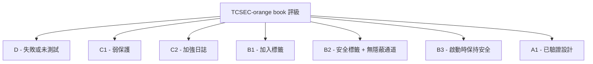
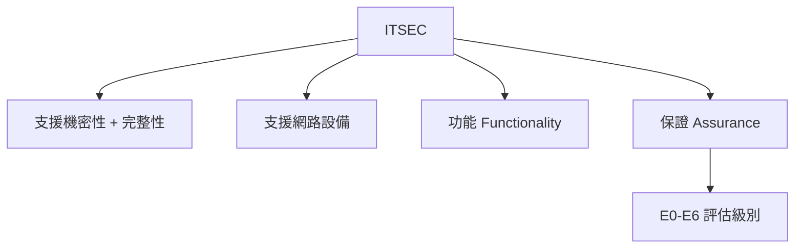
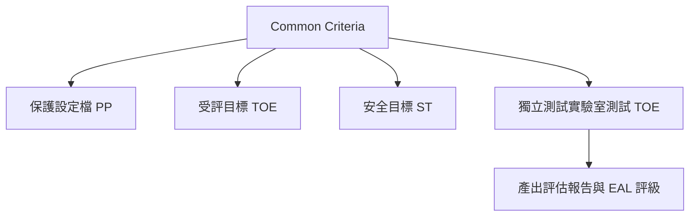
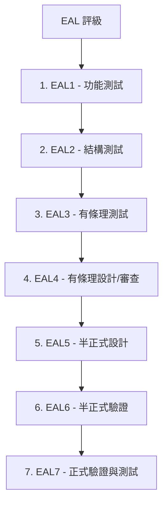

這是 Domain 3 的九個教材中的第二個。

## 建立安全環境的需求 [1]
*   每個組織在建立安全環境時，都需要從供應商那裡**採購各種產品**，例如防火牆、路由器、入侵偵測系統等。
*   作為建議採購流程的安全專業人員，我們必須確保產品**設計良好**並提供**所需的安全功能**。

## 面臨的挑戰：供應商聲明 [2]
*   當我們詢問防火牆供應商其產品的安全性時，他們很可能會誇大其產品的優勢。
*   **我們作為安全專業人員，不應該相信這種行銷說辭**。

## 如何比較不同供應商的產品並信任其聲明？ [2]
*   答案是 **評估標準 (Evaluation Criteria)**。
*   評估標準是**獨立、客觀的產品評估系統**。

## 評估標準的運作方式 [2]
1.  **廠商創建產品**。
2.  廠商**付費給獨立的測試實驗室**，使用特定的評估標準來評估其產品。
3.  獨立實驗室**測試產品，給予評級，並產生報告**。
4.  廠商可以將此報告提供給客戶。
5.  **客戶會信任報告中的評級**，因為它是**由獨立的測試實驗室**而非供應商提供的。

## 評估標準的兩個主要步驟 [3]
1.  **認證 (Certification)**
2.  **認可 (Accreditation)**

## 認證 (Certification) [3]
*   是對解決方案或產品進行的**全面技術分析**，以確保其滿足我們的需求。
*   換句話說，認證步驟是**獨立測試實驗室評估產品並給予評級**的過程。

## 不同的評估標準系統 [3]

### TCSEC (Trusted Computer System Evaluation Criteria) / 橘皮書 (Orange Book) [3, 4]
*   是最早開發的評估標準之一。
*   得名於其書籍封面的顏色：**橘色** [3]。
*   **僅設計用於評估系統提供的機密性 (Confidentiality)** [4]。
*   **僅設計用於評估未連接到網路的產品，即單機系統 (Single Standalone Systems Only)** [4]。
*   **TCSEC 定義了七個功能級別 (Functional Levels)**，產品可以根據評估結果被劃分到這些級別 [4]：
    *   **D1**: 產品**失敗**或**未經測試**，這不是一個令人放心的評級 [4]。
    *   **C1**: 產品提供**弱保護機制** [4]。
    *   **C2**: 在 C1 的基礎上，**C2 增加了產品提供嚴格的日誌記錄程序** [4]。C2 是產品最常見的評級 [4]。
    *   **B1**: **標籤 (Labeling) 成為產品的要求** [4]。
    *   **B2**: 產品提供**安全標籤 (Security Labels)** 並**驗證沒有隱蔽通道 (Covert Channels)** [4]。
    *   **B3**: 產品提供**安全標籤、驗證沒有隱蔽通道**，並且**在啟動期間必須保持安全** [5]。
    *   **A1**: 產品可以達到的**最高功能評級**是 **已驗證的設計 (Verified Design)**，非常安全以至於實際上可能難以使用 [5]。
 

### ITSEC (Information Technology Security Evaluation Criteria) [5]
*   是**對較舊的 TCSEC 的重大改進** [5]。
*   **ITSEC 不僅可以用於評估產品的機密性，還可以用於評估完整性 (Integrity)** [5]。
*   **ITSEC 還可以用於評估連接到網路的設備**，非常有用 [5]。
*   **ITSEC 使用與 TCSEC 完全相同的功能級別 (D1、C1、C2、B1 等)** [5]。
*   ITSEC 提供的最終主要改進是，它**不僅可以用於評估產品提供的功能 (Functionality)，還可以用於評估保證 (Assurance)** [5]。
    *   **功能 (Function)** 指的是系統應該做什麼 [6]。
    *   **保證 (Assurance)** 指的是我們如何驗證和測試系統是否正常工作 [6]。
*   ITSEC 中用於評估保證的級別稱為 **評估級別 (Evaluation Levels 或 E Levels)**，共有七個 (E0 到 E6) [6]。講者認為不需要記憶這些級別的具體細節 [6]。

### Common Criteria (資訊科技系統安全評估通用準則) / ISO 15408 [6]
*   通常簡稱為 **Common Criteria** [6]。
*   已被採納為**國際標準，具體而言是 ISO 15408** [6]。
*   Common Criteria 的評估過程始於定義 **保護設定檔 (Protection Profile, PP)**，它**定義了一類安全設備（例如防火牆、智慧卡等）的安全需求** [6, 7]。

*   **受評目標 (Target of Evaluation, TOE)** **定義了將被評估的特定產品或系統** [7]。這是供應商提供的要進行評估的具體產品，例如 Cisco ASA 5515-X 防火牆 [7]。
*   **安全目標 (Security Target, ST)** 是**由產品供應商準備的文件**，它**定義了供應商聲稱內建於受評目標 (TOE) 中的特定功能和保證安全屬性和能力** [7]。
*   獨立測試實驗室將測試受評目標 (TOE) 的功能和保證方面 [7]。
*   最終結果將是一個 **評估保證級別 (Evaluation Assurance Level, EAL)** 評級 [7]。
*   在介紹 EAL 評級之前，講者提供了一個 Common Criteria 流程的可視化摘要，並強調務必理解這些概念 [7]。
*   **EAL 評級共有七個**，從最低到最高依次為 [7, 8]：
    *   **EAL1 (Functionally Tested)**: **僅測試了產品的功能** [8]。
    *   **EAL2 (Structurally Tested)**: **僅測試了產品的結構** [8]。
    *   **EAL3 (Methodically Tested and Checked)**: **經過有條理的測試和檢查** [8]。這些級別是**逐步累積**的 [8]。
    *   **EAL4 (Methodically Designed, Tested, and Reviewed)**: **經過有條理的設計、測試和審查** [8]。
    *   **EAL5 (Semi-formally Designed and Tested)**: **經過半正式的設計和測試** [8]。
    *   **EAL6 (Semi-formally Verified Design and Tested)**: **經過半正式的驗證、設計和測試** [8]。
    *   **EAL7 (Formally Verified Design and Tested)**: **經過正式的驗證、設計和測試** [8]。

      
*   **強烈建議記憶這些 EAL 級別及其順序** [8]。

## 認可 (Accreditation) [8]
*   如影片開頭所述，評估標準的重點是幫助組織評估和比較不同的產品，並選擇最適合其組織的解決方案 [8]。
*   選擇產品的最後一步是 **管理階層的批准和簽署 (Official Management Signoff)** [8]。
*   認可是指**在一段特定的時間內**，**管理階層正式簽署批准購買和部署產品**到組織中 [8, 9]。
