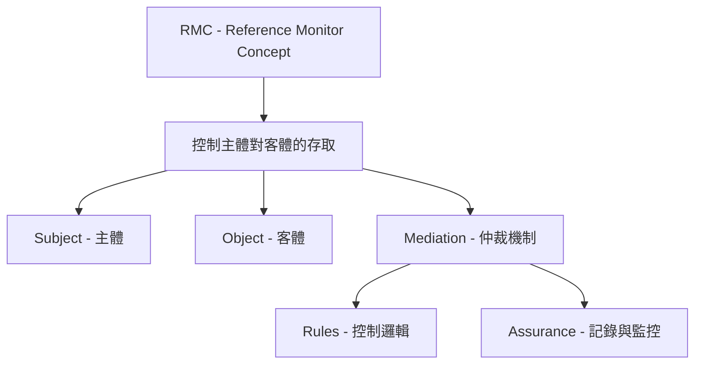
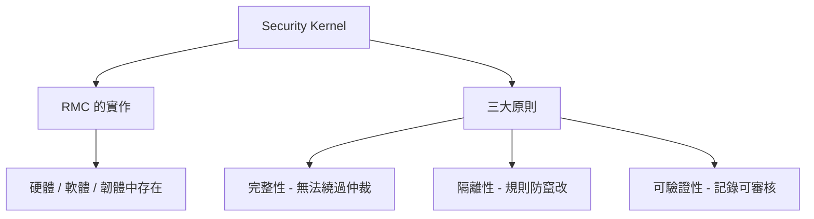
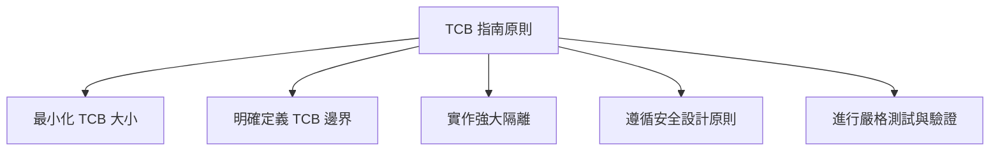

# 可信任運算基底 (Trusted Computing Base, TCB) 詳細解釋與指南

## 什麼是可信任運算基底 (Trusted Computing Base, TCB)?

**可信任運算基底 (TCB) 是系統或架構內所有保護機制 (totality of protection mechanisms) 的總和**，這些機制共同運作以強制執行安全策略 [1, 2]。

- **總和 (Totality)** 意指所有負責保護系統的保護機制，包括人員、流程和技術 [2]。
- 請留意任何意指「所有保護機制」的詞語，例如「集合 (collection)」、「組合 (assembly)」、「分類 (taxonomy)」等，都屬於 TCB 的範疇 [2]。

## TCB 的關鍵機制

TCB 包含許多關鍵機制，以下將詳細說明：

### 參考監視器概念 (Reference Monitor Concept, RMC)

RMC 是一個簡單但至關重要的概念：為了實現安全，我們必須控制 **主體 (subjects)** 對 **客體 (objects)** 的存取，以及主體可以對客體執行的具體操作 [3]。

- **主體 (Subject)**：是主動的實體，例如想要存取客體的人員或進程 [3]。
- **客體 (Object)**：是被主體存取的被動實體，例如資料庫、Word 檔案、建築物，甚至其他進程 [4]。
- **仲裁 (Mediation)**：控制主體存取客體的任何機制。這可以是實體的鎖、登入提示，或系統核心的控制 [3]。
- **規則 (Rules)**：仲裁機制根據一套規則來做出決策，這代表了控制的功能性面向 [3, 4]。
- **保證 (Assurance)**：我們需要確保仲裁機制持續正常運作。通常透過記錄 (logging) 和監控這些記錄來實現，這是控制的保證性面向 [4, 5]。



**重點：RMC 僅是一個概念。要使其有用，需要將其付諸實施 [4]。**

### 安全核心 (Security Kernel)

**安全核心是參考監視器概念 (RMC) 的實作** [6]。每當我們想要控制主體對客體的存取時，我們都會使用安全核心來控制該存取 [6]。

- 安全核心可以在硬體、軟體、韌體等任何需要安全性的地方找到 [6]。

### RMC 和安全核心的重要原則

RMC 及其安全核心的實作必須滿足三個重要原則 [5, 6]：

- **完整性 (Completeness)**：主體永遠無法繞過仲裁機制。例如，沒有後門 [6]。
- **隔離性 (Isolation)**：用於控制仲裁的規則是防竄改的。只有授權人員才能更改這些規則 [6]。請記住，「隔離性」表示規則是防竄改的。
- **可驗證性 (Verifiability)**：透過記錄和監控來驗證仲裁機制是否正常運作，這是保證性面向 [5]。



## 系統內的硬體元件

以下是一些電腦系統內重要的硬體元件，它們在 TCB 中扮演著角色 [5]：

- **中央處理器 (CPU)**：電腦的大腦，負責提取、解碼、執行和儲存指令 [5]。
- **主要儲存 (Primary Storage)**：速度非常快、容量小且具揮發性記憶體。範例包括 CPU 的快取和暫存器，以及隨機存取記憶體 (RAM) [5, 7]。**揮發性 (Volatile)** 意味著斷電後資料會消失 [7]。
- **次要儲存 (Secondary Storage)**：速度較慢、容量大得多且具非揮發性。範例包括磁性硬碟、固態硬碟 (SSD)、光碟媒體等 [7]。**非揮發性 (Non-volatile)** 意味著斷電後資料仍然存在。
- **虛擬記憶體 (Virtual Memory)**：一種記憶體管理技術，作業系統會暫時將 RAM 中不常使用的資料傳輸回硬碟 (稱為分頁 paging)，以模擬擁有比實際更多的 RAM [8, 9]。

```mermaid
    graph TD
    A[TCB 涉及硬體] --> B[CPU]
    A --> C[主要儲存 (RAM)]
    A --> D[次要儲存 (SSD/HDD)]
    A --> E[虛擬記憶體 (Virtual Memory)]
```

## 系統內的軟體元件

以下是一些系統內主要的軟體元件，它們也是 TCB 的一部分 [10]：

- **作業系統 (Operating System)**：控制所有電腦硬體並允許多個程式運行的軟體系統。範例包括 Windows、macOS、Linux、Unix、iOS 和 Android 等 [10]。
- **系統核心 (System Kernel)**：作業系統的核心部分，控制一切 [11]。**請勿將系統核心 (作業系統的核心) 與安全核心 (RMC 的實作) 混淆，它們是非常不同的概念** [11]。
- **韌體 (Firmware)**：提供底層硬體控制的軟體，通常儲存在硬體上的非揮發性記憶體中 (例如唯讀記憶體 ROM) [11]。
- **中介軟體 (Middleware)**：類似軟體膠水，充當不同不相容應用程式之間的翻譯器，實現互操作性 [11]。

```mermaid
  graph TD
    A[TCB 涉及硬體] --> B[CPU]
    A --> C[主要儲存 (RAM)]
    A --> D[次要儲存 (SSD/HDD)]
    A --> E[虛擬記憶體 (Virtual Memory)]
```

## 保護機制 (Protection Mechanisms)

保護機制是我們用來保護系統和強制執行安全策略的概念和軟體技術 [11]。

- **程序隔離 (Process Isolation)**：確保多個同時運行的應用程式彼此隔離，互不干擾。有兩種主要方法 [12]：
  - **記憶體區隔 (Memory Segmentation)**：每個進程都被分配自己的記憶體空間，並且只允許存取其自身的記憶體空間 [12]。
  - **時間分割多工 (Time Division Multiplexing)**：為每個進程分配對資源 (如 CPU 或網路卡) 的一小段時間的存取權，然後將控制權轉移給下一個進程 [12]。
- **CPU 權限層級 (CPU Privilege Levels)**：CPU 提供不同層級的存取權限 [13]：
  - **問題狀態 (Problem State)**：較低的權限層級，大多數應用程式在此層級運行。此層級擁有足夠的 CPU 功能來運行，但沒有完全的存取權限 [13]。
  - **監管者狀態 (Supervisor State)**：較高的權限層級，作業系統的系統核心通常在此層級運行，擁有對所有 CPU 功能的完全存取權限 [13, 14]。
- **作業系統權限層級 (OS Privilege Levels)**：應用程式和進程在作業系統中有兩個常見的權限層級 [14]：
  - **使用者模式 (User Mode)**：較低的權限層級，大多數應用程式在此層級運行。使用者模式限制了應用程式可以存取的系統資源，防止直接存取硬體並限制其可以消耗的資源百分比 [14]。
  - **核心模式 (Kernel Mode)**：較高的權限層級，系統核心在此模式下運行，提供對底層硬體的無限制存取 [15]。
- **環狀保護模型 (Ring Protection Model)**：一種思考如何保護系統資源和定義不同信任或權限層級的方式。最內層的 **環 0 (Ring Zero)** 擁有最高的權限，系統核心在此運行，因此需要最高的保護。越往外層 (環 1、2、3)，權限越低。大多數應用程式運行在最外層的 **環 3 (Ring Three)** [15]。
- **安全記憶體管理 (Secure Memory Management)**：實作安全核心以仲裁應用程式對共享記憶體的存取，確保記憶體區隔並防止緩衝區溢位和記憶體耗盡等問題 [16]。
- **資料隱藏 (Data Hiding)**：如果應用程式以較低的權限層級運行，則較高權限層級的資料將對該應用程式隱藏。這與 **Bell-LaPadula 機密性模型** 的實作類似 [16, 17]。
- **縱深防禦 (Defense in Depth)**：實作多層安全控制，並在每一層都有完整的控制 (預防、偵測和矯正控制的組合)，以確保單一層的失敗不會暴露或危及資產的安全 [17]。

## TCB 的指南原則

- **最小化 TCB 大小**：較小的 TCB 更容易理解、分析和信任。
- **明確定義 TCB 的邊界**：清楚了解哪些組件屬於 TCB，哪些不屬於。
- **實作強大的隔離**：確保 TCB 內部的組件受到保護，免受外部組件的干擾。
- **遵循安全設計原則**：例如最小特權、權限分離等。
- **進行嚴格的測試和驗證**：確保 TCB 能夠正確地強制執行安全策略。



了解 TCB 的概念及其相關組件和原則，對於設計、實作和評估安全系統至關重要。TCB 是安全基礎的核心，確保其完整性和正確性是保護系統的關鍵。
