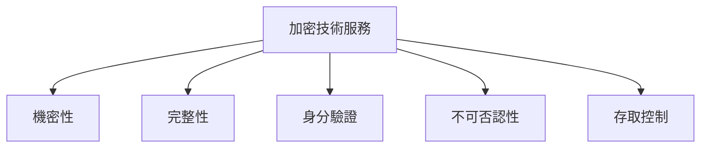
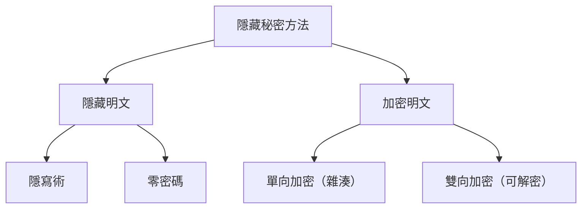
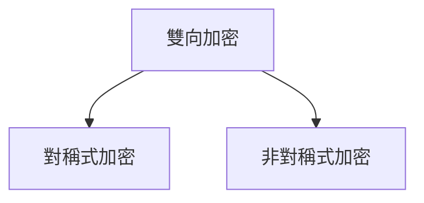
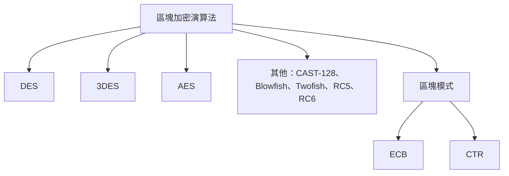
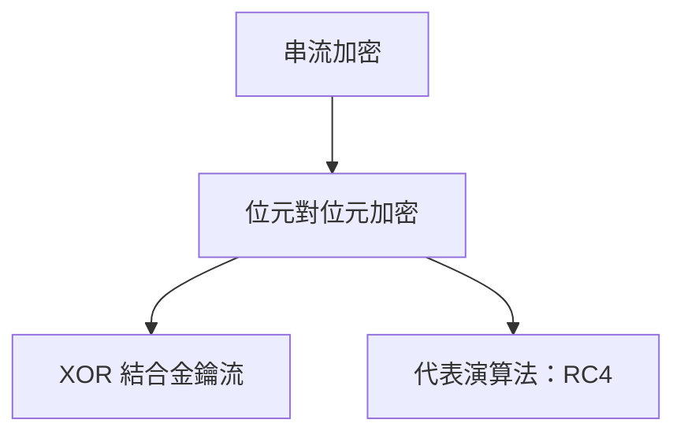
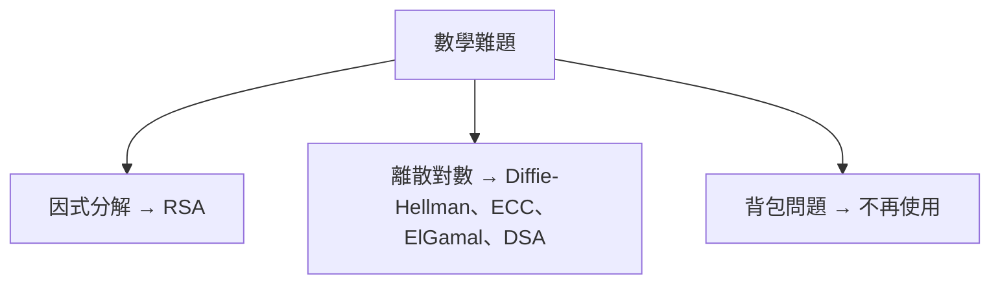

# 加密技術心智圖 (Cryptography MindMap) 詳細介紹與指引

## 簡介

- 這是一個關於 CISSP 考試 Domain 3 中加密技術主要主題的回顧。
- 旨在理解這些主題之間的相互關聯，並引導您的學習。
- 這是 Domain 3 系列九個影片中的第六個。
- 加密技術非常酷且引人入勝，它賦予了我們每天都在使用但可能沒有意識到的許多服務與能力 [1]。

## 加密技術的重要性與應用

- **線上購物安全**：保護您的信用卡詳細資訊和個人資訊不被竊取。
- **軟體更新驗證**：確保您下載的更新來自官方來源（例如 Apple），且未在傳輸過程中被修改。
- **隱匿通訊**：提供犯罪分子隱藏其通訊的能力。
- **數位權利管理 (DRM)**：保護線上銷售的電影或音樂等內容。
- **安全電子投票**。
- **數位簽章文件**。
- **雲端環境中可防禦的資料銷毀**。
- **加密貨幣**。

## 加密技術提供的五大服務

- **機密性 (Confidentiality)**：
  - 確保資料僅對授權人員可見。
  - 防止未經授權的資訊洩露。
- **完整性 (Integrity)**：
  - 確保資訊未被未經授權的個人操縱或更改。
  - 防止對資料進行未經授權或意外的更改。
  - **雜湊 (Hashing) 等於完整性，完整性等於雜湊**。
- **身分驗證 (Authenticity)**：
  - 確認某事物來自何處。
  - 例如，驗證訊息是否來自特定發送者。
- **不可否認性 (Non-repudiation)**：
  - 防止某人否認先前的行為。
  - **來源不可否認性 (Non-repudiation of origin)**：發送者不能否認他們發送了特定的訊息，不能否認確切的訊息源自他們。
  - **交付不可否認性 (Non-repudiation of delivery)**：接收者不能否認他們收到了特定的訊息。
- **存取控制 (Access Control)**：
  - 透過控制誰獲得密文和解密金鑰，來控制誰可以解密並存取資料。



## 加密技術重要術語

```mermaid
graph TD
    A[加密術語] --> B[明文 / 清晰文本]
    A --> C[加密 (Encryption)]
    A --> D[解密 (Decryption)]
    A --> E[金鑰 (Key) / 加密變數]
    A --> F[密文 (Cipher Text)]
    A --> G[金鑰叢集]
    A --> H[工作因子]
    A --> I[初始化向量 (IV) / Nonce]
```

- **明文 (Plain Text) / 清晰文本 (Clear Text)**：任何人都可以讀取的資料。
- **加密 (Encryption)**：使用**加密演算法 (cryptographic algorithm)** 和 **加密變數 (crypto variable)**（更常稱為 **金鑰 (key)**）將明文轉換為 **密文 (Cipher Text)** 的過程。
- **加密變數 (Crypto Variable) / 金鑰 (Key)**：
  - 必須保密的位元字串。
  - 本質上對加密演算法進行編程。
  - 決定演算法執行加密或解密以轉換明文或密文的具體步驟。
- **解密 (Decryption)**：使用加密演算法和金鑰將密文轉換回明文的過程。
- **金鑰叢集 (Key Clustering)**：兩個不同的金鑰從相同的明文產生相同的密文。這應盡力避免。好的加密演算法旨在最小化或理想情況下消除金鑰叢集。金鑰叢集是不好的，因為如果有兩個金鑰可以解密相同的密文，突然之間暴力破解攻擊就容易了一倍。
- **工作因子 (Work Factor)**：攻擊者破解密碼系統所需的估計時間或努力。工作因子越高，密碼系統越安全。
- **初始化向量 (Initialization Vector, IV) / 隨機數 (Nonce)**：
  - 與金鑰一起使用並輸入到加密演算法中的隨機數，用於加密某些明文。
  - 在任何會話中，IV 應僅使用一次。
  - 旨在幫助防止產生的密文中出現模式。即使使用相同的明文和相同的金鑰，只要使用不同的 IV，就可以避免產生相同的密文，從而避免模式。

## 好的加密演算法的屬性

- **混淆性 (Confusion)**：重點在於隱藏金鑰和產生的密文之間的關係。混淆性表示，如果金鑰中的一位元發生變化，則密文中的大約一半位元應該發生變化。
- **擴散性 (Diffusion)**：與混淆性類似，但重點在於明文。如果明文中的單一位元發生變化，則密文中的大約一半位元應該發生變化。擴散性的重點在於隱藏明文和密文之間的關係。
- **雪崩效應 (Avalanche Effect)**：評估演算法提供的混淆性和擴散程度。理想情況是，如果金鑰（混淆性）或明文（擴散性）中的單一位元發生變化，將導致密文中至少 50% 的位元發生變化。

```mermaid
graph TD
    A[加密演算法屬性] --> B[混淆性 (Confusion)]
    A --> C[擴散性 (Diffusion)]
    A --> D[雪崩效應 (Avalanche Effect)]
```

## 隱藏秘密的方法



### 隱藏明文

- **隱寫術 (Steganography)**：將秘密資料隱藏在普通的非秘密檔案中以避免被發現。例如，將明文隱藏在 JPEG 圖像檔案中。
- **零密碼 (Null Cipher)**：透過將秘密訊息的字元與非密文字元混合，將秘密訊息隱藏在眾目睽睽之下。例如，秘密訊息可能是段落中每個單字的首字母。

### 使用機器或演算法加密明文

- **單向加密 (One-way Encryption)**：將明文轉換為密文，但無法反向操作，無法從密文確定明文。
  - 用於**完整性**。
  - 通常稱為**雜湊 (Hashing)**。
  - 使用**單向數學函數**，將任意長度的輸入轉換為固定長度的輸出（**訊息摘要 (message digest)**）。
  - **確定性 (Deterministic)**：相同的輸入始終產生相同的輸出（相同的摘要）。
  - 應用：透過比較不同時間點的檔案雜湊值，可以輕鬆判斷檔案是否已更改。
  - 常見的雜湊演算法：**MD5、SHA-1、SHA-2、SHA-3**。您應該能夠辨識這些是雜湊演算法。
- **雙向加密 (Two-way Encryption)**：可以使用金鑰將明文加密為密文，只要擁有正確的金鑰，就可以將密文解密回明文。
  - 可以加密然後稍後解密。
  - 有兩種主要的演算法類型：**對稱式 (Symmetric)** 和 **非對稱式 (Asymmetric)**。

## 雙向加密演算法



### 對稱式演算法 (Symmetric Algorithms)

- 使用**單一金鑰**進行加密和解密。
- 通常比非對稱式演算法快得多。
- 適用於需要快速高效加密大量資料的情況。
- **主要缺點**：
  - **金鑰分配 (Key Distribution)**：加密和解密使用相同的金鑰，安全傳輸金鑰是個問題。解決方案包括帶外傳輸金鑰（不方便或效率低下）或使用混合式加密（結合非對稱式加密）。
  - **可擴展性 (Scalability)**：金鑰數量隨著參與者數量的增加而呈指數級增長（n \* (n-1) / 2）。
- **主要類型**：
  - **區塊加密 (Block Ciphers)**：一次加密或解密固定大小的資料區塊（例如 16、32、64 或 128 位元）。
    - **DES (Data Encryption Standard)**：使用 56 位元金鑰和 64 位元區塊，執行 16 輪替換和換位。56 位元金鑰現在不夠安全，容易被暴力破解，因此不應使用。
    - **Triple DES (3DES)**：金鑰長度為 168 位元（3 \* 56），但由於中間人攻擊，有效金鑰長度僅為 112 位元。
    - **AES (Advanced Encryption Standard)**：優秀且廣泛使用的加密演算法。可變金鑰長度（128、192 或 256 位元），使用 128 位元區塊。
    - 其他區塊加密演算法：**CAST-128、SAFER、Blowfish、Twofish、RC5、RC6**。您應該能夠辨識這些是對稱式區塊加密演算法。
  - **區塊模式 (Block Modes)**：加密或解密明文區塊的不同方法，各有優缺點。
    - **ECB (Electronic Code Book)**：最不安全的區塊模式，因為它不使用初始化向量 (IV)。速度最快。僅適用於不重複的短隨機文本。
    - **CTR (Counter Mode)**：速度和安全性之間最佳的平衡。使用初始化向量 (IV)，比 ECB 安全。
    - 其他區塊模式也使用初始化向量 (IV)，因此比 ECB 安全得多。



    *   **串流加密 (Stream Ciphers)**：將明文的單一位元與來自**偽隨機密碼位元流 (pseudo random Cipher digit stream) / 金鑰流 (key stream)** 的單一位元使用**互斥或 (exclusive OR, XOR)** 運算結合，產生密文的單一位元。
        *   唯一需要知道的主要串流加密演算法是 **RC4**。如果遇到關於對稱式串流加密的問題，請想到 RC4。



### 非對稱式演算法 (Asymmetric Algorithms)

- 使用數學相關的**金鑰對 (key pair)**：**私鑰 (private key)**（必須絕對保密，永不與任何人分享）和 **公鑰 (public key)**（可以給任何人）。
- **解決了對稱式加密的兩個主要問題**：
  - **金鑰分配**：使用非對稱式加密安全有效地分配對稱式金鑰。
  - **可擴展性**：所需的非對稱式金鑰數量僅線性增長，而非指數級增長。
- 還能實現**數位簽章 (digital signatures)** 和 **數位憑證 (digital certificates)** 以及整個信任根 (root of trust)。
- **主要缺點**：**速度慢**，可能比對稱式加密慢幾個數量級。需要加密大量資料或需要快速加密時，應使用對稱式加密。
- **依賴的困難數學問題**：
  - **因式分解 (Factoring)**：將兩個大的質數相乘很容易，但反過來分解回原始的兩個質數非常困難。唯一需要知道依賴因式分解的非對稱式演算法是 **RSA**。
  - **離散對數 (Discrete Logs)**：求冪很容易，但反過來找出原始整數要困難得多。一些依賴離散對數的非對稱式演算法：
    - **Diffie-Hellman 金鑰交換協定**：用於在不安全的通道（例如網際網路）上安全地交換對稱式加密金鑰。
    - **橢圓曲線加密 (Elliptic Curve Cryptography, ECC)**：與 RSA 相比，可以使用更短的金鑰提供相同的加密強度，因此 **ECC 更有效率**。這是關於 ECC 您應該記住的主要內容。
    - **ElGamal**：只需能夠辨識 ElGamal 是一種使用離散對數作為其難題的非對稱式演算法。
    - **DSA (Digital Signature Algorithm)**：顧名思義，用於創建數位簽章。
  - **背包問題 (Napsack)**：曾被認為是一個難題，但發現了顯著的問題，因此不應使用。



- **數位憑證**：允許我們驗證公鑰的所有者。
- **數位簽章**：提供來源和交付的完整性、身分驗證和不可否認性。

## 加密演算法如何轉換明文為密文

- **替換 (Substitution)**：簡單地替換字元。例如，凱撒密碼 (Caesar Cipher)。
  - **單字母替換密碼 (Monoalphabetic Substitution Ciphers)**：僅使用一個替換字母表。如果將 B 替換為 X，則始終替換為 X，這會導致模式，而模式在密碼學中必須避免。
  - **多字母替換密碼 (Polyalphabetic Substitution Ciphers)**：使用多個替換字母表，有助於減少模式。
  - **跑鑰密碼 (Running Key Cipher)**：一種替換密碼，通常使用書籍中的文本來提供非常長的密鑰流以進行替換。
  - **一次性密碼本 (One-time Pads)**：需要一個預先共享的一次性金鑰，基本上是一個長度至少與要加密的文本一樣長的真正隨機字串。明文的每個字元都透過與一次性密碼本中的對應字元使用模數加法進行加密。如果正確完成（使用真正隨機的一次性密碼本且永不重複使用），則提供牢不可破的加密。
- **換位 (Transposition)**：簡單地重新排列明文中的所有字母。例如，斯巴達棒狀密碼 (Spartan Scytale)、鐵路柵欄密碼 (Rail Fence Cipher) / 曲折密碼 (Zigzag)

```mermaid
graph TD
    A[加密方式] --> B[替換 (Substitution)]
    B --> B1[單字母替換]
    B --> B2[多字母替換]
    B --> B3[跑鑰密碼]
    B --> B4[一次性密碼本]

    A --> C[換位 (Transposition)]
    C --> C1[斯巴達棒密碼]
    C --> C2[鐵路柵欄 / 曲折]
```
