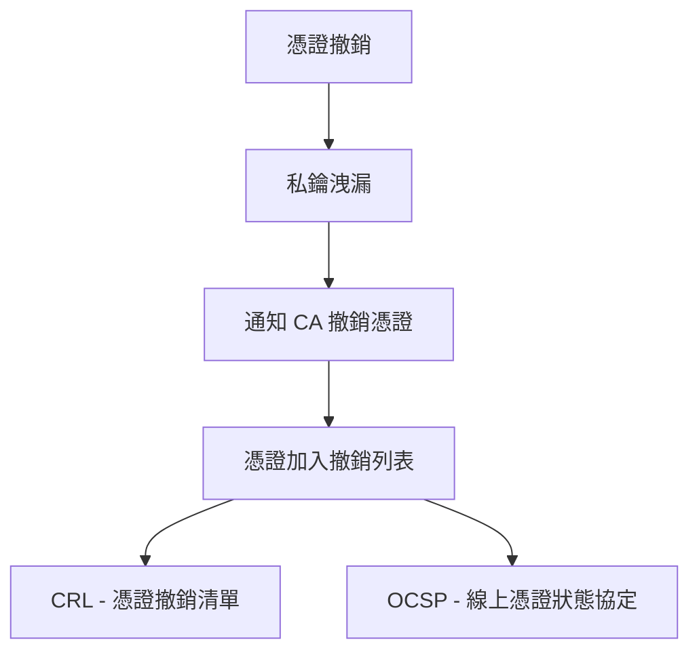
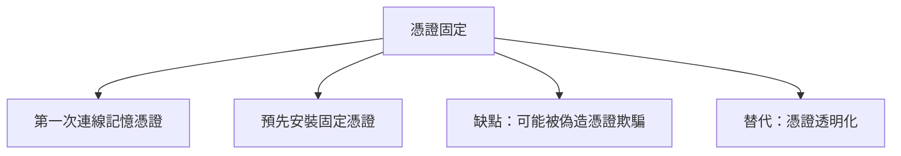
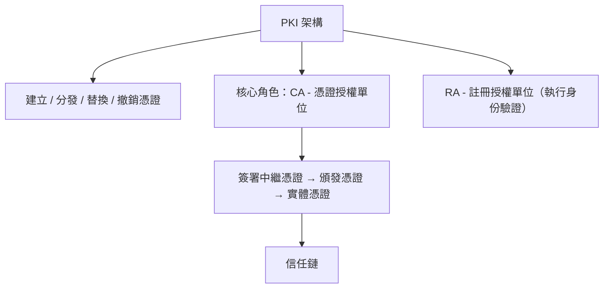
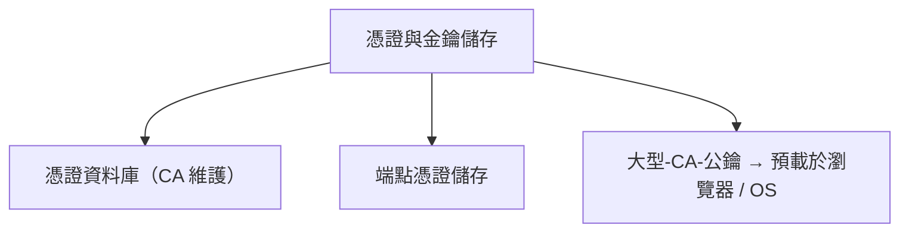
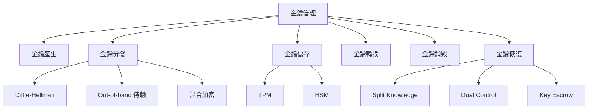

# 數位簽章與憑證

## 數位簽章

數位簽章是一種重要的技術，提供了三個核心功能：**完整性**、**身份驗證**和**不可否認性**。這些功能確保數據的安全性與可信度。以下是數位簽章的常見應用場景：

- **電子郵件**：透過數位簽章，確認郵件內容未被篡改（完整性）、發送者身份真實（身份驗證），並防止發送者否認發送行為（來源不可否認性）。
- **程式碼簽署**：例如，從 Apple 下載的軟體更新使用數位簽章，證明來源為 Apple，且傳輸過程中未被修改。
- **法律文件**：在 PDF 等電子文件上簽署數位簽章，讓接收者能驗證簽署者的身份。

### 數位簽章的核心服務

1. **完整性 (Integrity)**  
   確保訊息或檔案在傳輸過程中未被更改或損壞。

2. **身份驗證 (Authenticity)**  
   確認訊息來源的真實性，讓我們知道發送者是誰。

3. **不可否認性 (Non-repudiation)**  
   防止相關方否認訊息的有效性，分為兩種類型：
   - **來源不可否認 (Non-repudiation of Origin)**：發送者無法否認發送了該訊息。
   - **交付不可否認 (Non-repudiation of Delivery)**：接收者無法否認收到了該訊息。

```mermaid
graph TD
  A[數位憑證來源] --> B[ GiganticCA (ex:DigiCert,Entrust)]
  A --> C[公司內部 CA]
  A --> D[自簽憑證]
  A --> E[X.509 標準]
```

## 數位憑證

數位憑證用來驗證公鑰的所有者，解決了在不安全的網路（如網際網路）上進行安全通訊的問題。如果沒有憑證，收到公鑰時無法確定它是否真屬於目標對象，還是被惡意第三方替換。

數位憑證包含以下關鍵資訊：

- 公鑰所有者的名稱。
- 公鑰的副本。

### 數位憑證的來源與標準

- 數位憑證可以由不同實體創建：

- 大型憑證授權單位 (Certificate Authorities, CA)：如 DigiCert、Entrust 等，這些憑證受到全球信任。
- 公司內部 CA：僅在公司內部有效並被信任。
- 自簽憑證 (Self-signed Certificate)：由個人創建，但只有創建者自己信任。

為了確保不同來源的憑證能夠互通，我們採用 X.509 標準，讓所有憑證具備一致性和互操作性。

### 憑證有效期與替換

憑證通常有效期為 1 至 2 年，到期日會標註在憑證中。到期前或到期後，需創建新的憑證，這稱為定期替換。

### 憑證撤銷 (Certificate Revocation)

數位憑證包含公鑰，而公鑰與私鑰組成一對金鑰對。私鑰必須嚴格保密，不能與任何人分享。如果私鑰洩漏，相關公鑰將不再可信，這時需要撤銷憑證。

撤銷流程如下：

- 私鑰洩漏後，立即通知憑證授權單位 (CA)。
- CA 將該憑證列入撤銷列表。
- 在信任某憑證前，應向 CA 查詢其是否已被撤銷。若已撤銷，則不可信任其公鑰。

查詢憑證狀態的兩種方式：

- **憑證撤銷列表 (CRL) **：CA 提供包含所有已撤銷憑證的列表，客戶端需自行搜尋，效率較低且開銷大。
- **線上憑證狀態協定 (OCSP) **：客戶端查詢特定憑證狀態，CA 直接回應是否有效，效率更高。



### 憑證固定 (Certificate Pinning)

旨在防止攻擊者攔截並偽造憑證。例如，DigiNotar 事件就展示了這種風險。透過固定本地信任的憑證，可提升安全性。

固定方式有兩種：

-       記憶首次連線的憑證：較不安全，因首次可能已被攔截。
-      預裝固定憑證：軟體內預先安裝可信憑證，更安全。

然而，憑證固定存在問題，目前正被 憑證透明化 (Certificate Transparency) 取代。



## 公開金鑰基礎建設 (PKI) 是一套用於創建、分發、使用、儲存、替換和撤銷數位憑證的系統，包括角色、政策、程序與軟硬體。其目標是將公鑰與所有者綁定，並建立通訊信任。

PKI 的核心

- 憑證授權單位 (CA) 是 PKI 的基礎，被稱為信任根。
- CA 使用其私鑰簽署憑證，包含所有者名稱和公鑰。由於私鑰獨一無二，憑證無法被偽造。
- 任何人可使用 CA 的公鑰（通常預載於瀏覽器或作業系統）驗證憑證。

身份驗證與信任鏈

- CA 在頒發憑證前，透過註冊授權單位 (RA) 驗證申請者的身份。
- 為降低風險，CA 的根私鑰通常離線儲存，並用於簽署中繼憑證。中繼憑證再簽署頒發憑證，最終頒發給用戶的實體憑證，形成信任鏈。
- 實際頒發憑證的角色是頒發 CA。

### 憑證管理

-       CA 維護憑證資料庫，記錄所有頒發與撤銷的憑證。
-       端點設備（如電腦、手機）使用憑證儲存安全保存私鑰與相關憑證。





## 金鑰管理

金鑰管理是密碼學中最具挑戰的部分，因為即使系統細節公開，金鑰的安全性仍決定一切。這源自 1883 年柯克霍夫原則。
金鑰管理的關鍵活動

### 金鑰產生 (Key Generation)

#### 隨機生成對稱或非對稱金鑰，避免可預測的模式。

#### 金鑰分發 (Key Distribution)

##### 安全傳輸金鑰給需要的人，方法包括：

-       Diffie-Hellman 金鑰交換：生成共享金鑰而不直接傳送。
-       頻外傳輸：透過其他安全通道發送。
-       混合加密：用公鑰加密對稱金鑰傳送，接收者用私鑰解密。

### 金鑰儲存 (Key Storage)

#### 使用專用硬體確保安全：

-       信任平台模組 (TPM)：內建於設備的小型晶片。
-       硬體安全模組 (HSM)：外部設備，兼具加速加密功能。

##### 金鑰輪換 (Key Rotation)

##### 定期更換金鑰，頻率取決於數據價值與風險。

##### 金鑰銷毀 (Key Disposal)

##### 安全銷毀金鑰，例如用於加密銷毀數據。

##### 金鑰恢復 (Key Recovery)

-       知識分割：多人共享金鑰片段，需合作恢復。
-       雙重控制：多人參與操作恢復。
-       金鑰託管：第三方保存金鑰副本。


