# 實體安全心智圖 (Physical Security MindMap) 超級詳盡介紹與解釋

這份文件旨在提供 YouTube 頻道 "Destination Certification" 上傳的影片 "Physical Security MindMap (9 of 9) | CISSP Domain 3" 的詳盡介紹與解釋 。
本文是 CISSP 考試 Domain 3 中實體安全主題的複習，旨在幫助考生理解各主題之間的關聯性並引導學習 。
這是 Domain 3 系列九個影片中的最後一個。

```mermaid
graph TD

%% 實體安全總覽
A1["實體安全 (Physical Security)"]
A1 --> B1["重要性 (Importance)"]
A1 --> B2["首要目標：人員安全"]
A1 --> B3["五大控制類別"]
A1 --> B4["深度防禦 (Defense in Depth)"]
A1 --> B5["周界安全 (Perimeter Security)"]
A1 --> B6["偵測控制"]
A1 --> B7["存取控制"]
A1 --> B8["延遲控制"]
A1 --> B9["窗戶安全"]
A1 --> B10["側錄 (Skimming)"]
A1 --> B11["基礎設施服務"]
A1 --> B12["火災安全"]

%% 五大控制類別
B3 --> C1["嚇阻 (Deter)"]
C1 --> C1a["標誌 (Signage)"]
C1 --> C1b["環境設計"]
B3 --> C2["延遲 (Delay)"]
C2 --> C2a["鎖"]
B3 --> C3["偵測 (Detect)"]
C3 --> C3a["CCTV 攝影機"]
B3 --> C4["評估 (Assess)"]
B3 --> C5["回應 (Respond)"]

%% 偵測控制
B6 --> D1["CCTV 攝影機"]
B6 --> D2["被動式紅外線感測器"]
B6 --> D3["照明"]

%% 存取控制
B7 --> E1["讀卡機"]
E1 --> E1a["接觸式"]
E1 --> E1b["非接觸式"]
B7 --> E2["識別證"]
B7 --> E3["門與尾隨攻擊"]
E3 --> E3a["尾隨 / 夾帶"]
E3 --> E3b["防尾隨門 / 旋轉閘門"]

%% 延遲控制
B8 --> F1["鎖"]
F1 --> F1a["機械鎖"]
F1 --> F1b["電子鎖"]
F1 --> F1c["密碼複雜性"]

%% 窗戶安全
B9 --> G1["震動感測器"]
B9 --> G2["玻璃破碎感測器"]

%% 側錄
B10 --> H1["ATM 裝置"]
B10 --> H2["RFID 側錄"]

%% 基礎設施服務
B11 --> I1["電力"]
I1 --> I1a["UPS"]
I1 --> I1b["發電機"]
I1 --> I1c["停電類型"]
B11 --> I2["HVAC"]
I2 --> I2a["冷卻與濕度控制"]
I2 --> I2b["空氣過濾與正壓"]

%% 火災安全
B12 --> J1["火災預防"]
B12 --> J2["火災偵測"]
J2 --> J2a["火焰探測器"]
J2 --> J2b["煙霧探測器"]
J2b --> J2b1["離子式"]
J2b --> J2b2["光電式"]
J2b --> J2b3["雙感應式"]
J2 --> J2c["熱感測器"]
B12 --> J3["火災抑制"]
J3 --> J3a["水基系統"]
J3a --> J3a1["濕管"]
J3a --> J3a2["乾管"]
J3a --> J3a3["預作用 / 淹沒"]
J3 --> J3b["氣體系統"]
J3b --> J3b1["Inergen / Argonite / FM200 / FE25"]
J3b --> J3b2["Halon (禁用)"]
B12 --> J4["滅火器"]
J4 --> J4a["A/B/C/D/K 類"]
J4 --> J4b["C 類（CO2）"]
```

// ... existing code ...

## 實體安全的重要性 (Importance of Physical Security)

實體安全對於達成機密性 (Confidentiality)、完整性 (Integrity) 和可用性 (Availability) 至關重要。有一個很重要的說法是：「**如果你能觸摸到那個盒子，你就擁有那個盒子**」。這意味著，如果攻擊者能夠實體存取設備，例如防火牆或伺服器，他們就能輕易地取得該設備的控制權。這是因為我們的設備內建了各種繞過控制的機制，例如原廠重設按鈕。

因此，我們需要仔細控制誰可以存取我們的設施、特定房間和某些設備。實體安全對於達成完整性和可用性也至關重要，因為實體安全控制，例如 UPS (不斷電系統) 和發電機，可以提供乾淨穩定的電力供應。HVAC (暖通空調) 系統則提供適當溫度和濕度的冷空氣。火災偵測與抑制系統有助於確保我們的設施不會燒毀。這些對於達成機密性、完整性和可用性都非常重要。

## 實體安全的首要目標 (Primary Goal of Physical Security)

實體安全有一個最主要且至上的目標，那就是人員的安全 (Safety of People)。人是任何組織中最有價值和最重要的資產，因此實體安全控制必須將人員安全置於一切之上。

## 實體安全的五個控制類別 (Five Categories of Physical Security Controls)

實體安全中有五個主要的控制類別：

- **嚇阻 (Deter)**：嚇阻控制旨在阻止不良事件的發生，例如擅自闖入、財產損失、盜竊和入侵。這可以透過標誌 (Signage) 和建築物及其周圍土地的環境設計 (Environmental Design) 來實現。
- **延遲 (Delay)**：延遲控制旨在拖延風險發生的時間。例如，鎖 (Locks) 可以延遲攻擊者獲得未經授權的存取。
- **偵測 (Detect)**：偵測控制旨在發現風險是否已經發生。閉路電視 (CCTV) 攝影機是偵測控制的完美例子。
- **評估 (Assess)**：評估控制用於確定攻擊的方法和目標。
- **回應 (Respond)**：回應控制採取適當的行動來補救風險。

## 深度防禦 (Defense in Depth)

在實施上述控制時，我們絕不希望單獨實施一個控制。如果只有一個控制保護資產，一旦該控制失效，就會發生糟糕的事情。這就是為什麼我們希望擁有多層次的控制，並且在每一層都結合了預防性 (Preventive)、偵測性 (Detective) 和矯正性 (Corrective) 控制，或者在實體安全方面來說，是嚇阻、偵測、評估和回應控制。這就是深度防禦的概念。

保護設施的第一道防線通常是外部周界 (Outside Perimeter)，例如柵欄。另一道周界將是建築物的外牆 (Exterior Walls)。

## 周界安全 (Perimeter Security)

確保周界安全的最佳方法是最小化入口和出口的數量。

- **景觀設計 (Landscaping)**：指的是建築物周圍的樹木和植物。我們需要確保植物得到維護，以提供清晰的攝影機視野 (Clear Sight Lines for Cameras)，並防止攻擊者輕易地爬樹進入建築物。
- **坡度設計 (Grading)**：指的是建築物周圍的土地傾斜度。我們希望地面朝遠離建築物的方向傾斜，這樣在發生洪水時，建築物就能保持乾燥。

## 偵測控制 (Detective Controls)

- **閉路電視 (CCTV) 攝影機系統 (Closed Circuit Television Camera Systems)**：是實體安全的重要組成部分，既可以作為嚇阻 (Deterrent) 控制，也可以作為偵測 (Detective) 控制，並且可以用於監控和稽核。然而，攝影機主要是偵測控制。
- **被動式紅外線感測器 (Passive Infrared Devices)**：是移動感測器 (Motion Sensors)。它們本質上是非常低解析度的攝影機，可以偵測其視野範圍內物體發出的紅外線 (熱)。如果恆溫動物進入房間，房間內的紅外線量將會增加，從而觸發偵測。這些設備必須在環境空氣溫度變化時自動重新校準。
- **照明 (Lighting)**：是重要的實體安全控制。光線充足的建築物有助於嚇阻犯罪，並且良好的照明對於人員安全非常重要。

## 存取控制 (Access Control)

- **讀卡機 (Card Readers)**：是電子系統，用於控制誰有權通過建築物或建築物內不同房間的門。主要有兩種讀卡機系統：
  - **接觸式 (Contact)**：員工必須滑動卡片通過讀卡機（較舊的磁條讀卡機）。
  - **非接觸式 (Contactless)**：員工只需將卡片靠近 RFID (射頻識別) 系統即可。
- **識別證 (Badges)**：通常是印有員工姓名和照片的卡片。
- **門 (Doors)**：是我們控制誰可以進入建築物和建築物特定部分的主要方式。針對門的社會工程攻擊 (Social Engineering Attack) 稱為尾隨 (Tailgating) 或夾帶 (Piggybacking)。這是指未經授權的人員跟隨已授權的人員通過已解鎖的門。這是一種非常常見且成功的攻擊，可以通過使用特殊門 (Specialized Doors)、防尾隨門 (Mantaps) 或旋轉閘門 (Turnstiles) 來防止。
  - **防尾隨門 (Mantaps)**：是前後相連的兩道門。您必須解鎖第一道門進入一個小空間，關上身後的第一道門，然後才能解鎖第二道門。防尾隨門可以有效防止尾隨或夾帶。

## 延遲控制 (Delay Controls)

- **鎖 (Locks)**：是實體安全中延遲控制的完美例子。攻擊者遲早會撬開、強行破壞或解開鎖並進入，這只是時間問題。由於鎖被視為延遲控制，因此絕不應單獨實施。我們始終需要多層安全或深度防禦。
  - 鎖有很多不同的種類，可以分為兩大類：
    - **機械鎖 (Mechanical Locks)**：例如鑰匙鎖、機械密碼鎖和磁力鎖。
    - **電子鎖 (Electronic Locks)**：例如感應式或 RFID 卡鎖、電子密碼鎖和生物辨識鎖。
  - 決定密碼鎖安全性的最重要因素之一是密碼的複雜性 (Complexity of the Combination)。

## 窗戶安全 (Window Security)

我們喜歡窗戶透進的自然光，但窗戶通常是建築物周界的薄弱環節。窗戶可以使用各種不同類型的玻璃製成，例如平板玻璃、強化玻璃、夾層玻璃、鋼絲玻璃、聚碳酸酯等等。但不需要記憶不同類型的玻璃，而是應該了解幾種可以用於偵測窗戶玻璃是否破損的感測器。

- **震動感測器 (Shock Sensors)**：直接安裝在玻璃面板上，旨在偵測窗戶破碎時產生的微小震動波。
- **玻璃破碎感測器 (Glass Break Sensors)**：本質上是麥克風，持續監聽玻璃破碎時產生的特定音頻。在嘈雜的辦公室中，震動感測器可能更有效。

## 側錄 (Skimming)

側錄是指犯罪分子使用電子設備從合法的交易中竊取卡片資訊。例如，犯罪者在銀行提款機上安裝小型電子設備以記錄您的金融卡號碼，或在銷售終端機上側錄您的信用卡號碼。另一種情況是，攻擊者站在安全門附近，無線記錄員工識別證的 RFID 通訊。

## 主要基礎設施服務 (Major Infrastructure Services)

有三個主要的基礎設施服務對於設施的運作至關重要：網路 (Network)、電力 (Power) 和 HVAC (暖通空調)。

### 電力安全 (Power Security)

現今很難找到不需要電力的設備，也很難想像沒有電子系統的企業如何運作。因此，安全部門非常關心提供一致且乾淨的電力供應。這裡的「乾淨電力」並不是指來自風力或太陽能等再生能源（雖然這些是很棒的電力來源），而是指以完美的 60 赫茲頻率振盪且沒有雜訊或失真的交流電 (AC Power)，它是一個完美的正弦波。

- **不斷電系統 (UPS - Uninterruptible Power Supplies)**：基本上是巨型電池，可以提供即時但短期的電力，直到發電機有時間啟動並上線。
- **發電機 (Generators)**：通常是連接到交流發電機的大型柴油引擎，可以提供長期備用電力，持續數小時甚至數天，具體取決於現場的燃料量以及補充燃料的速度。

實體安全關注各種不同的停電類型：

- **停電 (Blackout)**：長時間沒有電力。
- **故障 (Faults)**：瞬間電力中斷。
- **電力衰減 (Power Degradation)**：電力過低或過高。
- **降壓 (Brownouts)**：公用事業公司有意降低電壓。
- **電壓驟降 (Sags and Dips)**：短時間的低電壓。
- **電壓驟升 (Sures)**：瞬間過高的電壓，例如閃電。

### HVAC (暖通空調) 安全 (HVAC Security)

HVAC 代表暖氣 (Heating)、通風 (Ventilation) 和空調 (Air Conditioning)。這些系統提供建築物所需的空氣，並維持正確的溫度和濕度，同時過濾空氣。資料中心引入冷空氣的主要原因是冷卻設備並確保設備在所需的溫度範圍內運作。HVAC 系統還將提供適當濕度的空氣，以防止過於乾燥導致靜電，以及過於潮濕導致凝結，這兩種情況都不利。ASHRAE (美國供暖製冷空調工程師協會) 定義了理想的溫度和濕度範圍。

- **理想溫度 (Ideal Temperature)**：18 至 27°C。
- **理想濕度 (Ideal Humidity)**：40% 至 60%。

HVAC 系統的最後一個主要功能是過濾空氣，以去除灰塵和其他污染物。在資料中心，空氣被吸入伺服器和其他設備，如果空氣中有污染物，可能會堵塞設備並導致短路或過熱故障。

與空氣品質相關的一個重要概念是正壓 (Positive Pressurization)。這是指將乾淨的過濾空氣以略高於環境壓力的狀態吹入資料中心，從而使資料中心保持正壓。這樣做的目的是，如果牆壁有任何裂縫或有人打開門，乾淨的空氣會被強制排出，防止任何髒空氣滲入。

### 火災安全 (Fire Security)

火災是一個嚴重的風險，與任何其他風險一樣，我們需要採取控制措施來降低火災風險。在實施控制時，我們需要結合預防性、偵測性和矯正性控制，即完整的控制。

- **火災預防 (Fire Prevention)**：預防火災的最佳方法是限制或消除任何可燃材料。然而，我們永遠無法完全預防火災的風險。
- **火災偵測 (Fire Detection)**：如果發生火災，我們希望盡快偵測到。有三種主要的火災偵測方法：
  - **火焰探測器 (Flame Detectors)**：偵測火焰產生的紅外線和紫外線。本質上是指向可能起火點的攝影機。
  - **煙霧探測器 (Smoke Detectors)**：在火災發生之前總會有煙霧，因此盡早偵測火災的最佳方法之一是使用煙霧探測器。主要有兩種煙霧探測器：
    - **離子式 (Ionization)**：對快速燃燒的火焰反應更迅速。
    - **光電式 (Photoelectric/Optical)**：對陰燃火災反應更迅速。
    - 現在大多數優質探測器都是雙感應式 (Dual Detectors)，結合了離子式和光電式探測器。
  - **熱感測器 (Heat Detectors/Thermal Detectors/Rate of Rise Detectors)**：本質上是溫度感測器，監測溫度的快速上升。如果溫度快速飆升，很可能發生了火災。
  - 在上述系統中，離子式煙霧探測器能最早偵測到我們最擔心的快速燃燒的火焰。
- **火災抑制 (Fire Suppression)**：一旦偵測到火災，我們希望盡快撲滅。主要有兩種抑制系統：
  - **水基系統 (Water-Based Systems)**：比氣體基系統便宜，但水和昂貴的資料中心電子設備是糟糕的組合! 水基系統常見於辦公大樓、旅館和其他一些水不會造成巨大損失的場所。有四種類型的水基系統：
    - **濕管系統 (Wet Pipe Systems)**：管道中始終充滿加壓水，隨時準備釋放。這是最便宜的系統，但存在顯著的缺點，例如不能在管道可能凍結的地方使用，並且由於管道中始終有加壓水，因此不可避免地會發生洩漏。
    - **乾管系統 (Dry Pipe Systems)**：外觀與濕管系統相同，但關鍵區別在於管道是乾燥的，充滿加壓氣體，只有在需要時水才會湧入管道。
    - **預作用系統 (Pre-action Systems)** 和 **淹沒系統 (Deluge Systems)**：這兩種系統都使用水來滅火。
  - **氣體基系統 (Gas-Based Systems)**：使用各種氣體來滅火。一些氣體基系統會置換房間內的氧氣。沒有氧氣就沒有火，但也沒有氧氣就沒有人，因此必須有安全系統，以便在釋放某些類型的氣體之前讓人們離開資料中心。另一種氣體基系統滅火的方法是中斷火災的化學放熱過程。需要了解的四種主要氣體是 Inergen、Argonite、FM200 和 FE25。有一種氣體在這裡沒有列出，那就是 Halon。Halon 傳統上用於資料中心，但由於它會破壞臭氧層，因此在全球範圍內被禁用。在考試中不要選擇 Halon，它對環境有害。
- **滅火器 (Fire Extinguishers)**：是隨處可見的紅色設備。有五種不同類別的滅火器：A、B、C、D 和 K。每個類別都用於撲滅不同類型的火災，並使用不同的滅火劑。其中一個需要特別注意的是 C 類滅火器。C 類滅火器專為撲滅電氣火災而設計，這是資料中心可能發生的火災類型。C 類滅火器通常使用 CO2 (二氧化碳) 作為滅火劑。CO2 是在資料中心使用的極佳滅火劑，因為 CO2 不具腐蝕性，不會損壞昂貴的設備，不留殘留物，不導電，並且在不過量使用的情況下對人類是安全的。

## 總結 (Summary)

實體安全是保護組織資產的基石，它不僅關乎防止未經授權的存取，更重要的是確保人員的安全以及系統的機密性、完整性和可用性。透過實施多層次的防禦措施，結合嚇阻、延遲、偵測、評估和回應等控制手段，我們可以有效地降低各種實體安全風險。
