# CCSP DOMAIN 5：雲端營運、IT 服務管理與調查

CCSP Domain 5 涵蓋了管理雲端環境的實務操作層面，從日常維護到服務交付，再到事件發生時的鑑識調查。本文件將深入探討雲端營運、IT 服務管理和調查三大核心領域的關鍵概念。

---

## 1. 雲端營運 (Cloud Operations)

雲端營運 (Cloud Ops) 指的是管理、維護和最佳化雲端基礎設施、應用程式及服務的過程。它涉及的活動包括效能監控、安全管理、合規性與資源最佳化，旨在確保雲端環境的順暢、快速、高效和可靠。透過 Cloud Ops，組織能夠有效擴展和管理資源、維持可用性，並提升整體系統的彈性，進而最佳化雲端投資的效益。

### 1.1. 系統存取方法

系統存取方法主要分為本地存取和遠端存取兩種。

#### 本地存取方法 (Local Access Methods)

提供與雲端設備直接的實體層面互動。這類方法通常用於初始設定或在網路無法存取時進行故障排除。它們賦予系統完全控制權，即使在啟動過程或網路服務停用時也能操作，對於深度層次管理至關重要。

- **KVM (Keyboard Video Mouse)**：透過鍵盤、視訊和滑鼠提供直接硬體層級的存取。這使得使用者能夠如同身處實體機器前一樣，查看視訊輸出、控制鍵盤和使用滑鼠。對於完全控制至關重要，包括在啟動過程中、更新 BIOS 設定或作業系統無回應時。

- **Console Access (控制台存取)**：通常在命令列層級操作，直接連接到系統的控制台介面，例如 COM 埠。它通常是基於文字的，即使網路配置尚未設定或作業系統功能有限也能提供存取。常用於故障排除、系統啟動診斷及其他設定任務。

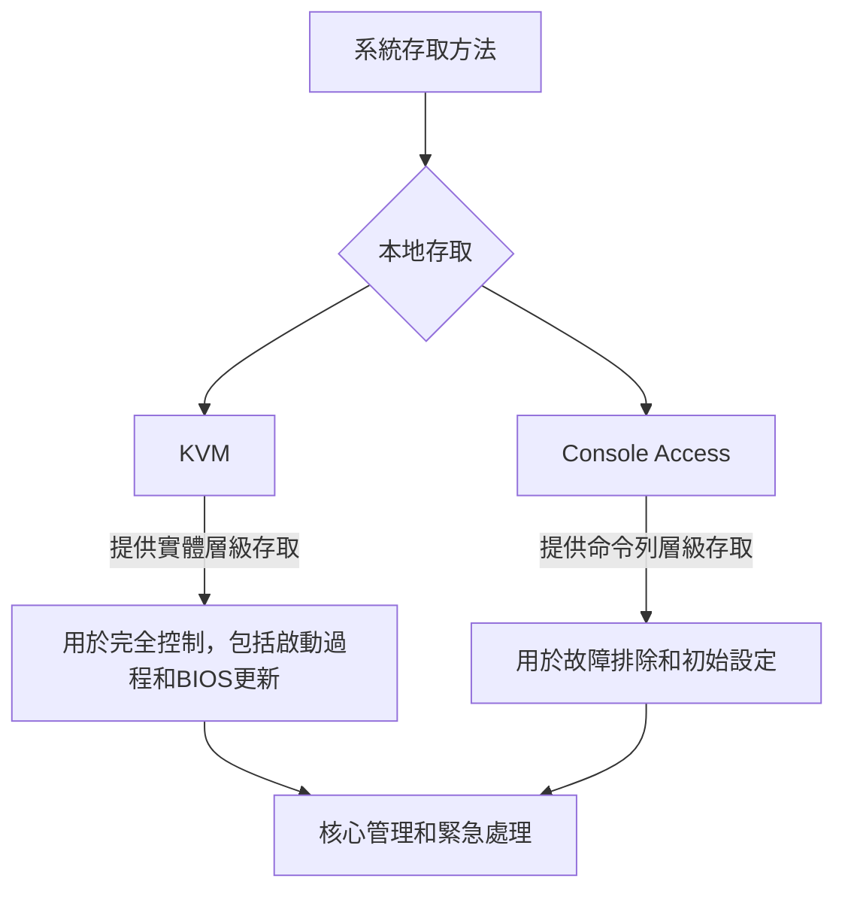

#### 遠端存取方法 (Remote Access Methods)

透過網路安全地連接到雲端設備。這些方法對於日常運營更為高效，而本地存取通常保留給需要直接、不受限制設備互動的特殊情況。

- **SSH (Secure Shell)**：主要用於遠端存取 Linux 或 Unix 系統的安全命令列協定。它啟用網路上的加密通訊，允許您執行命令、傳輸檔案並管理目標機器的配置。

- **RDP (Remote Desktop Protocol)**：主要用於 Windows 系統的圖形遠端存取協定。它提供一個視覺化環境，讓您如同坐在實體機器前一樣，透過圖形使用者介面 (GUI) 互動應用程式、檔案和系統設定。

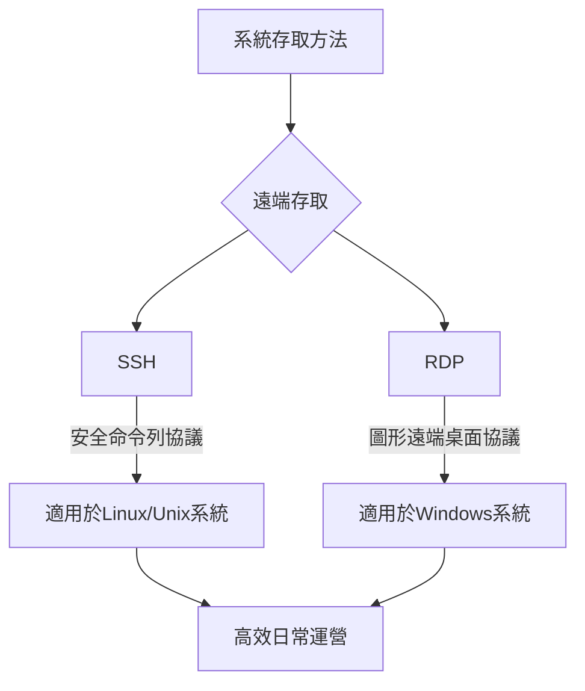

### 1.2. 硬體配置 (Hardware Configuration)

在雲端環境中，硬體配置涉及管理與物理層組件相關的設定。

- **BIOS (Basic Input Output System)**：儲存在主機板記憶體晶片上的韌體。它在系統開機時初始化硬體。在雲端中，BIOS 可用於控制啟動順序、啟用虛擬化擴展、啟用安全啟動或配置電源管理。因此，在雲端中管理 BIOS 仍然很重要。

- **TPM (Trusted Platform Module)**：內建於端點設備（如筆記型電腦或伺服器）的晶片。TPM 用於安全儲存加密金鑰、確保安全啟動並保護端點設備上的敏感資訊。這些晶片需要在硬體層級正確配置。

- **HSM (Hardware Security Module)**：一種物理設備，專為在組織層級而非單一設備上安全儲存和管理加密金鑰而建。HSM 是用於管理加密金鑰的專用硬體設備，且絕對需要在硬體層級正確配置。

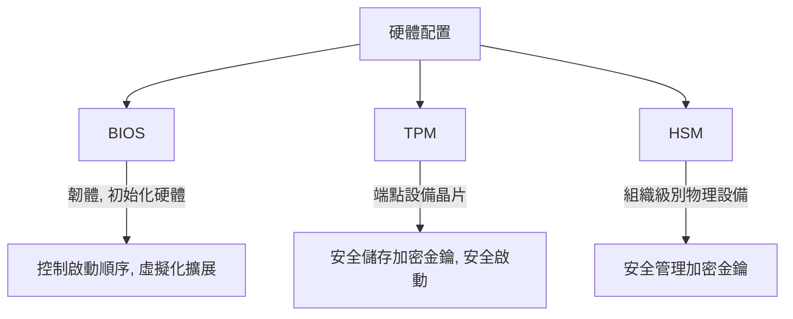

### 1.3. 系統強化 (Hardening)

系統強化是透過減少攻擊面和最小化漏洞來保護系統的過程。這是任何新設備、系統、應用程式、作業系統都必須執行的關鍵過程。新設備交付時並非完全鎖定和安全，需要根據特定環境的需求進行配置。因此，強化是將任何東西鎖定並確保其在生產中保持適當鎖定的關鍵過程。

- **安全基準線 (Security Baselines)**：是強制性的配置設定，旨在確保系統具有安全的控制基礎。它們本質上是一個檢查清單，列出您需要執行哪些操作來鎖定（強化）系統。範例包括禁用不必要的服務、禁用或移除訪客帳戶、安裝所有必要的修補程式。應為每個系統建立基準線，並根據系統在環境中的特定用途進行定制。

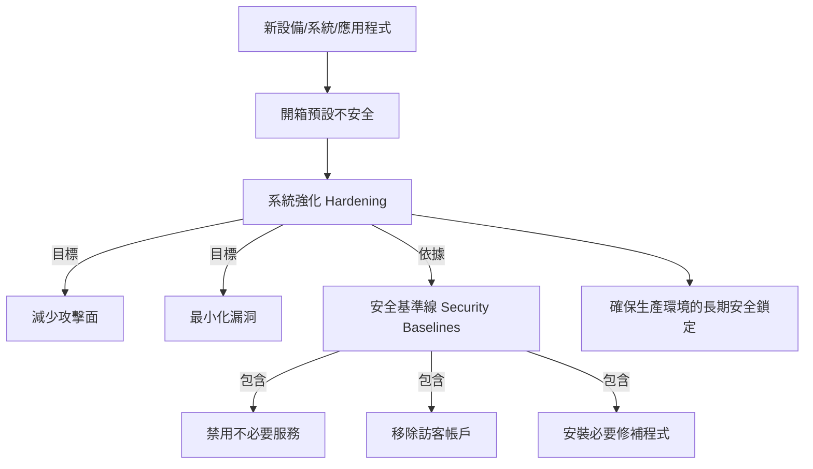

### 1.4. 可用性 (Availability)

可用性當然是指在授權方需要時，我們的資訊是可存取的。這是雲端營運中非常重要的一環。

- **叢集 (Clustering)**：一種實現高可用性的架構選項，涉及多個系統共享工作負載。例如，一組 10 台網頁伺服器位於負載平衡器後方，如果其中一台伺服器故障，仍有其他九台叢集成員運行以提供可用性。

- **冗餘 (Redundancy)**：與叢集不同，冗餘涉及單一主系統和一個或多個次要系統，以便在故障時切換。與叢集不同的是，當主系統在線時，冗餘的次要系統不執行任何工作。

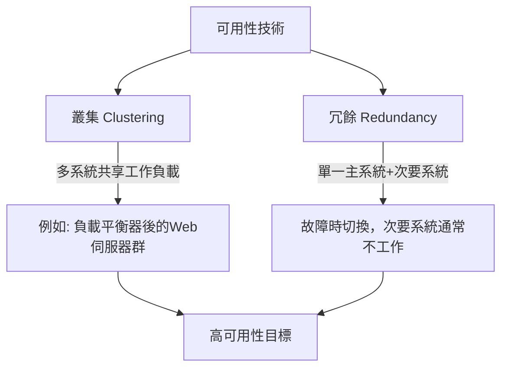

### 1.5. 監控與控制 (Monitoring and Control)

監控和控制是雲端營運的另一項關鍵要求，需要監控和控制雲端中各種系統。

#### 虛擬機器 (VM) 監控

- **Guest OS Virtualization Tool Set (客體作業系統虛擬化工具集)**：這是一個安裝在 VM 作業系統上的軟體代理程式。此工具集可報告 VM 的效能及其他指標，並可用於推送配置變更至 VM。

- **VM Introspection (VM 內省)**：與上述方法非常不同，它允許從 VM 外部監控和分析 VM 的狀態，通常由 Hypervisor 完成。這種方法能夠偵測惡意軟體、未經授權的變更或異常行為，且不依賴於 VM 內部安裝的軟體，從而使這種類型的監控較不易受攻擊者篡改。VM 內省可檢查記憶體、檔案系統和處理活動，是安全監控系統、執行鑑識和合規性管理的強大工具。

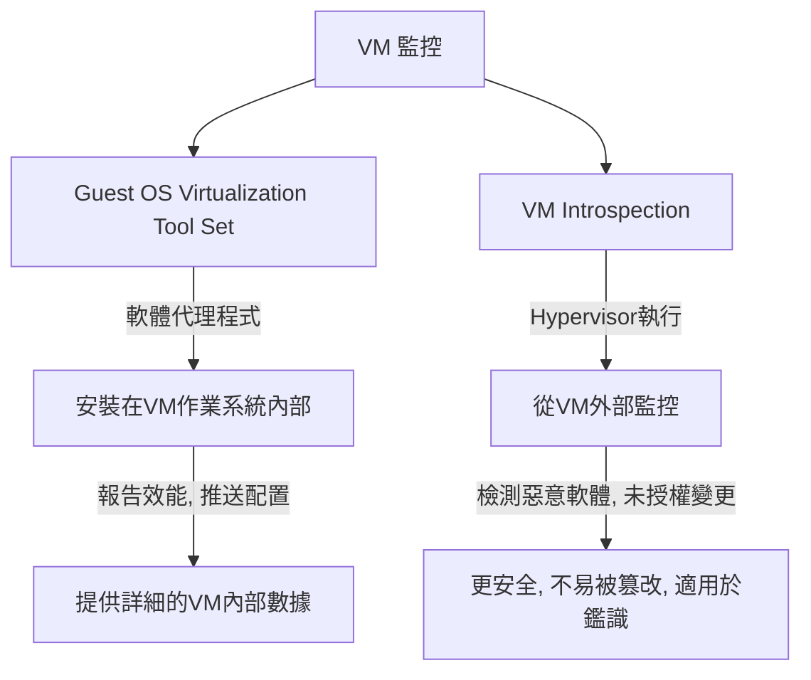

#### 效能監控 (Performance Monitoring)

為確保最佳效能，需要監控一系列指標，包括 CPU 使用率、記憶體使用率、磁碟和網路頻寬。雲端供應商必須確保在其所有設備和服務中監控這些指標。

#### 網路監控 (Network Monitoring)

在雲端中，網路監控對於確保雲端資源的安全性、效能和可用性至關重要。透過追蹤流量模式、延遲、頻寬使用率和潛在異常，組織可以偵測並回應 DDoS 攻擊、未經授權存取和資料洩露等威脅。監控有助於最佳化資源使用、防止中斷並維持合規性。

- **SNMP (Simple Network Management Protocol)**：一種用於網路監控的實用協定。SNMP 可用於監控、管理和配置網路設備，如路由器、交換器、伺服器和工作站。它允許管理員收集即時網路效能數據、偵測問題並接收特定事件的警報。

#### 應用程式效能監控 (Application Performance Monitoring)

- **Real User Monitoring (RUM - 真實使用者監控)**：涉及監控真實使用者如何使用您的系統。您可以監控他們的使用情況、頁面載入時間、可能遇到的常見錯誤，然後解決這些問題。

- **Synthetic Performance Monitoring (合成效能監控)**：涉及建立代理程式模擬使用者操作。與監控真實使用者不同，這裡是建立代理程式來測試應用程式的功能性、可用性及回應時間。

#### 硬體監控 (Hardware Monitoring)

雲端供應商會密切監控各種硬體組件，以確保可靠性、防止故障、處理硬體故障並進行維護，確保整個雲端的高效能。例如，監控設備的各種溫度以防止過熱，並根據溫度變化動態調整風扇速度。電源供應單元被監控以偵測問題並確保能源效率。硬碟健康至關重要，持續分析使用率、讀寫速度、錯誤率和驅動器溫度等指標以預測和避免儲存故障。CPU 和記憶體使用率被追蹤以平衡工作負載並防止資源短缺。網路介面卡的健康、速度和錯誤率被監控以維持可靠連接。備用電池透過不斷電系統 (UPS) 的部分進行健康和充電水準檢查。

### 1.6. 分散式資源排程 (DRS - Distributed Resource Scheduling)

DRS 是一種平衡可用資源與不同客戶需求的方法。如果雲端供應商遇到難以處理的需求高峰，需要機制來在客戶之間共享資源。

- **預留 (Reservations)**：客戶與供應商簽訂協議，保證會分配最小量的資源。例如，他們可能同意一台特定 VM 保證有 8GB RAM。預留可設定用於計算、網路和儲存。預留本質上是一種保證的最低限額。

- **限制 (Limits)**：客戶在計費週期內將被分配到的最大資源量。限制有助於避免因意外或未經授權使用雲端資源而導致巨額帳單。如果您設定了限制並超出，供應商將停止向您提供資源。限制本質上是定義的最大值。

- **共享 (Shares)**：當多個 VM 或應用程式競爭相同資源時，定義資源存取的相對優先級。較高的共享會增加優先級，允許應用程式在爭用情況下存取更多資源。共享僅在存在資源爭用問題時才重要，它們本質上定義了在資源爭用事件中誰擁有優先權。

- **動態最佳化 (Dynamic Optimization)**：根據即時需求和使用模式自動調整資源分配。這有助於透過重新分配未充分利用的資源並回應工作負載變化來最大化效率，無需手動干預。它還有助於確保滿足客戶的預留。例如，如果計算節點資源不足，它可能會被即時遷移到具有更多可用資源的不同計算節點。因此，動態最佳化顯然是雲端服務快速彈性和可擴展性的重要技術。

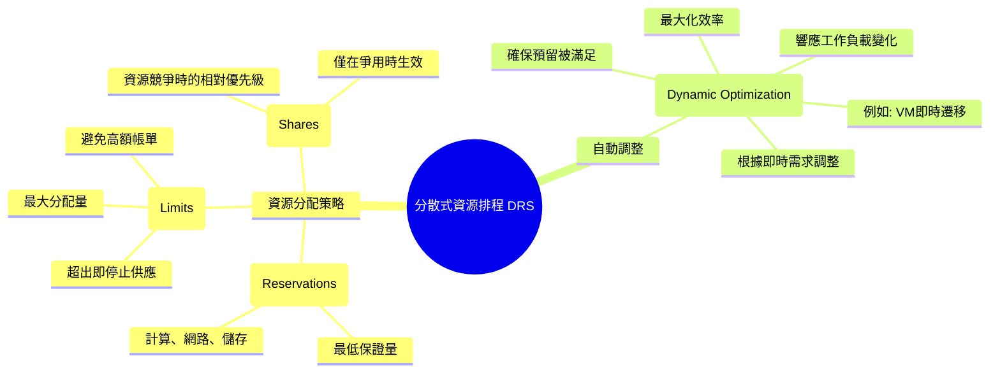

### 1.7. 備份與還原 (Backups and Restoration)

備份和還原是雲端中保護資料免於遺失、損壞和意外刪除的另一項重要操作。由於雲端環境通常託管關鍵應用程式和資料，可靠的備份可確保客戶在硬體故障、網路攻擊或人為錯誤時能夠恢復重要資訊。還原過程允許快速資料檢索和服務連續性，從而最大程度地減少停機時間和潛在的收入損失。定期的備份也支持遵守資料保護政策和法規。簡而言之，備份和還原對於維護雲端中的資料完整性、可用性和可靠性至關重要。

#### 備份內容

當然，備份 VM 中儲存的資料很重要，但我們也需要備份作業系統 (OS) 和 VM 配置。如果需要恢復虛擬機器，則需要備份 VM 的虛擬硬體配置和作業系統配置，因為如果想恢復 VM，需要知道它運行在什麼虛擬硬體上。

#### 備份方法

- **Agent-based backups (基於代理程式的備份)**：涉及在每個 VM 上安裝一個代理程式。安裝在 VM 上的代理程式可以確保資料按要求備份。

- **Agentless backups (無代理程式備份)**：顧名思義，無代理程式備份不涉及在 VM 上安裝任何代理程式軟體。相反，有一個公用程式會遠端登錄系統、備份檔案，然後登出。

- **Snapshots (快照)**：捕獲 VM 在特定時間點的確切狀態和資料，包括其硬碟、卷、記憶體甚至設定上的所有資料。本質上，與 VM 相關的每一位資料都可以被快照捕獲。快照提供快速可靠的 VM 備份方式，可在更新失敗、系統崩潰或資料損壞後輕鬆回滾到先前的狀態。快照對於測試、開發、鑑識和恢復目的特別有用。快照基本上是運行中 VM 及其所有相關資料的時間點捕獲。

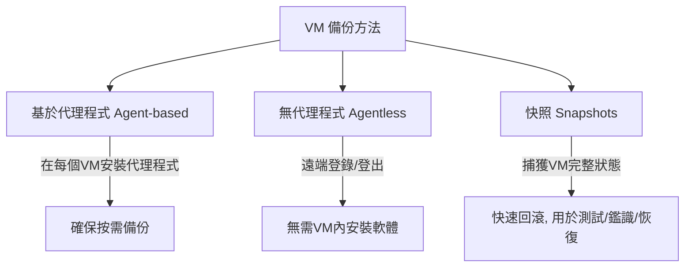

---

## 2. IT 服務管理 (IT Service Management)

IT 服務管理 (ITSM) 專注於設計、交付、管理和改善組織雲端環境中服務的使用方式。在此領域中最著名和廣泛使用的框架是基於 ITIL (Information Technology Infrastructure Library)。ITIL 框架在定義所有主要流程的最佳實踐方面做得非常出色。

### 2.1. ITIL 框架與五大類別

ITIL 流程分為五大主要類別：

1. 服務策略 (Service Strategy)
2. 服務設計 (Service Design)
3. 服務轉換 (Service Transition)
4. 服務運營 (Service Operation)
5. 持續服務改進 (Continual Service Improvement)

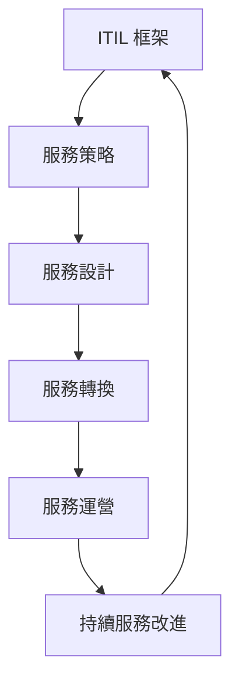

#### 服務策略 (Service Strategy)

專注於將 IT 服務與整體業務目標和目的對齊。如果我們的 IT 安全策略不符合業務的整體需求，那麼方向就是錯的。安全和 IT 的存在是為了幫助業務實現其目標和目的，所以必須與業務目標和目的保持一致。服務策略包括服務組合管理、需求管理、財務管理和業務關係管理。

### 2.2. 服務設計 (Service Design)

服務設計專注於確保服務在設計時考慮到可靠性、可用性、可擴展性和合規性。雲端特定的考量包括選擇最能符合組織效能和法規要求的雲端服務類型、基礎設施、平台、軟體即服務、地理區域和配置。

- **可用性管理 (Availability Management)**：確保雲端服務持續可用和可靠。此過程包括針對雲端環境設計冗餘、故障轉移和高可用性解決方案。

- **容量管理 (Capacity Management)**：涉及規劃以確保有足夠的容量來滿足需求。雲端對於容量管理非常有利，因為其快速彈性和可擴展性意味著我們可以比本地部署模型更容易地應對需求高峰。雲端環境中的容量管理涉及最佳化自動擴展、資源配置和資源分配。

- **連續性管理 (Continuity Management)**：業務連續性和災害恢復計畫，確保關鍵雲端服務在發生中斷時仍能運作或可以快速恢復。

- **服務水準管理 (Service Level Management - SLM)**：專注於簽訂正確的合約。客戶在遷移到雲端之前，必須確保其雲端供應商能夠滿足其要求，這至關重要。因此，服務水準管理專注於確保簽訂具備正確條款的合約，然後監控並強制執行這些要求。請記住，客戶對其遷移到雲端的一切仍負有責任，因此最終取決於客戶確保其要求由服務供應商滿足。

#### 2.2.1. 合約類型 (Contract Types)

服務水準管理中可以使用多種不同的合約。

- **SLA (Service Level Agreement - 服務水準協議)**：是雲端供應商與其客戶之間的正式合約，定義了預期的服務和安全水準，包括正常運行時間、效能、加密、存取控制、事件響應、漏洞管理等。SLA 還指定了可測量的指標，並概述了如果供應商未能達到約定標準的懲罰或補償。

- **PLA (Privacy Level Agreement - 隱私水準協議)**：專注於如何在雲端處理個人資訊和敏感資料，以符合隱私法規並保護客戶資訊。

- **OA (Operational Agreement - 操作協議)**：是雲端服務供應商內部的協議，定義了維護安全標準以支持 SLA 和 PLA 的職責和流程。儘管客戶無法直接看到 OA，但對於雲端服務供應商內部的一致性以滿足客戶要求至關重要。

- **可協商合約 (Negotiable Agreements)**：通常只由較小的雲端供應商提供或在特殊情況下。這基本上意味著供應商願意與客戶協商合約條款。

- **不可協商合約 (Non-negotiable Agreements)**：顧名思義，不可協商。主要的雲端供應商通常不願協商其條款，而是只會提供標準合約，由您選擇是否簽署。不可協商合約更為常見。

- **點擊包裝合約 (Click Wrap Agreements)**：在雲端中非常常見。這些是數位合約，使用者透過點擊「我同意」或類似按鈕來接受，通常是在註冊或使用雲端服務時。這些點擊包裝合約概述了服務條款，包括使用權限、資料處理和責任限制。只要清晰呈現且使用者有機會審查，它們就具有法律約束力並可執行。

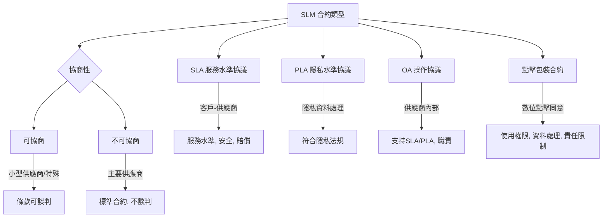

### 2.3. 服務轉換 (Service Transition)

服務轉換專注於將服務移入雲端或從一個雲端供應商遷移到另一個。它涵蓋變更管理、配置管理和知識轉移，以確保順利轉換，包括準備使用者和管理與變更相關的任何風險。

- **變更管理 (Change Management)**：涉及制定特定的流程和監督機制來進行變更。這有助於限制進行變更並意外搞垮系統的風險。

- **配置管理 (Configuration Management)**：專注於確保我們擁有所有資產的準確庫存，並確保所有這些資產都得到正確配置。

- **發布與部署管理 (Release and Deployment Management)**：當我們發布新服務和功能時，需要非常小心。此過程涉及協調、文件和培訓等，以確保發布順利。

### 2.4. 服務運營 (Service Operations)

服務運營專注於服務上線後，維持和支援雲端服務。

#### 修補程式管理 (Patch Management)

修補程式管理是一個主動的過程，用於創建一個持續配置的環境，使其能防禦已知漏洞。需要及時修補軟體以確保其安全。

##### 監控修補程式級別的方法

- **Agent-based monitoring (基於代理程式的監控)**：在每個設備上安裝一個小型軟體組件（代理程式）來監控和報告該設備的狀態。代理程式可提供實時數據和更深入的洞察，因為它直接在系統上運行，使其成為詳細、頻繁更新和複雜環境的理想方法。

- **Agentless monitoring (無代理程式監控)**：不需要在每個設備上安裝軟體。相反，它們使用 SSH 或 WMI (Windows Management Instrumentation) 等協定從中央位置掃描系統。無代理程式部署較快，但根據權限和系統配置，可能對某些數據的訪問有限。

- **Passive monitoring (被動監控)**：透過觀察網路流量或系統日誌來推斷修補狀態，而無需主動掃描或在您要檢查修補程式級別的系統上安裝軟體。被動監控侵入性較低，但也不如其他方法全面。常用於識別明顯的修補程式漏洞，而非詳細的合規性。此方法在主動掃描可能中斷服務的環境中也很有用。

##### 部署修補程式的方法

- **手動修補 (Manual Patching)**：需要 IT 管理員手動下載、測試和安裝修補程式。這使得 IT 管理員可以完全控制更新的時間和選擇，使其成為關鍵系統的理想選擇，在這些系統中，修補程式必須經過徹底驗證以避免中斷。然而，手動修補可能非常耗時，並可能導致延遲，從而增加未修補漏洞的風險。

- **自動化修補 (Automated Patching)**：使用軟體工具自動應用修補程式，通常按計畫或更新可用時立即進行。這種方法確保修補程式應用得更快、更一致，從而降低未修補漏洞的風險。雖然自動化修補效率高，但更有可能導致問題。自動化修補需要仔細配置以避免停機等問題。它可能不適用於所有系統，特別是那些需要自訂更新或在修補前進行大量測試的系統。

##### 修補時的考量

- **時區 (Time Zones)**：在系統和使用者遍布全球的全球化世界中，修補程式的規劃變得更複雜。通常，修補程式的部署必須在一天中的不同時間錯開，以便在每個時區的理想時間進行部署。

- **即時啟動間隙 (Instant-on Gaps)**：如果 VM 休眠了六個月，當您重新啟動它時，它將缺少過去六個月的修補程式，這意味著它可能無法防禦最新的威脅。這被稱為修補程式間隙，通常稱為即時啟動間隙。解決此問題的兩種主要方法是：在修補週期期間喚醒所有 VM 以確保它們已修補，或者當您喚醒休眠 VM 時，立即將其隔離，安裝必要的修補程式，然後再將其從隔離區中取出。

#### 事件管理 (Incident Management)

是偵測、響應和解決可能影響雲端服務的事件（如中斷、效能問題或安全漏洞）的過程。事件管理涉及識別問題的根本原因、減輕其影響並盡快恢復正常服務操作。雲端事件管理通常利用自動化監控警報和預定義的工作流程來簡化響應。事件管理的一個關鍵部分是從事件中學習，並找出可以進行哪些改進以防止此類事件再次發生。

#### 問題管理 (Problem Management)

在雲端中，問題管理專注於識別和解決重複發生事件的根本原因，以防止它們在未來再次發生。與事件管理（關注即時響應和恢復）不同，問題管理通常是主動和調查性的。問題管理涉及分析模式、進行根本原因分析以及實施雲端環境中問題的永久解決方案或變通方法。預防勝於治療。

### 2.5. 持續服務改進 (Continual Service Improvement)

持續服務改進管理涉及衡量服務績效、識別改進機會並實施增強功能。它旨在不斷提高 IT 流程和服務的有效性和效率。如果我們不持續改進，那麼我們就沒有盡力推動業務向前發展。

---

## 3. 調查 (Investigations)

### 3.1. 鑑識科學原則與方法

#### 保護現場 (Securing the Scene)

最重要的第一步是保護現場，建立周邊以防止未經授權的人員進入現場，以避免證據遺失或污染。保護現場至關重要，因為一旦證據被污染，就無法去污染。保護數位犯罪現場特別具挑戰性，因為我們希望盡可能多地保留證據，但又要平衡阻止正在進行的洩露等事情。

#### 證據來源 (Sources of Evidence)

- **口頭或書面陳述 (Oral or Written Statements)**：證人告訴調查員他們目睹或寫下的內容。

- **文件 (Documents)**：調查員可以找到的任何筆記、檔案等。

- **數位鑑識 (Digital Forensics)**：以科學方式檢查和分析來自儲存媒體的資料，以便資訊可用作法庭上的潛在證據。

  - **快照 (Snapshots)**：如果發生需要調查的事件，我們不能直接向雲端供應商索取他們的物理硬碟進行鑑識分析。相反，我們可能會對 VM 進行快照，快照本質上是 VM 在時間上凍結的副本。快照對於數位鑑識非常有用。

  - **即時證據 (Live Evidence)**：最具挑戰性且重要的數位證據類型之一，指儲存在系統揮發性記憶體中的任何資料，例如 RAM 和 CPU 的快取和暫存器。從物理系統恢復即時證據需要專門工具，且任何即時證據在系統斷電時都會丟失。從虛擬機器恢復即時證據更容易，只需拍攝快照。

  - **雲服務供應商數據 (Cloud Service Provider Data)**：在雲端中，調查事件時，可能可以查看來自雲服務供應商的數據，例如配置資訊（VM 類型，包括 CPU、記憶體和儲存資源，有助於識別異常變更或配置），網路元數據（虛擬私有雲配置、子網、路由表和網路安全組規則，可指示潛在的錯誤配置或未經授權的網路變更），身份存取管理元數據（可告訴您授予使用者、角色和群組的權限等），甚至儲存容器或加密元數據。雲端供應商擁有大量關於其環境配置的資訊，這些數據對於調查非常有用。

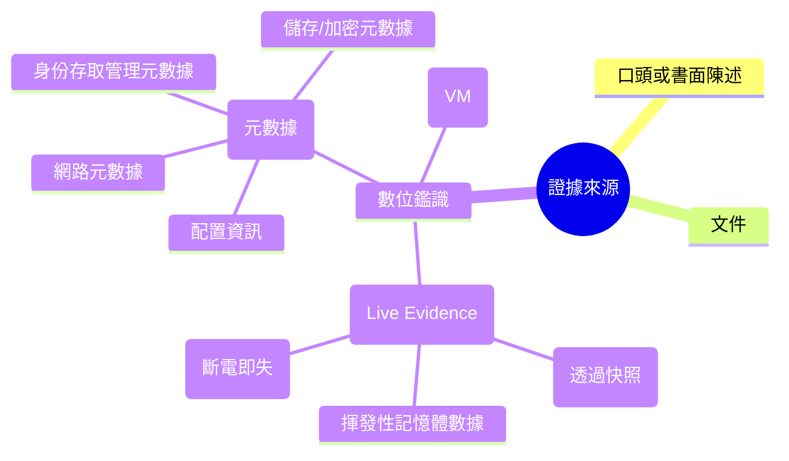

#### 電子發現 (eDiscovery)

是識別、收集和產生電子儲存資訊以用於法律訴訟的過程。

- **ISO 27050**：一個重要的國際標準，與電子發現相關。ISO 27050 是一套標準，為電子發現提供指導和最佳實踐，涵蓋在法律環境中識別、收集和保存這些電子儲存資訊。

### 3.2. 雲端鑑識的挑戰 (Forensic Challenges in the Cloud)

在雲端進行鑑識可能具有挑戰性，因為您通常比在本地環境中控制更少。您的雲端供應商對您調查的支援將根據服務模型而異。

- **SaaS (Software as a Service)**：在 SaaS 模型下，您的選項極其有限。作為客戶，您基本上必須完全依賴雲服務供應商來執行任何形式的鑑識調查。

- **PaaS (Platform as a Service)**：作為客戶，您有更多控制權。您當然必須依賴雲服務供應商提供底層基礎設施，但您負責應用程式日誌和您部署的任何應用程式程式碼。因此，假設您已在應用程式中內建了適當的功能，您至少可以為您的 PaaS 鑑識調查獲得一些數據。

- **IaaS (Infrastructure as a Service)**：作為客戶，您擁有最大的控制權，執行鑑識調查的能力最強。因此，這是您當然也負有最大責任的服務模型。您可以對您的虛擬系統進行鑑識調查，但您仍需要雲服務供應商的合作，才能調查底層基礎設施（如物理硬體和物理網路設備）或獲取供應商硬碟的影像。因此，IaaS 中的客戶在雲端進行鑑識調查的能力要強得多，但他們仍然嚴重依賴雲服務供應商。

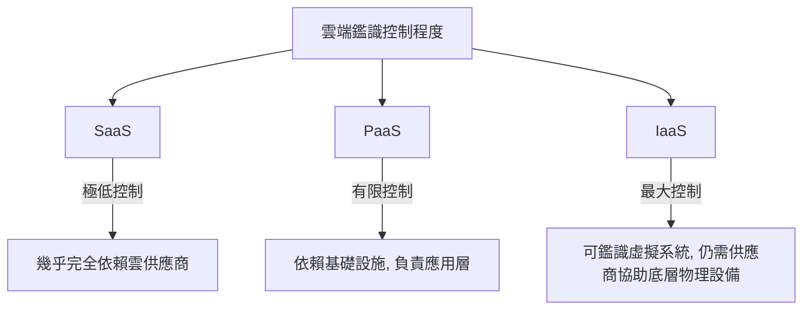

### 3.3. 證據鏈 (Chain of Custody)

證據鏈應與一個詞相關聯：控制。證據鏈是記錄證據在案件整個生命週期中完整旅程的過程，證明從收集的那一刻到可能數年後在法庭上呈現時對證據的控制，從而確保證據的完整性。

### 3.4. 證據的五項規則 (Five Rules of Evidence)

為了使證據被認為有用並在調查中可接受，需要滿足以下五項規則：

1. **真實性 (Authentic)**：您必須能夠將證據追溯到現場，證明證據以相關方式與事件相關。

2. **準確性 (Accurate)**：等同於完整性 (integrity)，您必須能夠證明證據具有完整性。

3. **完整性 (Complete)**：您必須收集所有證據，甚至包括可能幫助澄清嫌疑人的無罪證據。

4. **說服力 (Convincing)**：證據必須具有說服力、可靠且能向陪審團解釋。您的證據收集和分析程序不得對證據的真實性和準確性造成疑慮。

5. **可接受性 (Admissible)**：這是最基本的規則，證據必須能夠在法庭或其他地方使用。

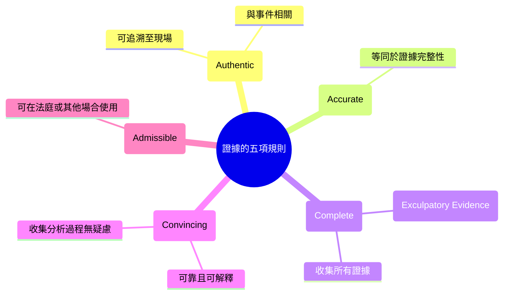

### 3.5. 文件與呈現 (Documentation and Presentation)

任何調查的最後一部分是極其徹底地記錄所收集的證據，並準備將該證據呈現給相關的利益方，例如法官、陪審團、反對派、監管機構、投資者等。
