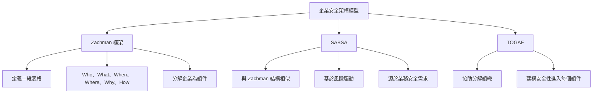
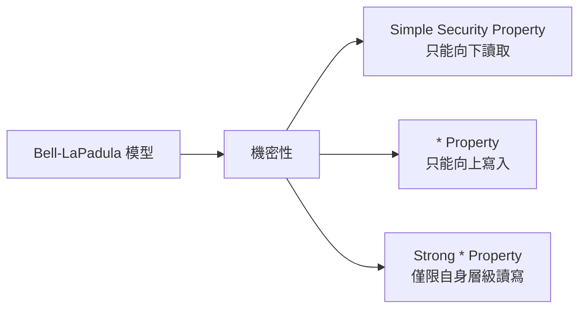
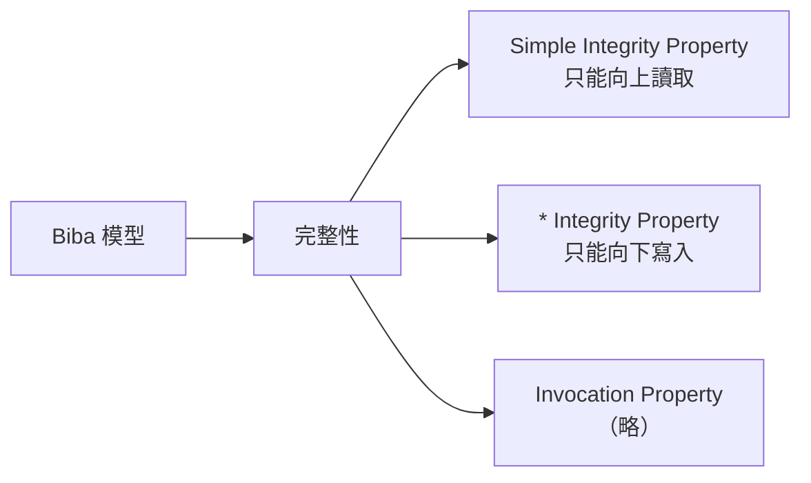
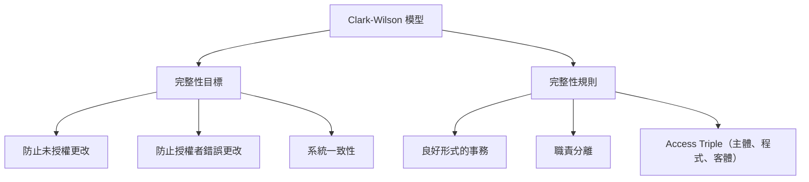
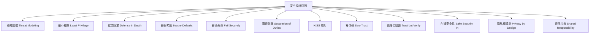
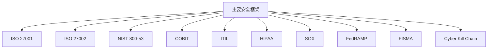
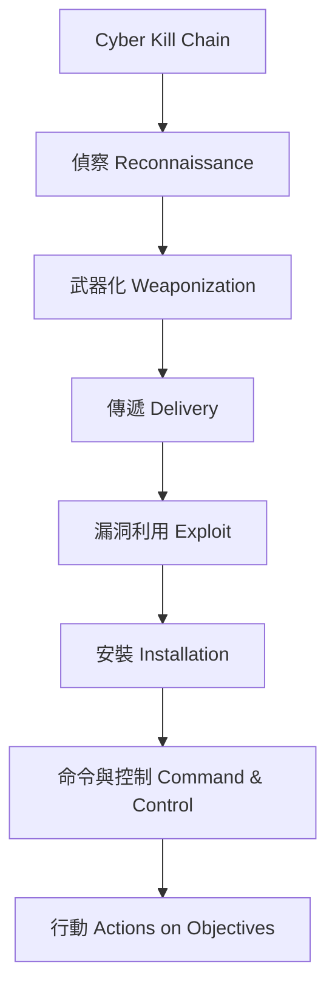

# 模型與框架 (CISSP 領域 3)

## 簡介
- 這是領域 3 的九個mindset的第一個 。
- 這些文件是我們完整的 CISSP 講義的一部分 。

作為安全專業人員，我們需要保護組織的資產，包括人員、數據、系統、流程、網路以及整個企業。
這並非易事，要概念化和思考這些複雜系統和整個組織流程的所有組件非常困難。
安全需求需要融入整個組織 。
那麼，我們該如何解決這個問題呢？ 

- 模型 / 模組是系統性解決問題的方法 。
- 模型是事物的概念性表示，可以縮小和簡化事物 。
- 例如，汽車模型、飛機模型和整個安全架構模型 。
- 模型有助於將複雜系統分解為其組件。
- 一旦我們理解了組成複雜系統的組件，我們就可以保護每個組件，從而解決將安全性融入甚至高度複雜系統的每個方面的問題 。
- 我們將討論各種模型，這些模型可能只關注機密性、完整性或防止利益衝突等等 （即C.I.A: Confidential, integrity, else: note- avaiability may not included in these considerations）。

## 企業安全架構
先從涵蓋整個企業安全架構的模型開始。首先是一些定義：
*   **架構 (Architecture)** 協同工作的一組組件。
*   **安全架構 (Security Architecture)** 保護和確保架構中每個組件安全 。
*   **企業安全架構 (Enterprise Security Architecture)** 如何保護企業的所有組件，包括人員、流程、系統等等 。



三個主要的企業安全架構 ：

*   **Zachman 框架：** 它定義了一個**二維表格**，提供了一種結構化的方式來定義企業，從而將其分解為組件 。
  - Zachman 框架將**如何 (How)、誰 (Who)、何時 (When) 和為何 (Why)** 定義為表格的列，然後將一些「object」定義為表格的行 。
  - note:不需要死記硬背這個表格，只需要知道 Zachman 是一個企業安全架構 。

*   **SABSA (Sherrid Applied Business Security Architecture)：** 它與 Zachman 獨立開發，但具有非常相似的結構 。
  - SABSA 的主要特點是它定義了一個**基於風險驅動的企業安全架構模型**，該模型源於對業務安全需求的分析 。
  - 同樣，不需要記住 SABSA 的具體細節，只需要知道它是一個企業安全架構 。

*   **TOGAF (The Open Group Architecture Framework)：** 正如 Zachman 和 SABSA 一樣，TOGAF 幫助您將組織分解為其組件，以便您可以將安全性構建到每個組件中 。

## 安全模型
主要有兩個分組：**基於格 (Lattice-based)** 和 **基於規則 (Rule-based)** 。


```mermaid
graph TB
    A[安全模型] --> B[基於格 Lattice-based]
    A --> C[基於規則 Rule-based]

    B --> B1[Bell-LaPadula]
    B --> B2[Biba]
    B --> B3[Lipner 實施]

    C --> C1[Clark-Wilson]
    C --> C2[Brewer-Nash (中國牆)]
    C --> C3[Gram-Denning]
    C --> C4[Harrison-Ruzzo-Ullman]
```

### 基於格的模型 (Lattice-based Models)
基於格的模型本質上是指**分層** 。
可以定義機密性或完整性的層級，然後定義關於在層級之間可以讀取或寫入內容的規則，以維持機密性(C)或完整性 (I)。

*   **Bell-LaPadula 模型：** 這是一個**僅關注機密性**的模型 。



  
*   因為它是一個基於格或分層的模型，所以需要定義不同層級的機密性，從較低的機密性到較高的機密性 。
*   該模型定義了控制主體（subject,人員或進程）在這些層級之間可以進行哪些操作的規則 。
    *   **簡單安全屬性 (Simple Security Property)：** 為了維持機密性，**只能讀取自身層級及以下的資訊** 。只能向下讀取 。
    *   **星號屬性 (\* Property)：** 為了維持機密性，**只能將數據寫入自身層級及以上的資訊** 。只能向上寫入 。
    *   **強星號屬性 (Strong \* Property)：** 如果您同時進行讀取和寫入操作，那麼**只能在自己的層級進行** 。
    *   總而言之，Bell-LaPadula 模型完全關於機密性：**只能向下讀取，向上寫入，並在自身層級重寫** 。

*   **Biba 模型：** 這完全關於**完整性**

  
*   請記住 Biba 中的「I」代表完整性 (Integrity) 。
*   同樣，因為它是一個基於層的模型，所以需要定義層級，但在 Biba 中，這些是**完整性的層級：低、中、高** 。
*   該模型定義了控制主體在層級之間可以進行哪些操作以維持完整性的規則 。
    *   **簡單完整性屬性 (Simple Integrity Property)：** 為了維持完整性，**只能向上讀取** 。如果向下讀取，將讀取到意義較小或不太準確的數據，因此只能讀取自身層級或以上的資訊 。只能向上讀取 。
    *   **星號完整性屬性 (\* Integrity Property)：** 為了維持完整性，**只能向下寫入** 。如果您向上寫入，將會破壞更準確的數據，因此只能向下寫入 。請記住，它與 Bell-LaPadula 模型相反 。
    *   還有第三條規則：invocation property，但在CISSP的考試中不需要了解它 。
    *   Biba 本質上是 Bell-LaPadula 的鏡像或相反 。
    *   Biba 中的「I」代表完整性 [8]。

*   **Lipner 實施 (Lipner Implementation)：** 最後要討論的與基於格的模型相關的部分實際上並非一個模型，而是一種實施 。
*   Bell-LaPadula 和 Biba 模型本質上是相互對立的 [8, 9]。因此，如果您想同時維持機密性和完整性，Lipner結合了這些模型，因此它被稱為 Lipner 實施，它結合了機密性和完整性 。

### 基於規則的模型 (Rule-based Models)


*   **Clark-Wilson 模型：** 正如 Biba 一樣，它完全關於**完整性**，但 Clark-Wilson 模型更深入 。它定義了三個完整性的目標 ：
    1.  防止未經授權的主體進行任何更改。
    2.  防止授權的主體進行錯誤的更改。
    3.  維持系統的一致性。
    為了實現這三個目標，它定義了三個規則 ：
    1.  您必須有**良好形式的事務 (well-formed transactions)**。
    2.  您必須有**職責分離 (separation of duties)**。
    3.  您必須有**存取三元組 (access triple)：主體、程式和客體** 。




*   **Brewer-Nash 模型 (也稱為中國牆模型)：** 它有一個目標：**防止利益衝突** [10]。

*   還有一些其他的模型，只需要將其識別為基於規則的模型即可 。
*   **Gram-Denning** 模型定義了允許主體存取客體的規則 。
*   **Harrison-Ruzzo-Ullman** 模型是 Gram-Denning 模型的增強版，它增加了通用權限，但同樣，只需知道它是一個基於規則的模型 。

## 安全設計原則
**其他安全設計原則**。這些原則可以幫助我們安全地設計、實施和運營系統 。
此介紹六個原則，這些原則在其他md中有更詳細的討論，因此我將提供非常簡短的解釋。



*   **威脅建模 (Threat Modeling)：** 是一個系統化的過程，用於識別、列舉和優先排序給定系統中的威脅。威脅建模有助於我們識別系統的所有相關威脅 。相關定義在風險管理篇章（領域 1）威脅建模框架中。
*   **最小權限 (Least Privilege)：** 是將使用者的操作限制在其執行角色所需的那些操作的原則 。
*   **縱深防禦 (Defense in Depth)：** 是指擁有**多層安全控制**，以便在一層失敗（攻擊者突破一層防禦）時，還有額外的層來保護資產 。理想情況下，您希望每一層都有**完整的控制**，即預防性、偵測性和糾正性控制的組合 。
*   **安全預設 (Secure Defaults)：** 是指系統的預設配置設定應該是**最安全的設定** 。例如，如果您購買一個新的防火牆，其預設配置應該是**阻止所有流量**，這是最安全的預設 。
*   **安全失效 (Fail Securely)：** 是指當系統失敗時，它會**失效到更高的安全狀態** 。再次以防火牆為例，安全失效意味著如果防火牆失敗，它將**阻止所有流量** 。相反的是**失效開放 (failing open)**，防火牆失效開放會讓所有流量通過。
*   **職責分離 (Separation of Duties) / 權責分離 (Segregation of Duties)：** 是指完成一項任務需要**多人參與**的原則，以防止錯誤和欺詐 。如果實施了職責分離，則需要**共謀**才能進行欺詐 。
*   **KISS 原則 (Keep It Simple Stupid)：** 這是一個普遍的真理，即漏洞不可避免地隨著複雜性的增加而增加 。因此，保持簡單，更小更簡單的系統將擁有更少的漏洞，並且更容易測試 。這一切都與**機制經濟性 (economy of mechanism)** 有關 。
*   **零信任 (Zero Trust)：** 是指組織不應自動信任其內部或外部的任何事物，而是**驗證任何嘗試連接或存取組織資產的事物** 。**信任無，驗證一切**，這就是零信任 。
*   **信任但驗證 (Trust but Verify)：** 是一個聽起來很相似但重點截然不同的原則 。信任但驗證的想法是，組織不能只關注預防，**您無法阻止所有攻擊** 。因此，「信任但驗證」原則是組織應該關注**完整的控制** 。完整的控制是預防、偵測和糾正的組合 。換句話說，部署預防性控制，但同時假設它們會失敗，因此也要確保您有良好的偵測和回應控制 。
*   **內建安全性 (Bake Security In)：** 將安全控制從一開始就構建到系統中，總是比之後再添加更容易、更便宜且更有效 。
*   **隱私權設計 (Privacy by Design)：** 正是這個概念，只是針對隱私 。**將隱私權納入設計**。隱私權設計實際上是一個包含七項基本原則的完整框架 ：主動而非被動、隱私權作為預設設定等等。
*   **責任共擔 (Shared Responsibility)：** 認識到現在幾乎每個組織都在很大程度上依賴各種服務提供者，例如雲端服務提供者 。大多數組織都非常依賴其服務提供者。如果一個組織的服務提供者沒有良好的安全控制，那麼該組織本身也不可能安全 [14]。因此，組織必須有明確定義的責任和義務，並確保其服務提供者清楚了解其責任 。

## 主要安全框架
現在我們來談談考試中您需要了解的主要**安全框架** 。您需要對其中一個主要框架有相當的了解，那就是 **ISO 27001**。它是世界上**最廣泛使用的安全框架** 。ISO 27001 為 **ISMS (資訊安全管理系統)** 提供了最佳實踐建議 。ISO 在標準的所謂 Annex A 中定義了跨越 14 個類別的 **114 個控制項** 。這些控制項定義了在一個良好運作的安全計畫中您應該採取的**所有最佳實踐**，從最高層的正確安全治理和安全策略，一直到人員培訓、資產管理、存取控制、密碼學、物理安全、網路安全，以及擁有合規職能 。重要的是要記住，ISO 27001 定義了控制項，因此**您可以通過 ISO 27001 認證** 。




另一方面，**ISO 27002** 提供了**資訊安全控制的實務守則** 。換句話說，它是 27001 中控制項的實施指南 。不能通過 27002 自我認證，它只是一個指導文件 。但是，您可以通過其他第三方 27001 認證 。

現在我要談到的接下來幾個安全控制框架，您不需要成為任何一個框架的專家，只需要知道它們主要用於什麼以及主要關注什麼 [16]。

*   例如，**NIST 800-53** 為美國聯邦機構提供了一套安全和隱私控制 [16]。
*   **COBIT (Control Objectives for Information and Related Technologies)** 由 ISACA 的 IT 稽核人員創建，並且由於它是由 IT 稽核人員創建的，因此**特別適用於稽核和保證工作** 。如果您想稽核一個控制項，如果您想稽核某些內容，最好使用 COBIT 控制項 。
*   **ITIL (Information Technology Infrastructure Library)** 定義了一個**將 IT 服務交付與業務目標和目的相一致的最佳實踐框架**。因此，ITIL 特別適用於查看 IT 流程，如變更管理、配置管理、存取管理、事件管理、可用性管理等等。
*   **HIPAA (Health Insurance Portability and Accountability Act)** 可預見地是一個**專注於保護醫療保健資訊**的框架 。
*   **SOX (Sarbanes-Oxley Act)**，我們可以感謝安隆 (Enron) 和世界通訊 (WorldCom) 制定了這項美國聯邦法律 。SOX 要求高層管理人員**個別證明財務資訊的準確性**，如果發現欺詐活動，懲罰將會更加嚴厲 。SOX 的安全方面在於財務記錄必須具有**完整性和可用性** 。
*   **FedRAMP (Federal Risk and Authorization Management Program)** 為雲端產品和服務的**安全評估、授權和持續監控**提供了一種標準化方法 。任何想要使用雲端服務的美國聯邦政府實體，這些雲端服務都必須符合 FedRAMP 標準或獲得 FedRAMP 批准 。
*   **FISMA (Federal Information Security Modernization Act)** 定義了美國聯邦政府機構和承包商的安全要求 。FISMA 要求每個美國聯邦政府機構制定、記錄和實施**全機構範圍的資訊安全計畫** 。
*   我將在這裡討論的最後一個框架是 **網路殺傷鏈 (Cyber Kill Chain)**，有時也稱為網路攻擊鏈 。網路殺傷鏈的基本思想是它定義了常見網路攻擊的七個階段，因此這些階段是鏈條中的環節，安全團隊可以在這些環節阻止、偵測或攔截攻擊者 。**打破鏈條中的一個環節，就沒有網路攻擊** 。您越早打破鏈條，攻擊對組織造成的損害就越小 。網路殺傷鏈的七個階段是：
  
    1.  **偵察 (Reconnaissance)**
    2.  **武器化 (Weaponization)**
    3.  **傳遞 (Delivery)**
    4.  **漏洞利用 (Exploit)**
    5.  **安裝 (Installation)**
    6.  **命令與控制 (Command and Control)**
    7.  **行動 (Actions)**
    請確保您了解這七個階段的順序以及每個階段的高階內容 。




