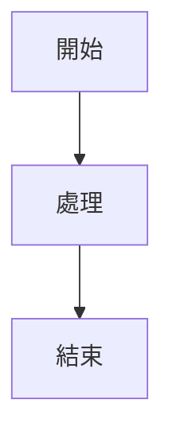

# 🚀 CISSP-Mindset 網站設置指南

## 📋 專案概述

這是一個使用 Jekyll 構建的 CCSP 雲端安全認證學習資源網站，包含：

- **CCSP 內容**: Domain 4 和 Domain 5 的 FAQ
- **Domain 3**: 安全架構相關內容
- **Domain 5**: 營運管理相關內容
- **Mermaid 圖表**: 豐富的視覺化圖表
- **響應式設計**: 支援各種設備

## 🛠️ 技術棧

- **靜態網站生成器**: Jekyll 4.2.2
- **CSS 框架**: Bootstrap 5.3.0
- **圖表庫**: Mermaid.js
- **語法高亮**: Prism.js
- **CI/CD**: GitHub Actions
- **部署平台**: GitHub Pages

## 📁 專案結構

```
cissp-mindset/
├── _ccsp/                 # CCSP 相關內容
│   ├── domain4-faq.md
│   ├── domain5-faq.md
│   └── index.md
├── _domain3/              # Domain 3 內容
│   ├── 1.Models--Frameworks.md
│   ├── 2.Evaluation-Criteria.md
│   ├── 3.Trusted-Computing-Basea.md
│   ├── 4.Vulnerabilities-in-Systems.md
│   ├── 6.Cryptography.md
│   ├── 7.Digital-Signatures--Certificates.md
│   ├── 8.CryptanalysisMindMap.md
│   ├── 9.PhysicalSecurityMindMap.md
│   └── index.md
├── _domain5/              # Domain 5 內容
│   ├── faq.md
│   └── index.md
├── _layouts/              # Jekyll 布局文件
│   ├── default.html
│   ├── page.html
│   └── post.html
├── assets/                # 靜態資源
│   ├── css/
│   ├── js/
│   └── images/
├── .github/workflows/     # GitHub Actions
│   └── deploy.yml
├── scripts/               # 腳本文件
│   ├── setup-jekyll.sh
│   └── test-build.sh
├── _config.yml           # Jekyll 配置
├── Gemfile               # Ruby 依賴
├── package.json          # Node.js 依賴
└── index.html            # 首頁
```

## 🚀 快速開始

### 1. 克隆專案

```bash
git clone https://github.com/your-username/cissp-mindset.git
cd cissp-mindset
```

### 2. 設置 Jekyll 目錄結構

```bash
# 運行設置腳本
chmod +x scripts/setup-jekyll.sh
./scripts/setup-jekyll.sh
```

### 3. 安裝依賴

```bash
# 安裝 Ruby 依賴
bundle install

# 安裝 Node.js 依賴
npm install
```

### 4. 本地開發

```bash
# 啟動開發伺服器
bundle exec jekyll serve

# 或者使用 npm 腳本
npm run serve
```

訪問 `http://localhost:4000` 查看網站。

## 🔧 部署到 GitHub Pages

### 自動部署 (推薦)

1. **推送代碼到 GitHub**

   ```bash
   git add .
   git commit -m "Initial setup for GitHub Pages"
   git push origin main
   ```

2. **啟用 GitHub Pages**

   - 前往 GitHub 倉庫
   - 點擊 "Settings" → "Pages"
   - 在 "Source" 選擇 "GitHub Actions"

3. **檢查部署狀態**
   - 前往 "Actions" 標籤
   - 查看 "Deploy to GitHub Pages" 工作流程

### 手動部署

```bash
# 構建網站
bundle exec jekyll build

# 部署到 GitHub Pages
npm run deploy
```

## 📝 內容管理

### 添加新內容

1. **CCSP 內容**

   ```bash
   # 將 Markdown 文件放在 _ccsp/ 目錄
   cp your-file.md _ccsp/
   ```

2. **Domain 3 內容**

   ```bash
   # 將 Markdown 文件放在 _domain3/ 目錄
   cp your-file.md _domain3/
   ```

3. **Domain 5 內容**
   ```bash
   # 將 Markdown 文件放在 _domain5/ 目錄
   cp your-file.md _domain5/
   ```

### 文件格式

每個 Markdown 文件應包含適當的 front matter：

```yaml
---
layout: page
title: "頁面標題"
description: "頁面描述"
---
```

### Mermaid 圖表

在 Markdown 文件中使用 Mermaid 圖表：

````markdown

````

## 🧪 測試

### 結構測試

```bash
# 運行結構測試
chmod +x scripts/test-build.sh
./scripts/test-build.sh
```

### 本地構建測試

```bash
# 構建生產版本
bundle exec jekyll build

# 檢查構建輸出
ls _site/
```

## 🔍 故障排除

### 常見問題

1. **Ruby 版本問題**

   ```bash
   # 使用 rbenv 或 rvm 管理 Ruby 版本
   rbenv install 3.1.0
   rbenv local 3.1.0
   ```

2. **Jekyll 構建失敗**

   ```bash
   # 清理並重新安裝
   rm -rf vendor/ Gemfile.lock
   bundle install --path vendor/bundle
   ```

3. **Mermaid 圖表不顯示**
   - 檢查圖表語法是否正確
   - 確認 Mermaid.js 已正確載入

### 本地環境問題

如果遇到本地環境問題，可以：

1. **使用 Docker**

   ```bash
   docker run --rm -it -p 4000:4000 -v $(pwd):/site jekyll/jekyll:4.2.2 jekyll serve
   ```

2. **使用 GitHub Actions 構建**
   - 推送代碼到 GitHub
   - 讓 GitHub Actions 處理構建

## 📊 性能優化

### 圖片優化

```bash
# 壓縮圖片
npm install -g imagemin-cli
imagemin assets/images/* --out-dir=assets/images/optimized
```

### 代碼壓縮

```bash
# 壓縮 CSS 和 JavaScript
npm install -g clean-css-cli uglify-js
cleancss -o assets/css/style.min.css assets/css/style.css
uglifyjs assets/js/script.js -o assets/js/script.min.js
```

## 🔒 安全

### 最佳實踐

- 定期更新依賴包
- 使用 HTTPS
- 實施內容安全策略 (CSP)
- 定期備份內容

### 安全檢查

```bash
# 檢查依賴漏洞
bundle audit
npm audit
```

## 📞 支援

### 文檔

- [Jekyll 官方文檔](https://jekyllrb.com/docs/)
- [GitHub Pages 文檔](https://pages.github.com/)
- [Mermaid 文檔](https://mermaid-js.github.io/mermaid/)

### 問題回報

如果遇到問題，請：

1. 檢查 GitHub Actions 日誌
2. 查看 [Issues](https://github.com/your-username/cissp-mindset/issues)
3. 創建新的 Issue 描述問題

## 🎉 完成

設置完成後，您的網站將在以下 URL 可用：

```
https://your-username.github.io/cissp-mindset
```

享受您的 CCSP 學習之旅！ 🚀
