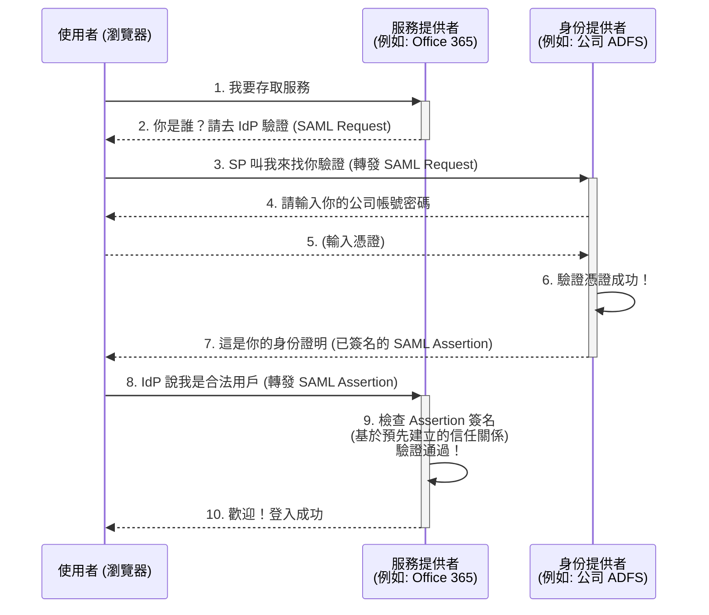
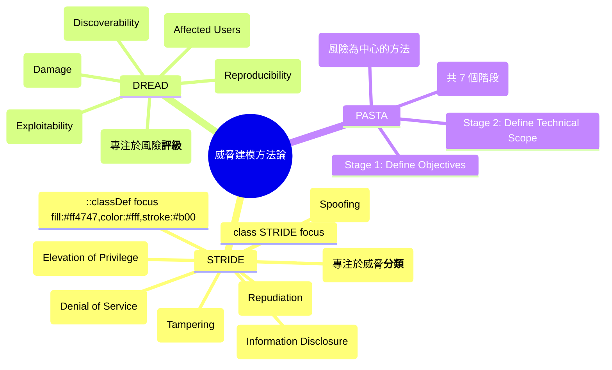
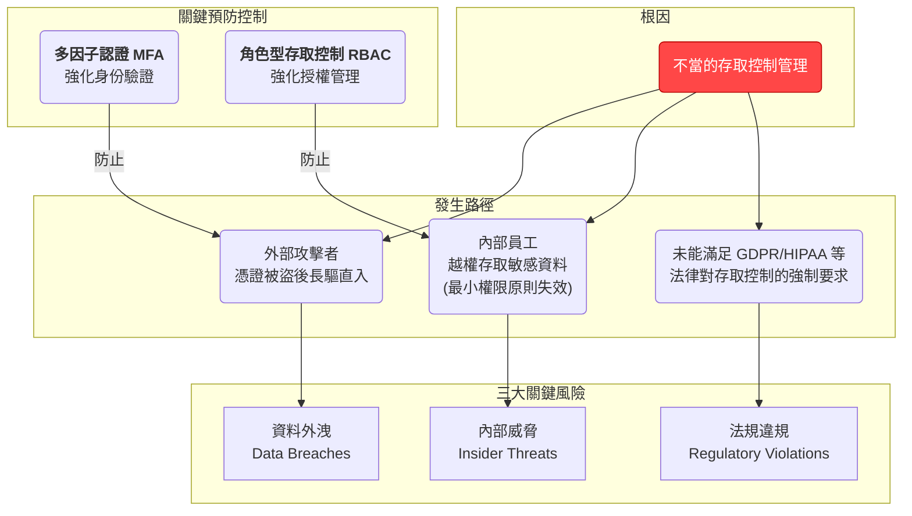
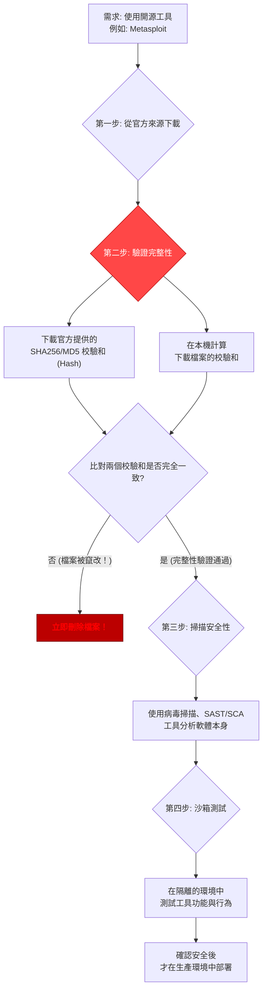

# CCSP Domain 4 - 雲端應用程式安全 FAQ

## 概述

Domain 4 專注於軟體開發生命週期 (SDLC) 中的安全、應用程式架構，以及確保雲端應用程式身份與存取安全的技術。這些題目涵蓋了身份聯盟、加密通訊和威脅建模等核心概念。

---

## 第一組題目：身份聯盟與加密通訊

### 題目 1 & 2：身份聯盟管理 (Federated Identity Management, FIM)

#### 題目 1

**題目：** 在身份聯盟管理中，身份提供者 (IdP) 和服務提供者 (SP) 之間的「信任關係」的目的是什麼？

**分析：**

- **選項 A (使用相同驗證方法)：** 錯誤。聯盟的優點之一正是 IdP 和 SP 可以使用不同的驗證方法。IdP 可能使用複雜的多因子認證，而 SP 只需信任 IdP 的驗證結果即可。
- **✅ 選項 B (允許 SP 依賴 IdP 進行用戶驗證，而無需重新驗證憑證)：** 完全正確。這正是「信任」的核心。SP 信任 IdP 已經做好了用戶身份的驗證工作。當 IdP 向 SP 發送一個包含用戶信息的「斷言 (Assertion)」或「令牌 (Token)」時，SP 基於這個信任關係，直接接受這個結果，而不會要求用戶在 SP 網站上再次輸入密碼。
- **選項 C (限制用戶在其家庭組織內的權限範圍)：** 錯誤。這是授權 (Authorization) 的一部分，通常由 IdP 或 SP 內部的權限系統控制，而非「信任關係」本身的目的。
- **選項 D (強制 IdP 和 SP 位於同一安全域內)：** 絕對錯誤。身份聯盟的設計初衷，恰恰是為了讓跨越不同安全域的組織能夠安全地共享身份信息。

#### 題目 2

**題目：** 在身份聯盟管理中，哪個角色負責驗證使用者身份，並發行一個權杖 (token)，讓使用者可以用來存取不同的組織？

**分析：**

- **選項 A (服務提供者 SP)：** 錯誤。SP 是消耗/驗證權杖的一方，它提供用戶想存取的服務（如 Salesforce, Office 365）。
- **✅ 選項 B (身份提供者 IdP)：** 完全正確。從名字就能理解，IdP 的核心職責就是提供身份。它擁有用戶資料庫，負責驗證用戶的憑證（如密碼、MFA），驗證成功後，生成並簽發一個安全的權杖（如 SAML Assertion 或 JWT），交給使用者。
- **選項 C (資源提供者)：** 這是 OAuth 中的一個角色，指擁有受保護資源（如數據）的伺服器，但驗證身份並發行權杖的是授權伺服器（在 FIM 概念中類似 IdP）。
- **選項 D (存取控制列表 ACL)：** 這是用來定義誰對什麼資源有何種權限的一個具體機制，不是一個角色。

#### 身份聯盟 (FIM) 流程圖解

為了將這兩題的概念串連起來，讓我們用一個典型的 SAML 登入流程圖來解釋 IdP 和 SP 的信任與互動：



**圖解核心：**

- **信任關係的建立 (幕後)：** 在步驟 9 之前，SP 和 IdP 的管理員早就交換了憑證或元數據 (Metadata)，建立了雙向信任。SP 知道如何驗證來自這個 IdP 的簽名，IdP 也知道要將用戶導向哪個 SP。
- **IdP 的職責 (步驟 4-7)：** IdP 是唯一看到用戶密碼的一方，負責實際的驗證工作，並發行已簽名的權杖 (SAML Assertion)。
- **SP 的依賴 (步驟 8-9)：** SP 從不接觸用戶的原始密碼。它完全依賴 IdP 的驗證結果，只需驗證權杖本身的合法性（檢查簽名），這就是信任關係的體現。

### 題目 3：安全通訊 (SSL/TLS)

**題目：** 在 SSL/TLS 交握過程中，使用哪種類型的密碼學來加密將在後續安全會話中使用的「會話金鑰 (session key)」？

**分析：** 這是一個典型的混合加密 (Hybrid Cryptography) 應用場景。

- **選項 A (對稱式密碼學)：** 錯誤。對稱加密使用會話金鑰來加密後續的應用數據，因為它速度快。但它本身無法安全地交換這個會話金鑰。
- **✅ 選項 B (非對稱式密碼學)：** 完全正確。非對稱加密（公鑰/私鑰）的主要用途就是安全地交換金鑰或進行數位簽章。在 TLS 交握中，客戶端會生成一個預備主金鑰 (pre-master secret)，然後用伺服器的公鑰來加密它。只有擁有對應私鑰的伺服器才能解密，從而雙方都能安全地得到這個秘密，並用它生成最終的對稱會話金鑰。
- **選項 C (雜湊)：** 錯誤。雜湊用於驗證數據的完整性 (Integrity)，確保數據未被竄改，但不能用於加密。
- **選項 D (數位簽章)：** 錯誤。數位簽章使用非對稱加密來驗證發送者的身份 (Authentication) 和數據的完整性，但不是用來加密會話金鑰本身。

#### TLS 握手加密流程圖解

```mermaid
flowchart TD
    subgraph A[第一階段: 交涉與身份驗證]
        Client --"1. ClientHello<br/>(我想連線, 我支援的加密套件)"--> Server
        Server --"2. ServerHello<br/>(決定加密套件)<br/>Certificate (我的證書+公鑰)"--> Client
    end

    subgraph B[第二階段: 金鑰交換 (核心步驟)]
        Client_Proc["3. 客戶端:<br/>- 驗證伺服器證書<br/>- 生成一個隨機密碼 (Pre-Master Secret)<br/>- <b>用伺服器的公鑰加密此密碼</b>"]
        Client_Proc --> C_Encrypted["加密後的 Pre-Master Secret"]
        C_Encrypted --"4. ClientKeyExchange"--> Server
    end

    subgraph C[第三階段: 生成會話金鑰 & 完成]
        Server_Proc["5. 伺服器:<br/><b>用自己的私鑰解密</b><br/>獲得 Pre-Master Secret"]
        D{"6. 雙方<br/>各自使用 Pre-Master Secret<br/>通過相同演算法<br/>生成唯一的 Session Key"}
        E[7. 後續所有應用數據<br/>都使用此 Session Key<br/>進行快速的<b>對稱加密</b>]
    end

    A --> B --> C
    style B fill:#ff4747,color:#fff,stroke:#b00
```

**圖解核心：**

- 整個流程的目的是為了安全地協商出一個只有通訊雙方知道的對稱會話金鑰 (Session Key)。
- 最關鍵、體現非對稱加密用途的步驟是 B 階段：利用「公鑰加密、私鑰解密」的特性，在不安全的網路上傳遞了一個秘密 (Pre-Master Secret)。
- 一旦雙方都有了這個秘密，就切換到 C 階段，使用高效的對稱加密來傳輸真正的數據。

### 題目 4：API 安全

**題目：** 哪種協定在使用不同的資料格式（允許 JSON、XML 和其他格式）方面更具彈性，並常用於基於 Web 的 API？

**分析：**

- **選項 A (SOAP)：** 錯誤。SOAP (Simple Object Access Protocol) 是一個非常嚴格的協定，它強制使用 XML 格式，並且有複雜的規範。
- **✅ 選項 B (REST)：** 完全正確。REST (Representational State Transfer) 不是一個協定，而是一種架構風格。它通常基於 HTTP，並且對數據格式沒有嚴格限制，可以使用 XML、JSON、純文本等任何格式。由於 JSON 的輕量和易於解析，RESTful API 絕大多數都使用 JSON，這使其非常靈活且流行。
- **選項 C (WSDL)：** 錯誤。WSDL (Web Services Description Language) 是用來描述 SOAP 服務的語言，本身是 XML 格式。
- **選項 D (UDDI)：** 錯誤。UDDI (Universal Description, Discovery and Integration) 是一個用來發布和發現 SOAP 服務的目錄服務。

### 題目 5：威脅建模 (Threat Modeling)

**題目：** 哪種威脅建模方法論專注於通過分析常見的威脅類別來識別潛在的安全問題？

**分析：**

- **✅ 選項 A (STRIDE)：** 完全正確。STRIDE 是微軟提出的一種威脅建模方法，其名稱本身就是六大威脅類別的縮寫，專門用來引導分析人員從這六個角度去思考系統可能面臨的威脅。
- **選項 B (PASTA)：** 錯誤。PASTA (Process for Attack Simulation and Threat Analysis) 是一個以攻擊者為中心的、七個階段的風險導向方法論，比 STRIDE 更為複雜全面。
- **選項 C (VAST)：** 錯誤。VAST (Visual, Agile, and Simple Threat modeling) 是另一種方法論。
- **選項 D (DREAD)：** 錯誤。DREAD 不是用來分類識別威脅的，而是用來對已識別的威脅進行風險評級的。DREAD 也是一個縮寫，代表 Damage, Reproducibility, Exploitability, Affected users, Discoverability。

#### 威脅建模方法論圖解



**圖解核心：**

- STRIDE 是分類法：它的作用就像一個清單，幫助你檢查系統是否可能遭受這六大類攻擊。當題目問到「威脅類別」時，幾乎總是指向 STRIDE。
- DREAD 是評分卡：當你用 STRIDE 找到一堆威脅後，可以用 DREAD 來為每個威脅打分數（例如 1-10），從而決定修復的優先級。

---

## 第二組題目：微服務架構安全

### 題目 1 & 2：資料保護的最後防線——加密

#### 題目 1

**題目：** 一家公司正在將其敏感客戶資料遷移到雲端環境。除了傳統的安全意識培訓之外，哪種策略最有效地緩解 OWASP Top 10 中的「敏感資料外洩」漏洞？

**分析：** 這題的關鍵是找到針對「資料外洩 (Sensitive Data Exposure)」這個特定風險最直接、最有效的技術控制措施。

- **選項 A (更強的密碼策略) / 選項 B (MFA)：** 這兩者都屬於身份驗證 (Authentication) 控制，作用是「防止未授權的人進門」。它們非常重要，但如果攻擊者透過其他漏洞（例如 SQL Injection）或作為一個惡意內部人員已經「進了門」，這些控制就無法保護門後的資料了。
- **✅ 選項 C (實施靜態和傳輸中資料加密)：** 這是最正確且最根本的答案。加密是保護資料本身的最後一道防線。它的作用是確保即使攻擊者成功繞過所有門禁，拿到了資料檔案（靜態資料）或竊聽了網路流量（傳輸中資料），他們得到的也只是一堆無法讀懂的亂碼。它直接對應「資料外洩」風險，目標就是讓資料即使被「洩漏」出去，也沒有價值。
- **選項 D (更頻繁的安全稽核)：** 稽核是一種偵測性 (Detective) 控制，作用是「事後發現問題」，而不是「事前預防」。

#### 題目 2

**題目：** 一家公司正在將其基於單體式的應用程式重構為微服務架構。在新環境中，哪種策略最有效地緩解可能會加劇的 OWASP Top 10 漏洞？（解釋中已指明是 A3:2017 敏感資料外洩）

**分析：** 這題是上一題的進階版，加入了「微服務」這個關鍵上下文。為什麼遷移到微服務會「加劇」敏感資料外洩的風險？

- 在單體式應用中，不同功能模組間的調用通常是記憶體內的函數調用，速度快且不經過外部網路。
- 在微服務架構中，這些功能被拆分成獨立的服務，服務之間透過網路 API 進行通訊。這導致內部東西向流量 (East-West Traffic) 劇增。每一個 API 請求都意味著資料在網路上「傳輸」。如果這些內部通訊沒有被加密，就給了內部攻擊者竊聽的絕佳機會。
- 因此，傳輸中資料 (Data in Transit) 的風險被極大地放大了。
- **✅ 選項 C (加密傳輸中和靜態的資料)：** 再次成為最佳答案。加密傳輸中資料 (例如，強制所有服務間的 API 調用都使用 TLS/mTLS) 直接應對了微服務架構帶來的最大新風險。同時，保持靜態資料加密依然是基礎要求。
- **選項 A (增加日誌和監控)：** 偵測性控制，無法預防。
- **選項 B (實施強身份驗證)：** 解決「誰在調用」的問題，但無法保護傳輸中的數據內容。
- **選項 D (加強輸入驗證和輸出編碼)：** 這是防禦 SQL Injection (A1) 和 XSS (A7) 的主要手段，與「資料外洩 (A3)」的關聯性較弱。

#### 安全縱深防禦 & 微服務風險圖解

##### 1. 安全縱深防禦 (Defense in Depth)

這張圖解釋了為什麼加密是最後的、也是最核心的保護。

```mermaid
graph TD
    subgraph Layers [安全防禦層級]
        L1[邊界/網路層<br/>(防火牆, WAF)]
        L2[身份驗證層<br/>(<b>密碼/MFA</b>)]
        L3[授權層<br/>(存取控制)]
        L4[應用/主機層]
        L5[資料層<br/>(<b>資料加密</b>)]
    end

    Attacker(攻擊者) --> L1 --> L2 --> L3 --> L4 --> L5 --> Data((敏感資料))

    note right of L2: 作用: 擋住非法用戶進入
    note right of L5: 作用: 即使所有防線被突破<br/>資料本身也是安全的
    style L5 fill:#ff4747,color:#fff,stroke:#b00
```

**圖解核心：** 密碼和 MFA 是重要的「門鎖」，但加密是存放資料的「保險箱」。真正的安全，是既有堅固的門鎖，又有打不開的保險箱。

##### 2. 單體式 vs. 微服務架構風險對比

這張圖展示了為什麼微服務架構加劇了「傳輸中資料」的風險。

```mermaid
graph TD
    subgraph Monolith [單體式應用]
        User1(使用者) --> App1[單體應用程式]
        subgraph InternalCalls [記憶體內部調用]
            App1 --"FunctionA()"--> ModA(模組 A)
            ModA --"FunctionB()"--> ModB(模組 B)
        end
        App1 --> DB1[(資料庫)]
        note right of InternalCalls: <b>安全風險較低<br/>不經過外部網路</b>
    end

    subgraph Microservices [微服務架構]
        User2(使用者) --> API_GW(API 閘道器)
        subgraph NetworkCalls [跨網路 API 調用]
            API_GW --"API Call"--> SvcA(服務A)
            SvcA --"<b>API Call (需加密!)</b>"--> SvcB(服務B)
            SvcA --"<b>API Call (需加密!)</b>"--> SvcC(服務C)
        end
        SvcB --> DB2[(資料庫B)]
        SvcC --> DB3[(資料庫C)]
        note right of NetworkCalls: <b>傳輸中資料風險劇增!<br/>所有 API Call 都需 TLS 加密</b>
        style NetworkCalls fill:#ff4747,color:#fff,stroke:#b00
    end
```

**圖解核心：** 從單體到微服務，最大的變化是大量的內部函數調用變成了外部網路 API 調用。這使得原本在記憶體中安全的數據，現在暴露在網路上，因此端到端的傳輸加密 (End-to-End Encryption) 變得至關重要。

### 題目 3：微服務架構下的存取控制

**題目：** 一家大型電商公司正在將其單體式應用遷移到微服務架構。哪種安全方法能最好地應對 OWASP Top 10 2017 中定義的「破碎的存取控制 (Broken Access Control)」漏洞？

**分析：** 這題再次聚焦於微服務帶來的挑戰，但這次是針對存取控制。

- 在單體應用中，權限控制邏輯可能集中在一個地方。
- 在微服務架構中，如果你有 100 個服務，難道要讓每個服務都各自實現一套用戶權限判斷邏輯嗎？這將導致策略不一致、程式碼重複、更新困難，並且極易出錯——這就是典型的「破碎的存取控制」。
- **選項 A (端到端加密)：** 解決的是資料機密性問題，不是存取控制問題。
- **選項 B (為每個微服務部署 WAF)：** WAF 主要防禦網路攻擊，通常不管應用程式內部的複雜權限邏輯。
- **✅ 選項 C (使用身份提供者集中化身份驗證和授權)：** 這是業界處理此問題的最佳實踐。透過建立一個中央的身份提供者 (Identity Provider, IdP)，所有與身份和權限相關的決策都由它來處理。
  - **流程：** 當一個請求到達微服務時，請求中會攜帶一個由 IdP 簽發的權杖 (如 JWT)。微服務本身不需要知道用戶密碼或複雜的權限規則，它只需驗證這個權杖的有效性，並從權杖中讀取該用戶的角色和權限，然後決定是否執行操作。
  - **好處：** 確保了權限策略的一致性，簡化了各微服務的開發，並且可以集中管理和審計所有權限，完美地解決了「破碎」的問題。
- **選項 D (增加服務間的網路分割)：** 網路分割是一種重要的隔離措施，可以限制攻擊的影響範圍（例如，服務 A 被駭，它也無法訪問服務 C 的網路），但它無法解決授權問題（例如，一個合法的用戶透過服務 A，是否有權限調用服務 B 的某個功能）。

#### 微服務存取控制模型圖解

```mermaid
graph TD
    subgraph Bad [混亂的分散式存取控制 (易破碎)]
        U1(User) --> SvcA1(服務 A)
        SvcA1 --> AuthA{服務 A 的<br/>權限邏輯}
        U1 --> SvcB1(服務 B)
        SvcB1 --> AuthB{服務 B 的<br/>權限邏輯}
        U1 --> SvcC1(服務 C)
        SvcC1 --> AuthC{服務 C 的<br/>權限邏輯}
        note right of Bad: <b>每個服務各自為政<br/>策略不一，管理噩夢</b>
        style Bad fill:#ffdddd
    end

    subgraph Good [集中式存取控制 (推薦模型)]
        U2(User) --> AG(API 閘道器)
        AG -- 攜帶權杖 (Token) --> SvcA2(服務 A)
        AG -- 攜帶權杖 (Token) --> SvcB2(服務 B)
        AG -- 攜帶權杖 (Token) --> SvcC2(服務 C)

        subgraph CentralAuth [中央身份與授權]
            IdP(<b>身份提供者 IdP</b>)
        end

        U2 --"1. 登入"--> IdP
        IdP --"2. 簽發權杖"--> U2

        SvcA2 --"3. 驗證權杖"--> IdP
        SvcB2 --"3. 驗證權杖"--> IdP
        SvcC2 --"3. 驗證權杖"--> IdP

        note right of Good: <b>單一權威來源<br/>策略一致，易於管理</b>
        style Good fill:#ddffdd
        style IdP fill:#ff4747,color:#fff,stroke:#b00
    end
```

**圖解核心：**

- 左邊的混亂模型中，每個服務都有一套自己的權限邏輯，很容易出現不一致和漏洞。
- 右邊的推薦模型中，所有服務都信賴中央的 IdP。它們只做一件事：檢查來自 IdP 的「通行證」（權杖）。所有複雜的權限判斷都在 IdP 集中完成，確保了整個系統的存取控制策略既健壯又一致。

---

## 第三組題目：存取控制風險與應用程式安全

### 題目 1 & 2：存取控制的風險與防護

#### 題目 1

**題目：** 在處理雲端環境中不適當的存取控制管理時，哪種風險組合最為關鍵？

**分析：** 這題問的是「不當存取控制」這個根因會直接導致哪些最嚴重的後果。

- **選項 A (未授權資料存取與網路擁塞)：** 「未授權資料存取」是正確的，但「網路擁塞」通常與效能或 DDoS 攻擊有關，不是存取控制不當的直接、關鍵風險。
- **✅ 選項 B (資料外洩、內部威脅和法規違規)：** 這是最全面且最關鍵的組合。讓我們拆解一下：
  - **資料外洩 (Data Breaches)：** 這是最直接的後果。存取控制失效，外部攻擊者或未授權的內部人員就能竊取敏感資料。
  - **內部威脅 (Insider Threats)：** 存取控制不僅防範外部攻擊，也防範內部人員。不當的控制（如未遵循最小權限原則）會讓合法員工存取到他們職責外的資料，無論是惡意濫用還是無意間的錯誤操作，都會構成內部威脅。
  - **法規違規 (Regulatory Violations)：** GDPR、HIPAA、PCI DSS 等幾乎所有主流法規都對敏感資料的存取控制有嚴格要求。控制不當直接意味著違法，可能面臨巨額罰款和商譽損失。
- **選項 C (合規問題與軟體更新挑戰)：** 「合規問題」是正確的，但「軟體更新挑戰」屬於弱點管理，與存取控制的關聯性較弱。
- **選項 D (增加的營運成本與系統停機)：** 這些都可能是間接後果，但遠不如選項 B 所描述的風險來得直接和致命。

#### 題目 2

**題目：** 一家跨國公司正在將其敏感資料和關鍵應用程式遷移到公有雲環境。在這種情況下，以下哪項代表了多因子認證 (MFA) 實施不當所帶來的最重大風險？

**分析：** 此題的核心是理解 MFA 的主要目的。MFA 用於加強身份驗證 (Authentication)，確保「你就是你所聲稱的那個人」。如果這個環節失效，後果是什麼？

- **✅ 選項 A (跨多個雲端服務對敏感資料的未授權存取)：** 完全正確。MFA 實施不當（例如，可以被繞過、未在所有關鍵端點上強制執行），意味著僅憑一組被盜的憑證（密碼），攻擊者就能成功登入。一旦進入，他們就可以橫向移動，存取與該身份關聯的所有雲端服務和敏感資料。這是最直接、最重大的衝擊。
- **選項 B (因雲端資源管理不善而增加的營運成本)：** 這是間接後果，不是 MFA 失效的直接風險。
- **選項 C (雲端租戶之間的未授權資料共享)：** 這更多是多租戶隔離（屬於雲端平台自身安全）的問題，而非身份驗證的問題。
- **選項 D (因存取控制配置錯誤導致的系統停機)：** 這更可能是授權 (Authorization) 或配置管理的問題，而非 MFA 的問題。

#### 存取控制風險關聯圖解

這張圖展示了「不當存取控制」作為萬惡之源，如何引發一系列災難性後果，以及 MFA 在其中扮演的角色。



**圖解核心：**

- **不當存取控制** 是一個廣泛的概念，它包含了身份驗證（你是誰？）和授權（你能做什麼？）兩個層面的失敗。
- **MFA** 是強化身份驗證的最有效手段之一。如果 MFA 實施不當，攻擊者就能輕易冒充合法用戶，直接導致「未授權存取」和「資料外洩」。
- **RBAC** 等授權策略是確保最小權限原則的關鍵。如果授權混亂，就會導致「內部威脅」。
- 這兩者任何一個的失敗，都可能觸發「法規違規」的嚴重後果。

### 題目 3：應用程式漏洞與防禦

**題目：** 一家雲端服務供應商在其多租戶環境中正經歷日益增多的 XSS 攻擊。哪種策略在有效緩解這些漏洞的同時，能為所有租戶維持最佳效能？

**分析：** 關鍵詞是「多租戶環境」、「有效緩解 XSS」、「維持最佳效能」。

- **選項 A (部署帶有預定義規則的共享 Web 應用程式防火牆 WAF)：** 這是基礎防禦，但「預定義規則」對新型的或經過混淆的 XSS 攻擊可能無效（高漏報率），或者為了安全而過於嚴格，導致誤擋正常流量（高誤報率），從而影響效能。
- **✅ 選項 B (利用基於機器學習的異常偵測與自適應安全控制)：** 這是最先進且最符合題意的答案。在多租戶環境中，每個租戶的應用流量模式都不同。
  - **機器學習/異常偵測：** 可以為每個租戶學習其「正常」流量基線，從而能精準地發現偏離常態的異常行為（如新型 XSS 攻擊），檢測能力更強。
  - **自適應 (Adaptive)：** 意味著安全控制可以根據實時威脅動態調整，而不是一成不變。這能顯著降低誤報率，從而維持最佳效能。
- **選項 C (強制所有租戶使用客戶端輸入淨化函式庫)：** 這是應用開發層面的良好實踐，但作為雲端供應商，無法強制也無法信賴所有租戶都完美實施。安全責任最終仍在供應商。
- **選項 D (為所有應用程式實施嚴格的內容安全策略 CSP 標頭)：** CSP 是防禦 XSS 的強力手段，但它需要在 Web 伺服器或應用層面進行精細配置。在多租戶環境中，一個嚴格的通用 CSP 可能會「弄壞」很多租戶的合法應用功能，管理複雜且影響巨大。

#### 傳統 WAF vs. 智慧 WAF 圖解

```mermaid
graph LR
    subgraph A [傳統 WAF (基於規則)]
        Traffic_In1(用戶流量) --> WAF1{靜態規則庫<br/>if(payload.contains('&lt;script&gt;')) then block}
        WAF1 --"符合規則-->" Block1[阻擋]
        WAF1 --"不符合規則-->" App1[應用程式]
        App1 --> Normal_Out1(正常回應)
        note right of WAF1: <b>優點:</b> 簡單快速<br/><b>缺點:</b> 無法應對未知攻擊<br/>易產生誤報/漏報
    end

    subgraph B [智慧 WAF (基於機器學習)]
        Traffic_In2(用戶流量) --> WAF2{動態分析引擎}
        WAF2 <--> ML[機器學習模型<br/>(已學習各租戶的正常流量基線)]
        WAF2 --"判定為異常(XSS)-->" Block2[阻擋]
        WAF2 --"判定為正常-->" App2[應用程式]
        App2 --> Normal_Out2(正常回應)
        WAF2 -->|回饋新數據| ML
        style ML fill:#ff4747,color:#fff,stroke:#b00
        note right of WAF2: <b>優點:</b> 可偵測未知攻擊<br/>低誤報率，效能影響小<br/><b>自適應調整</b>
    end
```

**圖解核心：**

- **傳統 WAF** 像一個只會對照黑名單的保安，遇到不在名單上的威脅（新型 XSS）就無能為力。
- **智慧 WAF** 則像一個經驗豐富的偵探，它了解每個人（每個租戶）的正常行為模式。任何偏離常態的舉動都會引起它的警覺，並且它會不斷學習，讓自己的判斷越來越準。這在複雜多變的多租戶環境中至關重要。

### 題目 4：軟體供應鏈安全

**題目：** 在雲端環境中實施像 Wireshark 和 Metasploit 這樣的開源安全工具時，最關鍵的安全考量是什麼？

**分析：** 這題問的是使用第三方軟體，尤其是開源軟體時，你的首要安全擔憂。

- **選項 A (評估社群支援的可用性)：** 社群支援對解決使用問題很重要，但它不是一個安全考量。
- **選項 B (評估工具的成本效益)：** 開源工具通常是免費的，這是一個優點，但與安全性無關。
- **✅ 選項 C (驗證工具的完整性與安全性)：** 這是最關鍵、最根本的安全考量。開源軟體意味著源碼公開，但也意味著任何人都可以創建一個帶有後門或惡意程式碼的偽造版本。如果你從非官方渠道下載，或者官方渠道本身被駭，你下載的「安全工具」可能本身就是一個特洛伊木馬。使用一個被竄改過的 Metasploit 無異於直接把駭客請進家門。
- **選項 D (確保與現有雲端服務的相容性)：** 這是一個營運考量，確保工具能正常工作，但排在安全驗證之後。如果工具本身不安全，能用也沒用。

#### 安全獲取開源軟體流程圖解



**圖解核心：**

- **驗證完整性 (Integrity Check)** 是防範供應鏈攻擊的第一道防線。透過比對雜湊值 (Hash)，你可以確保你下載的檔案和官方發布的檔案是逐字逐比特完全相同的，沒有在傳輸過程中被篡改。
- 即使來源可靠、完整性也沒問題，也應該進一步掃描其本身是否存在已知的漏洞（軟體成分分析 SCA），並在沙箱中運行觀察其行為，這構成了深度的供應鏈安全實踐。

---

## 複習重點總結

### 身份聯盟 (Federation) 必須掌握

- **核心角色：** 深刻理解 IdP (驗證身份、發行權杖) 和 SP (信賴結果、提供服務) 的職責。
- **核心目的：** 為了實現單一登入 (SSO)，減少用戶的密碼疲勞，並讓企業能集中管理身份，同時允許安全的跨組織協作。
- **核心技術：**
  - **SAML：** 主要用於企業級的身份驗證和 SSO。
  - **OAuth 2.0：** 主要用於授權，允許第三方應用在用戶同意下，存取特定資源（例如，允許某 App 讀取你的 Google 聯絡人）。
  - **OpenID Connect (OIDC)：** 建立在 OAuth 2.0 之上，增加了身份驗證的功能，更適用於現代 Web 和移動應用。

### 應用程式加密的實踐

- **混合加密是王道：** 牢記 SSL/TLS 握手是混合加密的典範。用慢但安全的非對稱加密來交換金鑰，用快但需要安全通道的對稱加密來傳輸數據。
- **金鑰管理：** 理解金鑰的生命週期管理（生成、儲存、分發、輪換、銷毀）是加密成功的關鍵。

### API 安全架構

- **REST vs. SOAP：** 記住 REST 的核心優勢是彈性、無狀態 (Stateless) 和對多種數據格式的支援 (特別是 JSON)。SOAP 則是更嚴格、功能更全（內建安全標準 WS-Security）的協定。
- **API 安全最佳實踐：** 除了協定選擇，還必須考慮：
  - **API 閘道器 (Gateway)：** 作為統一入口，提供速率限制 (Rate Limiting)、認證、日誌記錄等功能。
  - **認證與授權：** 使用 API Keys, OAuth 2.0 (Bearer Tokens) 等機制保護 API。
  - **輸入驗證：** 絕不信任任何來自客戶端的輸入，防止注入攻擊。

### 安全軟體開發生命週期 (Secure SDLC)

- **威脅建模是前提：** 在寫第一行程式碼之前，就應該進行威脅建模。
- **模型區分：** 清楚區分 STRIDE (用於威脅分類) 和 DREAD (用於風險評級) 的不同用途。這是考試高頻考點。
- **靜態與動態測試 (SAST & DAST)：**
  - **SAST (白箱測試)：** 在開發階段分析原始碼，尋找潛在漏洞。
  - **DAST (黑箱測試)：** 在應用程式運行時，從外部模擬攻擊，尋找漏洞。

### 微服務架構安全重點

- **加密是應對資料外洩的『最後』也是『最直接』的手段：**
  - 要能清楚地區分身份驗證控制 (如 MFA) 和資料保護控制 (如加密) 的不同作用。前者是「防君子進門」，後者是「防小人開箱」。
  - 在思考安全策略時，永遠要問：「如果身份驗證被繞過了，資料還安全嗎？」如果答案是否定的，就需要加密。
- **微服務架構放大了特定的安全風險：**
  - **傳輸中資料風險劇增：** 由於內部通訊網路化，服務間的東西向流量必須全部使用 TLS/mTLS 進行加密。
  - **存取控制變得破碎：** 由於服務數量眾多，必須採用集中式的身份驗證和授權方案來避免策略混亂和管理噩夢。
- **現代雲端應用安全的核心實踐：**
  - **API 閘道器 + 中央 IdP：** 這是微服務安全架構的黃金組合。API 閘道器作為所有流量的入口，可以統一處理認證、日誌、限流等；中央 IdP (使用 JWT/OAuth2.0 等標準) 則作為權限決策的單一來源。
  - **安全左移 (Shift Left)：** 在架構設計階段（例如，決定從單體遷移到微服務時），就必須預先識別出可能被放大的安全風險（如本例中的資料外洩和破碎的存取控制），並將對應的解決方案（如加密和集中式 IAM）納入初始設計中。

### 存取控制與應用程式安全重點

- **存取控制是基石，後果很嚴重：**
  - 必須能清晰闡述不當存取控制與資料外洩、內部威脅、法規遵循失敗之間的直接因果關係。
  - **MFA 是身份驗證的救星：** 它的失效直接導致攻擊者可以輕鬆冒用身份，造成跨服務的未授權存取。
- **Web 應用程式安全 (特別是 OWASP Top 10)：**
  - **XSS 防禦是多層次的：**
    - **伺服器端：** 輸出編碼 (Output Encoding) 是最根本的防禦。
    - **網路層：** WAF 是重要的防線。要能區分傳統 WAF（基於簽名）和智慧/次世代 WAF（基於機器學習/行為分析）的優劣，後者更適合動態、複雜的雲端環境。
    - **客戶端：** CSP (內容安全策略) 是強大的瀏覽器端防禦機制。
  - 在多租戶場景下，要考慮效能和可管理性，這使得自適應、智能化的解決方案（如選項中的機器學習 WAF）更具優勢。
- **軟體供應鏈安全意識：**
  - **零信任原則的延伸：** 不僅不信任網路，也不信任你所使用的軟體，直到你驗證過它。
  - **開源軟體的首要安全步驟：** 永遠是驗證其來源的可靠性和檔案的完整性 (Integrity)。必須養成從官網下載、並檢查雜湊值 (Hash) 或數位簽章的習慣。
  - **軟體成分分析 (SCA)：** 是進階的供應鏈安全實踐，用於分析你使用的軟體（包括開源函式庫）中是否包含已知漏洞的組件。

---

**希望這份針對性的解析能幫您釐清觀念，鞏固 Domain 4 的知識！**
