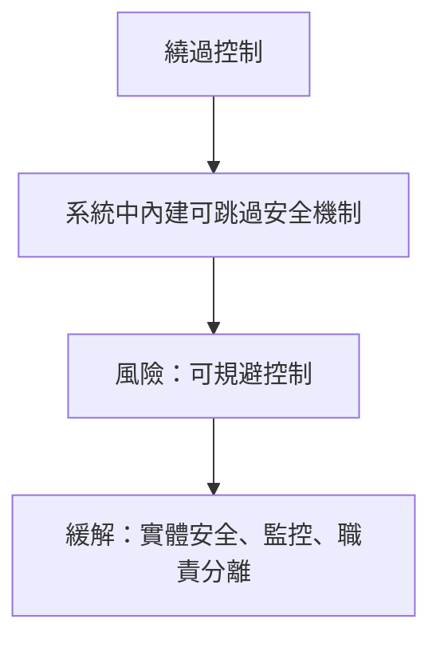
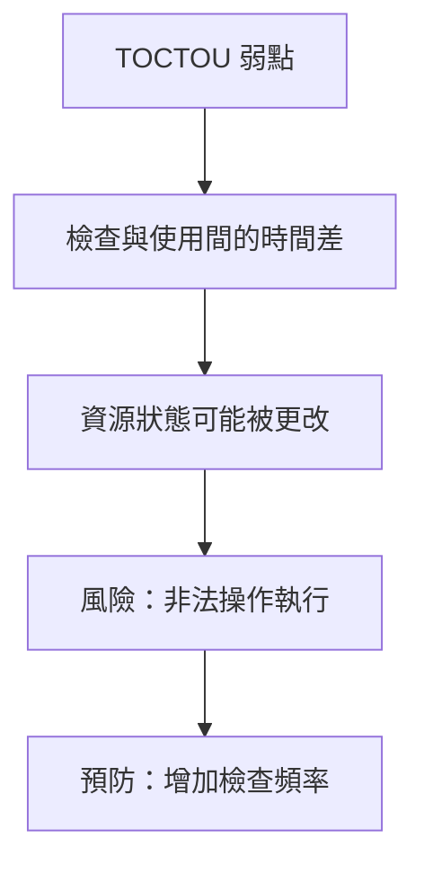
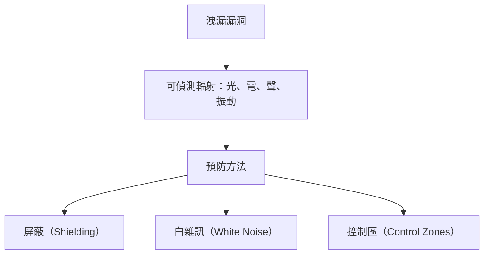
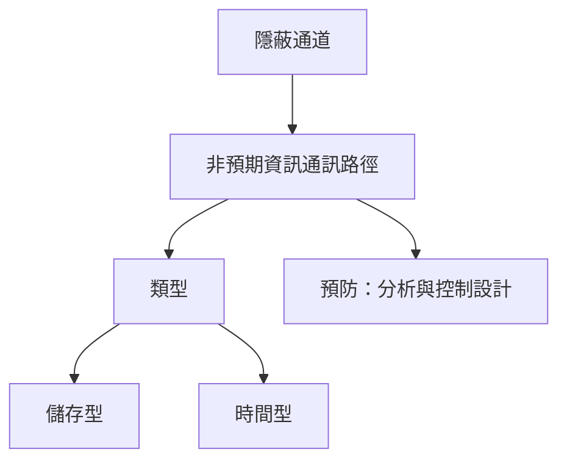
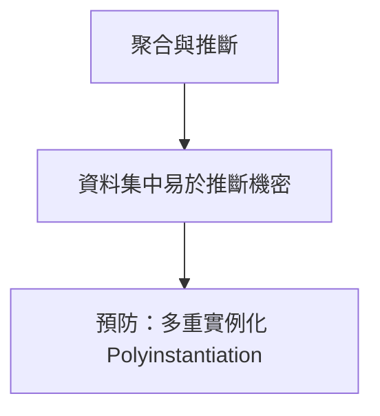
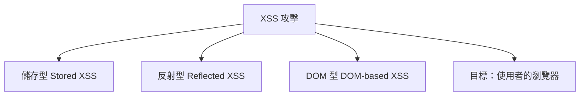
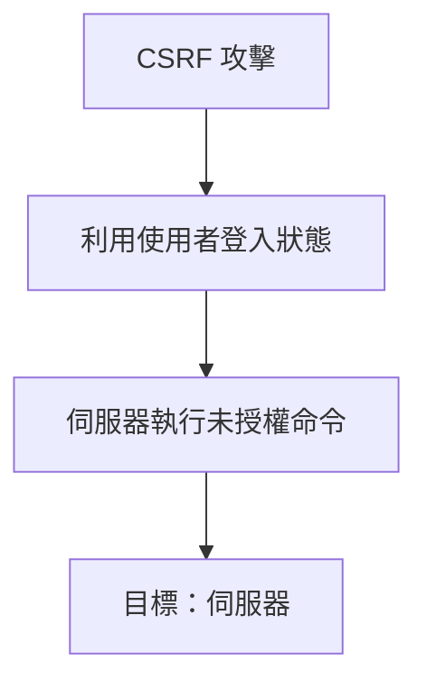
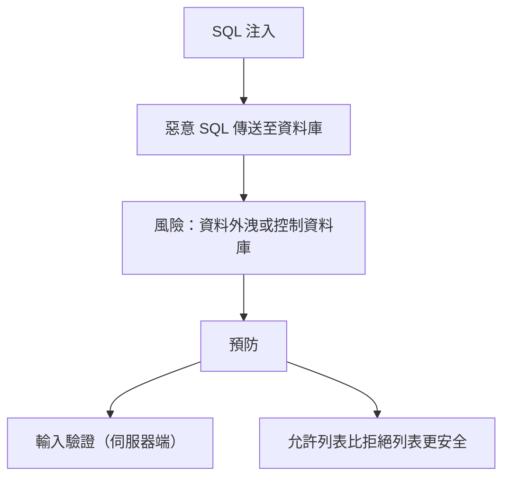
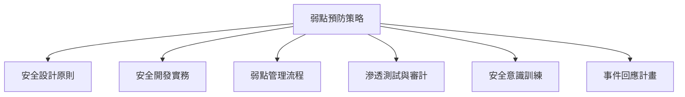

# 系統中的弱點 (Vulnerabilities in Systems) 詳細解釋與指南

**弱點在建構和運作複雜系統時不可避免地會出現** [1]。即使是一行程式碼也可能存在弱點，更不用說數十萬甚至數百萬行程式碼以及眾多相互連接的系統 [1]。作為安全專業人員，理解弱點通常發生在哪裡，以及如何設計和開發系統以預防這些弱點至關重要 [1]。我們必須確保參與設計、開發、部署和運營流程的人員具備正確的知識和培訓 [1]。

以下將說明一系列常見的系統弱點以及如何預防它們：

## 常見的系統弱點

### 單點故障 (Single Points of Failure)

- **定義：** 較大系統中非冗餘的部分，如果其中一個單點故障失敗，則整個系統將停止運作 [2]。
- **範例：** 只有一個路由器或一個防火牆，所有進出網際網路的流量都必須通過它。單一防火牆或路由器的故障將導致所有網際網路連線中斷 [2]。
- **預防：** **冗餘 (Redundancy)**。不只使用一個防火牆，而是至少兩個，並以某種方式配置和互連，以確保一個的故障不會導致整個網路失去與網際網路的連線 [3]。我們也可以在軟體、服務供應商甚至人員方面實現冗餘 [3]。

### 繞過控制 (Bypass Controls)

- **定義：** 故意內建於系統中的方法，允許繞過或規避安全控制 [3]。
- **範例：** 網路設備背面的配置重置按鈕。可以使用迴紋針或鉛筆按住按鈕 5 或 10 秒，設備將重置為原廠預設值，並且當前的管理員密碼將被遺忘 [4]。
- **風險：** 雖然繞過控制是出於好意而創建的，但它們確實會帶來風險，因為它們允許規避安全控制 [4]。
- **緩解：** 需要實施額外的緩解控制，以將風險降低到可接受的水平 [4]。在網路設備重置按鈕的範例中，降低未經授權人員使用迴紋針入侵網路風險的方法是實施**實體安全控制**，確保只有授權人員才能靠近網路設備，從而降低未經授權使用繞過控制的風險 [5]。緩解控制可以是各種形式，例如實體安全、增強的記錄和監控、職責分離等 [5]。



### 檢驗時間/使用時間競賽條件 (Time of Check/Time of Use - TOCTOU or Race Conditions)

- **定義：** 一種弱點，指應用程式在使用資源之前檢查其狀態，但資源狀態在檢查和使用之間可能會發生變化，從而使檢查結果無效 [6]。這可能導致應用程式執行無效的操作。換句話說，攻擊者試圖在資源（檔案、變數或記憶體中的某些資料）被檢查和使用之間搶先進行更改 [6]。
- **緩解：** 許多技術方法可以降低 TOCTOU 弱點的風險，例如例外處理、提供並發控制的事務、檔案鎖定等 [6]。但在 CISSP 考試中應尋找的答案通常很簡單：**增加執行檢查的頻率，以確保存取是適當的，從而縮小攻擊者可以搶先操作的時間窗口** [6]。



### 洩漏 (Emanations)

- **定義：** 從系統輻射出的任何形式的無線電波、電信號、光、聲音、振動等，可以被攔截以竊聽系統，從而洩漏資訊 [6]。
- **緩解：** 有三種主要方法可以解決洩漏漏洞：
  - **屏蔽 (Shielding)：** 使用各種方法阻擋系統的洩漏，使其無法被偵測到 [7]。可以使用法拉第籠阻擋電磁場，使用絕緣材料阻擋聲音，使用不透光的牆壁阻擋光線 [7]。軍方開發的一種屏蔽類型稱為 **TEMPEST**，專門用於屏蔽發射電磁輻射的設備 [7]。
  - **白雜訊 (White Noise)：** 發出強烈的隨機訊號，從而淹沒來自安全設備的微弱洩漏 [8]。
  - **控制區 (Control Zones)：** 將高價值系統放置在物理安全的區域中，基本上是實施實體安全控制，以確保只有授權人員才能靠近高價值系統，從而防止攻擊者靠近以偵測系統的洩漏 [8]。



### 隱蔽通道 (Covert Channels)

- **定義：** 可以被非預期地用於洩漏機密資訊的非預期通訊路徑 [9]。
- **類型：** 儲存型和時間型 [9]。
- **緩解：** 通過仔細分析系統和流程以識別這些非預期的通訊路徑，並設計控制措施以預防或減輕它們 [9]。



### 聚合與推斷 (Aggregation and Inference)

- **定義：** 當在一個位置聚合、收集和集中大量資料時（例如資料倉儲或大數據資料湖）會出現弱點 [10]。主要的弱點是**未經授權的推斷 (unauthorized inference)**，指某人可能能夠推斷出他們不應該知道的事情 [10]。
- **緩解：** 可以實施**多重實例化 (polyinstantiation)** 的概念，這意味著相同資訊或進程的不同版本可以存在於不同的分類級別 [11]。換句話說，未經授權的攻擊者只能看到他們版本的進程或資料庫中的一行，其他包含不同資訊的版本是不可見的，從而防止未經授權的推斷 [11]。



### 行動裝置 (Mobile Devices)

- **風險：** 行動裝置被認為是一個重要的弱點，因為它們通常包含大量敏感資訊並且具有移動性 [11]。遺失或被盜的行動裝置已成為許多隱私洩漏的根源 [11]。
- **緩解：**
  - 制定明確的**行動裝置可接受使用政策**，特別是要求不要在行動裝置上儲存敏感資料或嚴格限制儲存，並進行培訓和制定程序以確保員工理解並遵守可接受使用政策 [11, 12]。
  - 行動裝置回連公司網路的連線應**加密**，以確保傳輸中敏感資料的安全 [12]。
  - 行動裝置本身（端點）的安全應被重視，可以使用**強大的身份驗證、全碟加密和遠端清除**等控制措施 [12]。
  - **OWASP 行動應用程式安全專案 (OWASP Mobile Application Security Project)** 制定了行動裝置中最常見的安全缺陷和弱點 Top 10 列表 [13]。作為安全專業人員，我們必須確保在系統設計、開發和運營中解決以下常見弱點：
    - **不當平台使用 (Improper Platform Usage)：** 行動裝置內建的安全功能（如 Touch ID、Face ID 和 Keychain）未被正確使用 [13]。預防方法是使用**安全編碼和配置管理** [13]。
    - **不安全資料儲存 (Insecure Data Storage)：** 敏感資料（如 PII）儲存在行動裝置的不安全目錄中 [14]。避免方法是**不要在行動裝置上儲存敏感資料** [14]。
    - **不安全通訊 (Insecure Communications)：** 大多數行動裝置將通過不安全的網際網路與伺服器通訊 [14]。保護傳輸中資料的方法是使用 **SSL/TLS 等協定加密**並使用憑證驗證伺服器 [15]。
    - **不安全身份驗證 (Insecure Authentication)：** 攻擊者可能會發現行動應用程式如何呼叫後端伺服器，然後繞過應用程式直接向伺服器發送請求，從而繞過應用程式內建的身份驗證機制 [15]。預防方法是在**伺服器端執行身份驗證** [16]。
    - **密碼學不足 (Insufficient Cryptography)：** 行動裝置使用弱加密演算法或演算法實作不當 [16]。避免方法是使用**可靠的演算法並正確實作** [16]。
    - **不安全授權 (Insecure Authorization)：** 系統確定使用者可以存取哪些功能時做得不好，可能允許攻擊者繞過授權或授予自己未經授權的存取權限 [16, 17]。預防方法是**由後端伺服器執行授權**，並且伺服器應驗證任何行動裝置的請求是否在使用者授權存取的範圍內 [17]。
    - **客戶端程式碼品質 (Client Code Quality)：** 行動裝置上運行的軟體容易受到常見的攻擊，如記憶體洩漏和緩衝區溢位 [17]。預防方法是**編寫更安全的程式碼**，開發人員必須了解並接受安全編碼實務的培訓 [18]。
    - **程式碼篡改 (Code Tampering)：** 攻擊者更改或向行動應用程式添加新的惡意程式碼 [18]。預防方法是行動應用程式必須能夠在**運行時偵測其程式碼是否已被篡改** [18]。
    - **逆向工程 (Reverse Engineering)：** 攻擊者仔細分析行動應用程式以揭露有關其連接的後端伺服器的資訊、加密問題或洩漏智慧財產等 [18, 19]。預防方法是使用**程式碼混淆工具 (code obfuscation tools)** [19]。
    - **額外功能 (Extraneous Functionality)：** 攻擊者仔細分析應用程式以尋找開發人員留下的隱藏功能，這些隱藏功能通常允許攻擊者獲得對後端伺服器的未經授權存取 [19]。預防方法是在發布應用程式之前**移除額外功能**，並進行手動程式碼審查 [19]。

```mermaid
graph TD
    A[行動裝置風險] --> B[遺失/竊取造成洩漏]
    B --> C[緩解方法]
    C --> C1[政策與培訓]
    C --> C2[傳輸加密]
    C --> C3[端點安全：身份驗證、全碟加密、遠端清除]
    C --> C4[OWASP Top 10 缺陷預防]

    graph TD
    A[OWASP Mobile Top 10] --> B1[不當平台使用]
    A --> B2[不安全資料儲存]
    A --> B3[不安全通訊]
    A --> B4[不安全身份驗證]
    A --> B5[密碼學不足]
    A --> B6[不安全授權]
    A --> B7[程式碼品質差]
    A --> B8[程式碼篡改]
    A --> B9[逆向工程]
    A --> B10[額外功能未移除]
```

### 網路應用程式弱點 (Web-Based Vulnerabilities)

現在越來越多的應用程式是基於網路的，因此網路系統中的常見弱點是 CISSP 考試的重要主題 [19]。

#### 跨站指令碼攻擊 (Cross-Site Scripting - XSS)

- **定義：** 攻擊者將惡意腳本注入到原本良性和受信任的網站中，訪客的瀏覽器將下載並執行攻擊者的腳本代碼，本質上允許攻擊者在受害者的機器上運行代碼，從而允許攻擊者執行各種操作，例如竊取資料 [20]。
- **類型：**
  - **儲存型 (Stored XSS)：** 攻擊者發現一個有漏洞的網站，並以某種方式將其程式碼注入到網路應用程式中，使得該程式碼儲存在伺服器上，然後顯示給每個後續訪問該特定網頁的使用者 [20]。這可以通過攻擊者在具有論壇或評論部分的網站上簡單地輸入評論來實現，攻擊者在評論欄位中輸入一些 JavaScript 程式碼並提交。攻擊者的評論（程式碼）儲存在伺服器上，每個後續使用者的瀏覽器都將下載包含攻擊者嵌入的 JavaScript 程式碼的 HTML 頁面，解析該頁面並執行惡意 JavaScript 程式碼 [20, 21]。儲存型 XSS 是持久性的，每個後續使用者都會下載並執行注入的程式碼 [21]。
  - **反射型 (Reflected XSS)：** 攻擊者的惡意程式碼僅反射回一個特定的使用者 [21]。攻擊者向受害者發送電子郵件（可能是魚叉式網路釣魚攻擊），其中包含一個連結（URL），該 URL 包含一些惡意 JavaScript 程式碼。使用者點擊該 URL，向伺服器發送請求，然後伺服器向使用者顯示一個包含來自 URL 的惡意程式碼的網頁 [21]。反射型 XSS 是最常見的 XSS 形式 [22]。
  - **DOM 型 (DOM-based XSS)：** 一種技術上更複雜的實現 XSS 的方法，很少見 [22]。
- **目標：** 最終目標是**客戶端（使用者的瀏覽器）** [22]。



#### 跨站請求偽造 (Cross-Site Request Forgery - CSRF)

- **定義：** 攻擊者強迫或誘騙使用者在他們目前已通過身份驗證的網路應用程式上執行不想要的操作，實際上允許攻擊者在伺服器上執行未經授權的命令 [22, 23]。
- **目標：** 攻擊通過使用者進行，可能對使用者產生負面影響，但最終的目標是**伺服器** [23]。



#### SQL 注入 (SQL Injection)

- **定義：** **結構化查詢語言 (SQL)** 是用於與資料庫通訊的語言 [23]。網路應用程式可以向後端資料庫發送 SQL 命令，以驗證使用者的使用者名稱和密碼是否有效，或在資料庫中儲存新資料或從資料庫檢索資料 [23]。資料庫是網路應用程式儲存大量資料的地方，網際網路上的使用者永遠不應該能夠直接命令和控制後端資料庫 [23]。在 SQL 注入攻擊中，攻擊者會向網路伺服器發送一些 SQL 程式碼，然後網路伺服器將 SQL 程式碼傳遞給資料庫，從而允許攻擊者控制資料庫 [23]。實現 SQL 注入的一種方法是，攻擊者在表單欄位（如使用者名稱和密碼）中輸入文字並將其提交給網路伺服器。然後網路伺服器將提供的使用者名稱和密碼文字作為 SQL 命令的一部分發送給資料庫，如果網路伺服器沒有驗證提供的文字，則可能允許 SQL 注入攻擊發生 [23, 24]。
- **預防：** **輸入驗證 (Input Validation)**。網路應用程式絕不應該允許將來自使用者的 SQL 程式碼直接傳遞給資料庫 [24]。網路伺服器必須驗證所有輸入，通過移除特殊字元或對其進行轉義來**清理 (sanitize)** 輸入 [24]。
  - **重點：** 考試中很可能會看到關於 SQL 注入或跨站指令碼的非常技術性的問題和同樣技術性的答案可供選擇，但如果將其歸結為一點，您幾乎總是尋找的答案是**使用者的輸入已通過某種方式驗證和清理** [24]。
  - **輸入驗證的最佳實務：**
    - **在哪裡執行：** **絕對是在伺服器端 (server side)** [25]。客戶端驗證很容易被攻擊者繞過 [25]。
    - **技術：**
      - **允許列表 (Allow Lists)：** 僅允許特定的字元，所有其他字元都被阻止 [25]。**比拒絕列表更安全** [25]。
      - **拒絕列表 (Deny Lists)：** 僅阻止或移除特定的字元，所有其他字元都被允許 [25]。
    - **術語：** 歷史上曾使用「白名單 (whitelists)」和「黑名單 (blacklists)」，您可能仍然會在考試中看到這些術語。允許列表相當於白名單，拒絕列表相當於黑名單 [25]。



## 系統弱點指南原則

- **安全設計原則：** 在系統設計階段就考慮潛在的弱點，並採用安全設計原則（如最小特權、權責分離、縱深防禦等）來降低風險。
- **安全開發實務：** 採用安全的編碼實務，例如輸入驗證、輸出編碼、避免使用有已知弱點的函數等。
- **弱點管理：** 建立並維護一個弱點管理流程，包括定期掃描弱點、評估風險、修補弱點和驗證修補結果。
- **滲透測試和安全審計：** 定期進行滲透測試和安全審計，以識別系統中可能存在的弱點。
- **安全意識培訓：** 對所有使用者進行安全意識培訓，提高他們對常見弱點和攻擊手法的認識。
- **事件回應：** 建立完善的事件回應計畫，以便在弱點被利用時能夠及時處理和恢復。



理解系統中的弱點及其預防方法對於建立安全的資訊系統至關重要。持續關注最新的弱點資訊並採取積極的措施來減輕風險是安全專業人員的基本職責。
