# CCSP Domain 3 - 超級詳細複習指南

## 概述

Domain 3 的核心在於確保雲端運行的「地基」是穩固的，這涵蓋了從資料中心所在的物理土地，到運行虛擬機的伺服器硬體，再到構成雲端環境的邏輯結構。您的錯題主要集中在「選址決策」和「安全設計原則的應用」，這反映了考試的一個重要趨勢：要求考生在複雜情境下，做出權衡利弊的決策。

---

## 1. 實體與環境安全設計 (Physical & Environmental Design)

這是所有安全的基礎。如果攻擊者可以輕易走進機房拔掉電源，那麼再強的加密也無濟於事。

### 1.1 核心概念：透過環境設計預防犯罪 (CPTED)

CPTED 的精髓在於「防範於未然」，透過巧妙的心理學和環境設計，讓犯罪行為變得困難、容易被發現，從而打消潛在攻擊者的念頭。考試重點在於區分「自然」措施和「正式/機械」措施。

```mermaid
graph TD
    A[安全設計方法] --> B{CPTED 自然設計}
    A --> C{傳統正式/機械控制}

    subgraph CPTED 自然設計 (心理嚇阻)
        B --> B1[自然監控<br/>Natural Surveillance]
        B --> B2[自然出入控制<br/>Natural Access Control]
        B --> B3[領域性增強<br/>Territorial Reinforcement]
    end

    subgraph 傳統正式/機械控制 (物理/技術強制)
        C --> C1[監視器 CCTV]
        C --> C2[警衛/保全]
        C --> C3[警報系統]
        C --> C4[門禁卡/鎖]
    end

    B1 --> B1_Desc["設計清晰無死角的視線<br/><em>例如：開放式辦公區、低矮的灌木叢、充足的照明</em>"]
    B2 --> B2_Desc["用環境設計引導人流<br/><em>例如：單一訪客入口、人行道的鋪設、用植被區隔路徑</em>"]
    B3 --> B3_Desc["創造歸屬感與責任感<br/><em>例如：圍籬、標示牌('私人領域')、整潔的環境</em>"]
```

**考題陷阱：** 題目問到 CPTED 或「自然監控」時，選項中若出現「部署 AI 攝影機」或「增派警衛巡邏」，這些都是「正式/機械」控制，而非 CPTED 的「自然」原則。正確答案往往是那些看起來最不「技術性」的選項，如「設計開放式平面圖」或「安裝大片玻璃窗」。

### 1.2 新興實體威脅與應對

傳統的圍牆和鎖已不足以應對現代威脅。

#### 無人機 (Drones)

- **威脅：** 空中偵察、小型爆炸物、攔截無線訊號
- **應對策略 (多層次防禦)：**
  - **偵測 (Detect)：** 雷達、聲學感應器、射頻 (RF) 掃描
  - **分類 (Classify)：** 識別無人機型號、判斷其威脅性
  - **壓制/反制 (Neutralize)：**
    - **訊號干擾 (Jamming)：** 阻斷其控制訊號或 GPS
    - **欺騙 (Spoofing)：** 接管其控制權，引導至安全區域
    - **物理攔截：** 捕捉網、雷射、或出動己方無人機

#### 電磁脈衝 (EMP)

- **威脅：** 由核爆或專用設備產生，可瞬間摧毀半徑內所有未受保護的電子設備
- **應對策略：**
  - **法拉第籠 (Faraday Cage)：** 用導電材料將整個資料中心或關鍵區域包覆起來，形成電磁遮罩。這是最有效的防護措施
  - **EMP 濾波器：** 安裝在電源和通訊線纜的入口處

#### 氣候變遷

- **威脅：** 海平面上升、極端氣候（颶風、洪水、野火）頻率增加
- **應對策略：** 在選址階段就必須納入考量，選擇遠離海岸線、非洪水區、氣候穩定的地點

### 1.3 安全與營運的平衡 (Balancing Security & Operations)

安全設計的最高境界是在不影響正常營運的前提下達成目標。

#### 安全 vs. 緊急疏散

- **錯誤設計：** 緊急出口使用需要多因子認證的高安全性門禁
- **正確設計：** 緊急出口採用**「斷電時自動解鎖 (Fail-Safe)」**的推桿式門鎖，並有清晰的夜光標示和緊急照明，確保在混亂中也能快速疏散。日常則透過警報器防止濫用

#### 安全 vs. 能源效率

- **錯誤設計：** 為了安全，讓所有燈 24/7 全開，浪費能源
- **正確設計：** 採用智慧照明系統，與動態感應器、CCTV 和門禁系統連動。當偵測到異常活動時，不僅能精準點亮該區域燈光以嚇阻入侵者，還能觸發錄影和警報，同時在無人時保持低功耗，完美平衡

#### 安全 vs. 工作效率

- **錯誤設計：** 為了防止內部人員窺探，設置大量隔間和遮蔽，造成壓抑、溝通不便的工作環境
- **正確設計：** 採用開放式辦公區，實現「自然監控」，讓員工之間互相監督。敏感區域（如伺服器房）則使用玻璃牆，既保持了視覺上的通透性，又實現了物理隔離和門禁控制

---

## 2. 資料中心選址 (Data Center Site Selection)

這是 Domain 3 的絕對核心，也是您錯題最集中的地方。選址是一個不可逆的重大決策，其影響長達數十年。您必須像一個 CEO 一樣，從宏觀角度權衡各種風險。

```mermaid
mindmap
  root((資料中心選址決策))
    (法律與合規風險<br/>Legal & Compliance)
      ::classDef priority1 fill:#ff4747,color:#fff,stroke:#b00
      class Data Sovereignty,Data Residency,Data Localization priority1
      Data Sovereignty
      Data Residency
      Data Localization
      GDPR / CCPA
      產業特殊法規 (HIPAA, PCI DSS)
      跨境數據傳輸限制
    (地緣政治風險<br/>Geopolitical)
      政治穩定性
      法律體系成熟度
      貿易關係/制裁風險
      貪腐程度
    (地理/環境風險<br/>Environmental)
      自然災害
        - 地震帶
        - 洪水區
        - 颶風路徑
      氣候條件 (影響冷卻成本)
      水權/環境保護法規
    (技術/營運風險<br/>Technical & Operational)
      電力穩定性 & 成本
        - 多元電網來源
        - 再生能源可用性
      網路連接性
        - 靠近 IXP
        - 多元光纖路徑
        - 延遲 (Latency)
      人才供應
        - **安全架構師**
        - 營運工程師
      供應鏈與交通
```



### 2.1 地緣政治與法律風險的絕對優先級

這是您錯題反映出的最關鍵的知識缺口。

#### 黃金法則：法律 > 經濟 > 技術

- **第一關：是否合法？** 必須首先分析目標國家的資料主權 (Data Sovereignty)、資料落地 (Data Residency) 和相關隱私法規（如 GDPR）。如果法律不允許或風險過高，無論當地電費多便宜、網路多快，都必須一票否決。這是一個 Go/No-Go 的決策點
- **第二關：是否穩定？** 在滿足法律前提下，選擇政治長期穩定的國家。這能確保法律政策不會朝令夕改，基礎設施（電力、網路）可靠，商業環境可預測
- **第三關：是否可行？** 最後才是在符合上述條件的候選地點中，比較電力成本、網路品質、人才供應等技術和經濟因素


### 2.2 技術選址的權衡 (Trade-offs)

#### 城市 vs. 農村

| 特性            | 城市 (Urban)  | 農村 (Rural)    | 權衡考量                           |
| :-------------- | :------------ | :-------------- | :--------------------------------- |
| 網路延遲        | 低 (靠近 IXP) | 高              | 高頻交易等延遲敏感業務必須在城市   |
| 網路頻寬/多樣性 | 高 (選擇多)   | 低 (建設成本高) | 農村地區建立冗餘網路連接是主要挑戰 |
| 土地/營運成本   | 高            | 低              | 這是選擇農村的主要驅動力           |
| 人才供應        | 充足          | 稀缺            | 農村需要考慮遠端營運或人才外派     |
| 擴展潛力        | 低 (空間有限) | 高              | 農村廣闊的土地利於未來擴建         |
| 風險集中度      | 高 (易成目標) | 低              | 農村地點相對隱蔽                   |

#### 應用驅動選址 (Application-Driven Location)

- **高頻交易 (HFT)：** 唯一標準是物理鄰近性。必須緊鄰金融交易所，以追求最低的來回時間 (RTT)
- **內容分發網路 (CDN)：** 追求用戶體驗，節點應分散部署在靠近終端用戶的主要都會區
- **災難備援 (DR)：** 追求業務連續性，備援站點必須與主站點有足夠的地理距離，以避免受同一場災難影響（如位於不同地震帶、不同電網）

---

## 3. 雲端邏輯環境的設計與安全

實體安全搞定了，現在來看虛擬世界的安全設計。

### 3.1 邏輯層面的 CPTED 應用

將物理世界的原則應用於虛擬世界，是高階的抽象思維能力，也是考試重點。

#### 自然監控 (邏輯上)

- **目標：** 讓異常活動在虛擬環境中「顯而易見」
- **實現：**
  - **可觀測性 (Observability)：** 建立集中的日誌平台 (SIEM)、清晰的監控儀表板 (Dashboard)
  - **架構可視化：** 使用有意義的命名規則 (如 prod-web-vpc)、清晰的網路拓撲圖、標籤 (Tagging) 管理。讓管理員「一眼就能看懂」架構和資源關係

#### 自然出入控制 (邏輯上)

- **目標：** 引導使用者和流量遵循預設的路徑
- **實現：**
  - **網路分割：** 使用 VPC/VNet、子網路 (Subnet)、安全群組 (Security Group) 來建立清晰的邊界和流量路徑
  - **堡壘機 (Bastion Host)：** 設定唯一的、受嚴格監控的管理入口

### 3.2 IAM 的核心地位：RBAC 與資料分類

這是您錯題反映的另一個重點：先管好「人」和「權限」，再談其他。

```mermaid
flowchart TD
    subgraph 權限管理流程
        A[1. 數據分類<br/>Data Classification] --> B[2. 定義角色<br/>Define Roles]
        B --> C[3. 分配權限 (最小權限原則)<br/>Assign Permissions (PoLP)]
        C --> D{4. 用戶訪問}
    end

    subgraph 輔助安全控制
        E[身份驗證<br/>Authentication] --> D
        F[網路攻擊防護<br/>Network Protection] --> G[應用系統<br/>Application]
        D --> G
    end

    A --> A_Desc["識別 PII, SPI, 公司機密...<br/><em>這是所有控制的基礎</em>"]
    B --> B_Desc["定義'老師', '學生', '財務'..."]
    C --> C_Desc["老師 -> 可讀寫'學生成績'<br/>學生 -> 只能讀'自己的成績'"]
    E --> E_Desc["MFA (多因子認證)"]
    F --> F_Desc["WAF / DDoS 防護"]

    style A fill:#ff4747,color:#fff,stroke:#b00
```

#### 流程解析

- **一切始於資料分類：** 你必須先知道什麼資料是敏感的、重要的，才能決定誰可以碰它。這是所有存取控制的起點
- **RBAC 是基石：** 基於角色的存取控制 (RBAC) 是實現最小權限原則 (Principle of Least Privilege) 的最佳實踐。它將權限賦予「角色」而非「個人」，管理起來清晰、高效、不易出錯
- **其他工具是輔助：**
  - MFA 確保「來訪的人是他本人」，解決的是身份認證 (Authentication) 的問題
  - WAF 保護應用程式不受 SQL Injection 等攻擊，解決的是應用程式安全的問題
  - 但只有 RBAC 能解決「一個合法的用戶，是否有權限讀取他不該讀的資料」這個授權 (Authorization) 的核心問題

---

## 4. 新興技術的影響

雲端世界日新月異，您需要理解新技術如何從根本上改變基礎設施的需求。

### 4.1 IoT/AI → 攻擊面擴大


- **最直接的衝擊：** 不是加密變複雜或需要更多培訓，而是攻擊面 (Attack Surface) 的指數級擴大。每一個 IoT 設備都是一個潛在的網路入口點，而這些設備往往缺乏足夠的運算能力來運行複雜的安全代理，且更新維護困難，使其成為最薄弱的環節
- **應對策略：** 零信任網路架構 (Zero Trust) 和 網路微分割 (Micro-segmentation) 成為必然選擇

### 4.2 邊緣運算/5G → 架構分散化


- **趨勢：** 從少數幾個大型、集中的「超級資料中心」，轉向大量、小型、分散在網路邊緣、靠近用戶的「微型資料中心」
- **驅動力：** 5G 帶來的高速低延遲連接，以及 IoT、自動駕駛等應用對即時數據處理的需求
- **對選址的影響：** 未來的選址策略將更加複雜，不再是只選幾個大點，而是需要進行大量的微觀選址，例如在每個主要城市的 5G 基地台附近部署邊緣節點。資料主權問題也將因此變得更加複雜

---

## 總結與應考策略

### 培養「權衡」思維

Domain 3 的很多題目沒有完美的「正確」答案，只有在特定情境下的「最佳」選擇。您需要練習代入「雲端架構師」或「CSO」的角色，從風險、成本、合規、效能等多個維度去權衡利弊。

### 法律優先，永不動搖

看到任何與國際選址相關的題目，第一反應就是檢查選項中是否涉及資料主權、GDPR 等法律合規因素。如果有，它很可能就是最高優先級的考量點。

### 理解原則，而非死記

無論是 CPTED 還是最小權限，理解其背後的邏輯和目標，才能在面對全新情境時，做出正確的抽象應用和判斷。

---

**希望這份超級詳細的指南能幫助您徹底鞏固 Domain 3 的知識體系，預祝您考試順利成功！**
