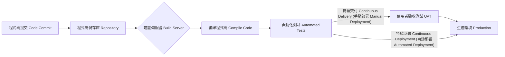

好的，這是一份關於安全軟體開發的詳細說明，其中融合了來源資料的資訊，並透過Mermaid語法輔助說明：

--------------------------------------------------------------------------------
安全軟體開發（Secure Software Development）是將安全性整合到軟體開發過程中的重要環節
。這表示安全性必須從專案的一開始就參與，並貫穿整個系統生命週期 (System Life Cycle, SLC)，以確保應用程式在整個生命週期中都能提供所需的機密性 (confidentiality)、完整性 (integrity) 和可用性 (availability)
。
來源中指出，安全性需求通常被歸類為「非功能性需求」，當專案預算超支或進度落後時，這些非功能性需求往往成為首批被犧牲的項目
。然而，若安全漏洞在開發後期才被發現，要補救的成本會高得多，因此，「內建安全性 (baking security in)」的概念非常關鍵，比事後修補更有效率且經濟
。
系統生命週期 (System Life Cycle, SLC)
系統生命週期 (SLC) 指的是一個系統從搖籃到墳墓的整體生命過程。它涵蓋了軟體開發生命週期 (Software Development Life Cycle, SDLC)，並包含以下階段：
• 規劃 (Planning)：定義專案目標、目的和初步成本估算，並獲得管理層的批准
。
• 需求分析 (Requirements Analysis)：收集並驗證業務需求、使用者需求、資料類型（收集、儲存、處理）以及系統的業務用途等，以建立詳細的需求集
。
• 設計 (Design)：將需求轉化為詳細的設計規劃
。
• 開發 (Development)：開始編寫程式碼以創建系統
。
• 測試 (Testing)：在開發和操作部署過程中，貫穿整個系統生命週期進行測試，包括驗證業務需求、審查設計、單元測試、介面測試、整合測試和整個系統測試
。
• 部署 (Deployment)：將系統移至生產環境的最後階段
。
• 營運 (Operations)：系統被啟用於業務目的的階段
。
• 處置 (Disposal)：當系統被淘汰或替換時，確保資料邏輯、流程等以完整性方式遷移到新系統，必要時舊系統的資料需被保留或防禦性地銷毀，以防止隱私洩露
。
軟體開發生命週期 (Software Development Life Cycle, SDLC) 方法論
SDLC 主要關注開發階段。多年來，發展出許多指導開發過程的方法論：
1. 瀑布模型 (Waterfall)
    ◦ 定義：以一系列按部就班、依序進行的步驟來完成專案，如同水只會往下流。階段包括規劃、定義需求、建置、測試和最終發布
。
    ◦ 特性：每個階段都必須在下一個階段開始之前完全完成，且不能回溯。如果在專案後期發現遺漏的需求，則無法返回修改，只能將其納入下一個瀑布週期
。
    ◦ 適用性：適用於預計不會有任何變更的專案
。
2. 敏捷開發 (Agile)
    ◦ 定義：為了解決瀑布模型的問題而創建。它遵循與瀑布模型相同的階段，但通常在兩週的衝刺 (sprints) 中快速迭代
。
    ◦ 特性：透過快速衝刺，可以快速迭代想法並「快速失敗 (fail fast)」
。
    ◦ Scrum Master (Scrum 大師)：在敏捷開發中，Scrum Master 的角色是促進者 (facilitator)，他們沒有專案經理的實權，而是作為團隊的教練，並促進與組織的溝通，以最大化團隊的生產力
。
    ◦ 適用性：更適合預計會有許多變更的專案
。
3. DevOps
    ◦ 定義：結合了開發 (Dev)、品質評估 (Quality Assessment) 和營運 (Ops)，以顯著縮短開發生命週期，甚至可能達到每天發布程式碼的程度
。
    ◦ 特性：DevOps 包含了自動化實踐，如持續整合 (Continuous Integration, CI) 和持續交付 (Continuous Delivery, CD)
。
    ◦ 安全性整合挑戰與方案：DevOps 可能與傳統安全實踐（如開發與營運之間的職責分離）相矛盾，且許多傳統安全技術對於其快速迭代來說過於緩慢
。因此，將安全性整合到 DevOps 中需要：
        ▪ 開發人員與安全團隊之間強有力的參與
。
        ▪ 使用安全開發框架
。
        ▪ 自動化大部分安全測試
。
        ▪ 僅少量使用傳統安全測試技術，如滲透測試
。
持續整合／持續交付 (CI/CD)
CI/CD 是一種使用大量自動化來加速軟體交付的方法
。
• 持續整合 (Continuous Integration, CI)：自動化將程式碼上傳到儲存庫 (repository)、提交程式碼，並透過建置伺服器編譯程式碼和執行大量自動化測試的過程
。
• 持續交付 (Continuous Delivery, CD)：自動化審查和使用者驗收測試，但仍需要手動步驟才能將程式碼移至生產環境
。
• 持續部署 (Continuous Deployment, CD)：自動化所有環節，包括在所有測試成功通過後自動將程式碼移至生產環境
。
以下是 CI/CD 流程的 Mermaid 圖解：

雲端安全聯盟 (Cloud Security Alliance, CSA) 的三個元階段 (Meta-phases)
雖然來源提到這些元階段在現實世界中並不常見，但它們是考試的重點
。它們描述了雲端環境下的軟體開發生命週期：
1. 安全設計與開發 (Secure Design and Development)：此階段包含從培訓、制定組織範圍的標準，到實際編寫和測試程式碼的所有活動
。
2. 安全部署 (Secure Deployment)：包括將程式碼從隔離的開發環境移至生產環境時的安全和測試活動
。
3. 安全營運 (Secure Operation)：包括保護和維護生產應用程式，涵蓋外部防禦（如網路應用程式防火牆 WAF）和持續的漏洞評估
。
