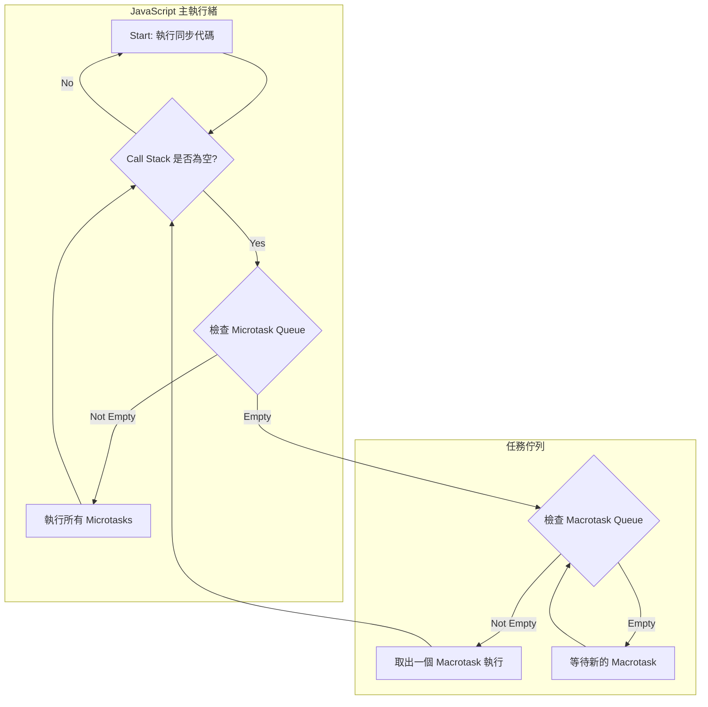

檔名： 01_JS_Async_Event_Loop.md

Markdown

# 考前參考資料 (1/10): JavaScript 核心 - 非同步與事件循環

本文檔專注於您在 `async/await` 和事件循環 (Event Loop) 上的常見誤區，提供從底層原理到實例的深度解析。

## 一、核心觀念：JavaScript 為何需要事件循環？

**誤區回顧：** 認為 `await` 只是讓程式碼「等一下」。
**深度解析：** `await` 不是「原地等待」，而是「掛起讓行」。要理解這一點，必須先明白 JS 的運作環境。

- **JavaScript 語言本身是單執行緒的**：在任何一個時間點，JS 主執行緒只能做一件事。如果沒有非同步機制，任何耗時的操作（如網路請求、檔案讀寫）都會徹底「凍結」整個程式，使用者介面將無法回應。
- **運行環境是多執行緒的**：瀏覽器或 Node.js 提供了額外的執行緒來處理這些耗時的非同步任務。

**事件循環 (Event Loop) 的使命**：就是作為一個調度員，不斷地檢查主執行緒的呼叫堆疊是否為空，如果為空，就從任務佇列中取出已完成的非同步任務的回呼函式，放入呼叫堆疊中執行。

## 二、術語深度解析與 Mermaid 圖解

- **呼叫堆疊 (Call Stack)**：一個「後進先出」(LIFO) 的結構。像一疊盤子，只能從最上面放（push）和拿（pop）。JS 主執行緒只會執行最頂端的函式。
- **Web APIs / Node.js C++ APIs**：由環境提供的非同步 API 執行緒池。當 JS 呼叫 `setTimeout`, `fetch` 等，就是把任務委託給它們，主執行緒可以繼續往下走。
- **宏任務佇列 (Macrotask Queue)**：存放**一般**非同步任務的回呼函式，如 `setTimeout`, `setInterval`, I/O 操作。這是一個「先進先出」(FIFO) 的隊伍。
- **微任務佇列 (Microtask Queue)**：存放**高優先級**非同步任務的回呼函式，如 `Promise.then/catch/finally`, `await` 後面的程式碼。

### Mermaid 圖解：事件循環的完整流程



## 三、async/await 的執行順序深度剖析

**核心觀念：** `await` 關鍵字會做兩件事：

1. 暫停 async 函式的執行
2. 將 async 函式剩餘的部分放入微任務佇列，然後讓出控制權

### 程式碼執行逐步追蹤

讓我們用最精確的步驟來追蹤這段程式碼：

```javascript
console.log("Start");

async function main() {
  console.log("A");
  const result = await Promise.resolve("B");
  console.log(result); // 這是微任務的一部分
  Promise.resolve("D").then((res) => console.log(res)); // 這是微任務中的微任務
  console.log("C"); // 這也是微任務的一部分
}

main();
console.log("End");
```

**執行步驟：**

1. **主執行緒開始：**

   - `console.log('Start')` 執行。輸出: `Start`

2. **main() 被呼叫：**

   - 進入 main 函式，`console.log('A')` 執行。輸出: `Start, A`

3. **遇到 await：**

   - main 函式被掛起
   - await 後面的所有程式碼被打包成一個回呼，放入微任務佇列
   - 控制權返回主執行緒

4. **主執行緒繼續：**

   - `console.log('End')` 執行。輸出: `Start, A, End`

5. **主執行緒同步代碼結束，Call Stack 為空：**

   - 事件循環檢查微任務佇列，發現有任務
   - 從 await 處恢復 main 函式的執行
   - result 被賦值為 'B'
   - `console.log(result)` 執行。輸出: `Start, A, End, B`
   - `Promise.resolve('D').then(...)` 執行，一個新的微任務被推入微任務佇列的末尾
   - `console.log('C')` 執行。輸出: `Start, A, End, B, C`

6. **當前微任務結束，再次檢查微任務佇列：**
   - 事件循環發現佇列中還有一個任務（打印 'D' 的任務）
   - 執行該任務。輸出: `Start, A, End, B, C, D`

**記憶訣竅：** 看到 `await`，就等於 async 函式說：「我先去排隊（微任務），外面的同步程式碼你們先跑」，等同步的跑完了，才輪到我從排隊的地方繼續。
