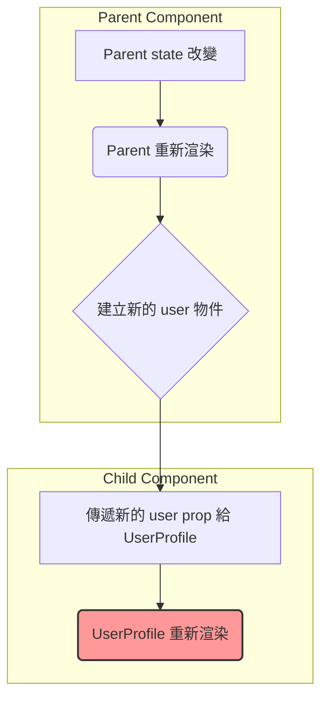

程式碼執行逐步追蹤
讓我們用最精確的步驟來追蹤這段程式碼：

JavaScript

console.log('Start');

async function main() {
console.log('A');
const result = await Promise.resolve('B');
console.log(result); // 這是微任務的一部分
Promise.resolve('D').then(res => console.log(res)); // 這是微任務中的微任務
console.log('C'); // 這也是微任務的一部分
}

main();
console.log('End');
主執行緒開始:

console.log('Start') 執行。輸出: Start

main() 被呼叫:

進入 main 函式，console.log('A') 執行。輸出: Start, A

遇到 await:

main 函式被掛起。

await 後面的所有程式碼被打包成一個回呼，放入微任務佇列。

控制權返回主執行緒。

主執行緒繼續:

console.log('End') 執行。輸出: Start, A, End

主執行緒同步代碼結束，Call Stack 為空:

事件循環檢查微任務佇列，發現有任務。

從 await 處恢復 main 函式的執行。

result 被賦值為 'B'。

console.log(result) 執行。輸出: Start, A, End, B

Promise.resolve('D').then(...) 執行，一個新的微任務被推入微任務佇列的末尾。

console.log('C') 執行。輸出: Start, A, End, B, C

當前微任務結束，再次檢查微任務佇列:

事件循環發現佇列中還有一個任務（打印 'D' 的任務）。

執行該任務。輸出: Start, A, End, B, C, D

記憶訣竅： 看到 await，就等於 async 函式說：「我先去排隊（微任務），外面的同步程式碼你們先跑」，等同步的跑完了，才輪到我從排隊的地方繼續。

檔案 2/10：JavaScript 核心 - this 關鍵字與作用域
檔名： 02_JS_This_Scope.md

Markdown

# 考前參考資料 (2/10): JavaScript 核心 - `this` 關鍵字與作用域

本文檔專注於您在 `this` 指向，特別是箭頭函式上的常見誤區，提供從底層綁定規則到實例的深度解析。

## 一、核心觀念：`this` 到底是什麼？

**誤區回顧：** 認為所有函式內的 `this` 都指向呼叫它的物件。
**深度解析：** `this` 是一個在函式被呼叫時才會被賦值的特殊關鍵字，它指向函式的「執行上下文 (Execution Context)」。它的值完全取決於函式**如何被呼叫**，而不是在哪裡被定義。

## 二、普通函式的 4 種 `this` 綁定規則

1.  **預設綁定 (Default Binding)**

    - **情境**：獨立的函式呼叫，沒有任何修飾。
    - **`this` 指向**：在非嚴格模式下指向全域物件 (`window`)；在嚴格模式 (`'use strict'`) 下指向 `undefined`。
    - **範例**：
      ```javascript
      function sayHi() {
        console.log(this);
      }
      sayHi(); // 在瀏覽器中輸出 window
      ```

2.  **隱含綁定 (Implicit Binding)**

    - **情境**：函式作為一個物件的方法被呼叫。
    - **`this` 指向**：指向**呼叫該方法的那個物件**（`.` 前面的物件）。
    - **範例**：
      ```javascript
      const user = {
        name: "Alex",
        greet() {
          console.log(this.name);
        },
      };
      user.greet(); // 輸出 'Alex'，因為 this 是 user
      ```

3.  **明確綁定 (Explicit Binding)**

    - **情境**：使用 `call()`, `apply()`, 或 `bind()` 方法來強制指定函式的 `this`。
    - **`this` 指向**：指向傳入的第一個參數。
    - **範例**：
      ```javascript
      function greet() {
        console.log(this.name);
      }
      const user1 = { name: "Alice" };
      const user2 = { name: "Bob" };
      greet.call(user1); // 輸出 'Alice'
      greet.call(user2); // 輸出 'Bob'
      ```

4.  **`new` 綁定**
    - **情境**：使用 `new` 關鍵字呼叫一個函式（建構函式）。
    - **`this` 指向**：指向一個**新建立的空物件**。
    - **範例**：
      ```javascript
      function User(name) {
        this.name = name;
      }
      const alice = new User("Alice");
      console.log(alice.name); // 輸出 'Alice'，因為 this 指向 alice
      ```

## 三、箭頭函式的 `this`：規則的顛覆者

**核心觀念：** 箭頭函式**沒有自己的 `this`**。它的 `this` 是在它被「定義」時，從它外層的**詞法作用域 (Lexical Scope)** 繼承來的，並且一旦綁定就永遠不會改變。

- **術語深度解析：**
  - **詞法作用域 (Lexical Scope)**：指變數和函式的可見性是由它們在原始碼中的物理位置決定的。簡單來說，就是「寫在哪裡，就能看到什麼」。物件的 `{}` 不會建立新的詞法作用域。

### Mermaid 圖解：`this` 的指向決策流程

````mermaid
graph TD
    A[函式被呼叫] --> B{是否用 `new` 呼叫?};
    B -- Yes --> C[this = 新建立的物件];
    B -- No --> D{是否用 `call`/`apply`/`bind` 呼叫?};
    D -- Yes --> E[this = 明確指定的物件];
    D -- No --> F{是否作為物件方法呼叫 (obj.func())?};
    F -- Yes --> G[this = 該物件 (obj)];
    F -- No --> H{是否在嚴格模式?};
    H -- Yes --> I[this = undefined];
    H -- No --> J[this = 全域物件 (window)];

    subgraph 箭頭函式例外
        K[函式是否為箭頭函式?] --> L{Yes: this = 繼承自外層詞法作用域};
        K -- No --> A;
    end

    style C fill:#9f9,stroke:#333,stroke-width:2px
    style E fill:#9f9,stroke:#333,stroke-width:2px
    style G fill:#9f9,stroke:#333,stroke-width:2px
    style I fill:#9f9,stroke:#333,stroke-width:2px
    style J fill:#9f9,stroke:#333,stroke-width:2px
    style L fill:#f99,stroke:#333,stroke-width:2px
實例深度剖析
JavaScript

const shape = {
  radius: 10,
  // 普通函式：遵循「隱含綁定」規則
  diameter() {
    // 呼叫時是 shape.diameter()，所以 this 指向 shape
    return this.radius * 2; // 10 * 2 = 20
  },
  // 箭頭函式：遵循「詞法作用域」規則
  perimeter: () => {
    // 定義時，它處於全域作用域，所以繼承了全域的 this (window)
    // window.radius 是 undefined
    return 2 * Math.PI * this.radius; // 2 * 3.14 * undefined = NaN
  },
};
結論與最佳實踐：

在物件的方法中，若要存取該物件的屬性，請永遠使用普通函式。

在需要保持外部 this 上下文的回呼函式中（例如 setTimeout, forEach），箭頭函式是絕佳的選擇。

檔案 3/10：React 深度解析 - 渲染原理與效能優化
檔名： 03_React_Rendering_Optimization.md

Markdown

# 考前參考資料 (3/10): React 深度解析 - 渲染原理與效能優化

本文檔專注於您在 React 元件渲染、`useMemo` 與 `useCallback` 上的常見誤區，提供從底層原理到實戰策略的深度解析。

## 一、核心觀念：React 的渲染心智模型

**誤區回顧：** 混淆了 `useMemo` 和 `useCallback` 的用途；忽略了非原始型別 props 導致的重新渲染。
**深度解析：** React 的核心是 `UI = f(state)`。當 `state` 或 `props` 改變時，函式 `f` (你的元件) 會重新執行以產生新的 UI 描述 (Virtual DOM)。優化的目標就是**避免不必要的 `f` 執行**。

**渲染的觸發時機：**
1. 元件自身的 `state` 改變。
2. **父元件重新渲染** (這是最常見的效能瓶頸來源)。
3. 傳遞給元件的 `props` 發生變化。

## 二、關鍵術語：參考相等性 (Referential Equality)

這是理解 React 優化的**鑰匙**。

- **術語深度解析：**
  - **原始型別 (Primitives)：** `string`, `number`, `boolean`, `null`, `undefined`。比較的是**值**。`5 === 5` 是 `true`。
  - **非原始型別 (Non-Primitives)：** `object`, `array`, `function`。比較的是**記憶體中的參考位址**。

  ```javascript
  const obj1 = {};
  const obj2 = {};
  console.log(obj1 === obj2); // false! 因為它們是兩個不同的物件，位址不同。
  ```
  React 在比較 props 是否變化時，用的就是 `===` 這種淺層比較。

## 三、優化工具箱深度解析

### 1. `React.memo(Component)`：防禦性包裹

- **做什麼？** 包裹一個元件，使其在接收 props 時進行淺層比較。如果 props 沒有變化（參考位址相同），就跳過本次渲染。
- **何時失效？** 當傳遞的 props 是在父元件渲染時**新建立**的物件、陣列或函式時，`React.memo` 就會失效。

### Mermaid 圖解：不必要的渲染流程



### 2. useMemo vs. useCallback：精準打擊

**核心觀念：** 一個記「值」，一個記「函式」。

#### useMemo(() => value, [deps])：快取「值」

- **做什麼？** 記憶一個計算結果（通常是物件或陣列）。它會執行傳入的函式，並將其回傳值的參考位址快取起來。
- **解決什麼問題？** 解決了在每次渲染時建立新物件/陣列，導致子元件 props 比較失敗的問題。

**實戰範例：**

```javascript
// 在 Parent 元件中
// user 物件的參考位址被快取，只有在 [] 依賴項改變時才會重建
const user = useMemo(() => ({ name: 'Alex' }), []);

// 現在傳遞給 UserProfile 的 user prop 在每次渲染時都是同一個
return <UserProfile user={user} />;
```

#### useCallback(() => fn, [deps])：快取「函式」

- **做什麼？** 記憶一個函式本身。它會將你傳入的函式的參考位址快取起來。
- **解決什麼問題？** 解決了在每次渲染時建立新函式，導致傳遞給被 React.memo 包裹的子元件的函式 prop 比較失敗的問題。

**實戰範例：**

```javascript
const MemoizedButton = React.memo(Button);

// 在 Parent 元件中
// handleClick 函式的參考位址被快取
const handleClick = useCallback(() => {
  // ... 邏輯 ...
}, []);

// 現在傳遞給 MemoizedButton 的 onClick prop 在每次渲染時都是同一個
return <MemoizedButton onClick={handleClick} />;
```

**記憶訣竅：**
- 你的 prop 是物件/陣列嗎？用 `useMemo`。
- 你的 prop 是函式嗎？用 `useCallback`。
- `useCallback(fn, deps)` 其實等價於 `useMemo(() => fn, deps)`。

## 四、實例深度剖析

```javascript
const Parent = () => {
  const [count, setCount] = useState(0);

  // 每次渲染都會建立一個新的 user 物件
  const user = { name: 'Alex' };

  // handleReset 函式在 Parent 的定義中，參考是固定的
  const handleReset = () => { console.log('Resetting...'); };

  return (
    <div>
      <button onClick={() => setCount(c => c + 1)}>Increment</button>

      {/* - onClick prop (handleReset) 參考不變
        - Button 被 React.memo 包裹
        - 結果：Button 不會重新渲染
      */}
      <Button onClick={handleReset}>Reset Score</Button>

      {/* - user prop 的參考每次都變
        - 結果：UserProfile 會不必要地重新渲染
      */}
      <UserProfile user={user} />
    </div>
  );
};
```

檔案 4/10：現代前端開發 - 工具鏈與渲染策略
檔名： 04_Frontend_Tooling_Rendering.md

Markdown

# 考前參考資料 (4/10): 現代前端開發 - 工具鏈與渲染策略

本文檔專注於您在前端優化術語（如 Tree Shaking）和渲染策略上的常見誤區，提供從原理到權衡的深度解析。

## 一、前端優化術語精準辨析

**誤區回顧：** 將所有減小檔案體積的技術都歸為一類。
**核心觀念：** 現代前端打包工具（如 Webpack, Vite）像一個多功能的工廠，`Tree Shaking`, `Minification`, `Code Splitting`, `Bundling` 是工廠裡不同的生產線，各有其職。

### Mermaid 圖解：前端打包流程

```mermaid
graph TD
    A[原始碼 (ES6 Modules)] --> B[Tree Shaking (移除死碼)];
    B --> C[Bundling (合併檔案)];
    C --> D[Minification (壓縮程式碼)];
    D --> E[Code Splitting (按需分割)];
    E --> F[最終打包檔案 (Bundles)];

    subgraph 打包優化流程
        B
        D
        E
    end
Tree Shaking (搖樹)

做什麼？ 移除未被使用的程式碼。它依賴 import 和 export 靜態分析，如果你從函式庫引入了 10 個函式但只用了 2 個，它會把那 8 個沒用到的從最終產物中刪除。

比喻： 外科手術，精準切除無用組織。

Minification (壓縮/醜化)

做什麼？ 減小已使用的程式碼的字元數。它通過縮短變數名、移除空白和註解等方式來實現。

比喻： 物理壓縮，把棉花壓成棉花糖。

Code Splitting (程式碼分割)

做什麼？ 將一個巨大的 JS 檔案，根據規則（如路由）分割成多個小塊 (chunks)。

解決什麼問題？ 解決首屏載入過慢的問題。使用者訪問首頁時，只需要下載首頁的 chunk，而不是整個應用的程式碼。

比喻： 百科全書按章節分冊，讀哪章拿哪冊。

Bundling (打包)

做什麼？ 將多個 JS 檔案和依賴合併成一個或幾個檔案。

解決什麼問題？ 解決瀏覽器早期對模組化支援不佳和過多 HTTP 請求導致的效能問題。

比喻： 把零散的零件組裝成一台完整的機器。

二、前端渲染策略的權衡藝術
誤區回顧： 認為只要能動態產生頁面，SSR 就是最佳解。核心觀念： 沒有最好的渲染策略，只有最適合特定場景的策略。這是一個在伺服器成本、資料新鮮度和使用者體驗之間的權衡。

策略比較表
策略	CSR (客戶端渲染)	SSR (伺服器端渲染)	SSG (靜態網站生成)	ISR (增量靜態再生)
HTML 生成時機	瀏覽器中 (執行 JS 後)	伺服器上 (每次請求時)	伺服器上 (建構時)	伺服器上 (建構時 + 過期後)
首屏速度 (FCP)	慢	快	極快	極快
SEO 友好度	差	佳	極佳	極佳
資料新鮮度	即時	即時	舊的 (需重新建構)	接近即時
伺服器負載	極低	高	無 (CDN)	低
適用場景	後台管理系統、Web App	高度個人化的頁面	部落格、文件、行銷頁	新聞網站、電商商品頁

匯出到試算表
深度解析：為什麼 ISR 更適合新聞網站？
一個新聞頁面有兩個特點：

內容會更新，但不是每秒都在變。

對絕大多數使用者來說，在同一時間看到的內容是相同的。

如果用 SSR：每來一個使用者，伺服器都要重新從資料庫讀取新聞內容、重新產生一次 HTML。如果一秒鐘有一萬個請求，伺服器和資料庫就會被重複查詢一萬次，這是巨大的浪費。

如果用 ISR (設定過期時間為 60 秒)：

第一個使用者來訪，伺服器產生 HTML 並將其快取起來。

接下來 60 秒內的所有使用者，都直接從快取中獲取這個靜態 HTML，速度飛快，伺服器幾乎沒有負擔。

60 秒後，下一個使用者來訪，他會立即收到舊的快取頁面（保證體驗），同時後台會非同步地觸發一次頁面重新生成。

生成完畢後，快取被更新，等待下一個 60 秒的週期。

結論： ISR 用「可接受的資料延遲」（60 秒）換取了「極高的效能和極低的伺服器成本」，完美契合了新聞網站的需求。

檔案 5/10：Web 架構基石 - Nginx 深度解析
檔名： 05_Architecture_Nginx.md

Markdown

# 考前參考資料 (5/10): Web 架構基石 - Nginx 深度解析

本文檔專為您準備，深入介紹 Nginx 的核心概念、多重角色以及在現代全端應用中的實戰配置，旨在鞏固您的後端架構知識。

## 一、Nginx 是什麼？為何它如此重要？

Nginx (發音為 "Engine-X") 是一款高效能、開源的 Web 伺服器軟體。它在現代 Web 架構中幾乎無處不在，是構建高效、可擴展應用的關鍵元件。

**核心設計哲學：** **非同步、事件驅動 (Asynchronous, Event-driven)**。

* **術語深度解析：**
    * **傳統模型 (如 Apache)**：每個連線進來，就分配一個專門的執行緒去處理。如果有一萬個連線，就需要上萬個執行緒，記憶體和 CPU 上下文切換的開銷巨大。
    * **Nginx 模型**：使用極少數的幾個工作程序 (worker process)，每個程序都是單執行緒的。這個執行緒利用作業系統的**事件通知機制**（如 Linux 的 epoll），可以同時監控成千上萬個連線。只有當某個連線**真正有事件發生**（如收到數據）時，才會去處理它，處理完畢後立刻去處理下一個有事件的連線。

**比喻：**
* **傳統伺服器**：像一個有很多接線員的總機，每個接線員在通話期間都只能服務一個客戶。
* **Nginx**：像一個超級接線員，他面前有成千上萬個電話，但只有燈亮的電話（有事件發生）他才會去接聽，說完一句話立刻掛斷，去看下一個燈亮的電話。

## 二、Nginx 的五大核心角色與應用情境

Nginx 在系統中通常不只扮演一個角色，而是身兼數職。

### Mermaid 圖解：Nginx 在架構中的位置

```mermaid
graph TD
    subgraph Internet
        User[Client Browser]
    end

    User --> Nginx;

    subgraph Your Server Infrastructure
        Nginx --> Frontend[Static Files (React/Vue)];
        Nginx --> API_GW{API Gateway};

        subgraph Backend Services
            API_GW --> ServiceA[Node.js App 1];
            API_GW --> ServiceB[Node.js App 2];
            API_GW --> ServiceC[Python App];
        end
    end

    style Nginx fill:#9f9,stroke:#333,stroke-width:2px
1. 反向代理 (Reverse Proxy)
是什麼？ 代理伺服器。客戶端只與 Nginx 通訊，Nginx 根據請求內容將其轉發給後端的真實應用伺服器。

核心作用：隱藏後端伺服器的真實 IP 和架構，提供統一的對外入口。

應用情境：這是 Nginx 最核心、最基本的用途。你的 Node.js 應用監聽在 localhost:3000，但使用者訪問的是 your_domain.com 的 80/443 端口，這中間的轉換就是由 Nginx 完成的。

2. 負載均衡 (Load Balancer)
是什麼？ 當你有多台應用伺服器時，Nginx 可以將請求流量平均分配到這些伺服器上。

核心作用：實現系統的水平擴展和高可用性。

應用情境：高流量的電商網站，部署了 3 台相同的後端應用來共同處理訂單。Nginx 會輪流將請求發給這 3 台伺服器，任何一台掛掉，Nginx 會自動將其從池中移除，保證服務不中斷。

3. 靜態內容伺服器 (Static Content Server)
是什麼？ Nginx 處理靜態檔案（HTML, CSS, JS, 圖片）的效率極高。

核心作用：實現「動靜分離」，讓應用伺服器專注於處理動態業務邏輯。

應用情境：你的 React/Vue 專案打包後會生成一堆靜態檔案。最佳實踐是將這些檔案放在 Nginx 的目錄下，由 Nginx 直接提供給使用者。而 API 請求（動態）則被 Nginx 轉發給後端。

4. API 閘道 (API Gateway)
是什麼？ 在微服務架構中，作為所有後端服務的統一入口。

核心作用：可以在這一層實現通用功能，如 SSL/TLS 終結、使用者認證、請求速率限制、日誌記錄等，而無需在每個微服務中重複實現。

5. 快取伺服器 (Cache Server)
是什麼？ Nginx 可以快取後端伺服器的回應。

核心作用：對於不常變動的內容，可以直接從 Nginx 的快取中返回，大幅降低後端壓力，提升回應速度。

應用情境：新聞網站的首頁或文章頁，可以設定快取 1 分鐘。在這 1 分鐘內，成千上萬的請求都由 Nginx 直接回應，只有第一個請求會真正到達後端應用。

三、實戰配置範例 (nginx.conf)
這是一個典型的全端應用（React/Vue + Node.js API）的 Nginx 設定檔。

Nginx

# 定義一個名為 "backend_api" 的上游伺服器群組 (用於負載均衡)
upstream backend_api {
    # 負載均衡策略，預設是輪詢 (round-robin)
    server node_app_1:3000; # 後端 Node.js 應用 1
    server node_app_2:3000; # 後端 Node.js 應用 2
}

server {
    listen 80;
    server_name your_domain.com;

    # --- 角色 3: 靜態內容伺服器 (處理前端 SPA) ---
    location / {
        root /var/www/frontend/build; # 前端打包後的靜態檔案路徑
        index index.html;
        # 處理前端路由，所有找不到的檔案都重定向到 index.html
        try_files $uri $uri/ /index.html;
    }

    # --- 角色 1 & 2: 反向代理 & 負載均衡 (處理後端 API) ---
    location /api/ {
        # 將請求轉發給上面定義的 "backend_api" 伺服器池
        proxy_pass http://backend_api;

        # --- 角色 4 & 5 的部分體現：設定標頭 ---
        # 確保後端應用能獲取到客戶端的真實資訊
        proxy_set_header Host $host;
        proxy_set_header X-Real-IP $remote_addr;
        proxy_set_header X-Forwarded-For $proxy_add_x_forwarded_for;
        proxy_set_header X-Forwarded-Proto $scheme;
    }
}
````
