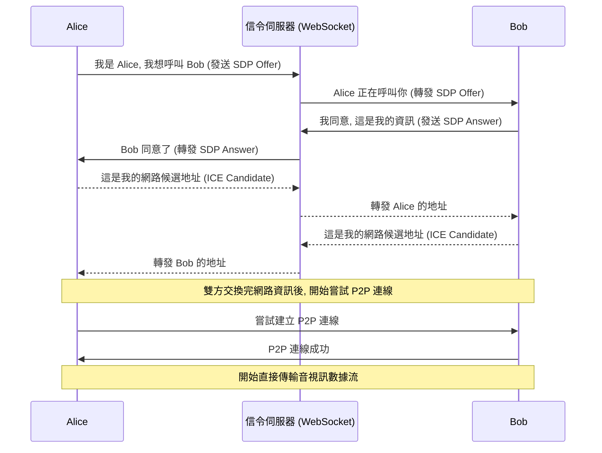

# 考前參考資料 (8/10): API 與後端通訊 - WebRTC & Middleware

本文檔專注於您在 WebRTC 運作前提和 Express.js 中介軟體執行流程上的常見誤區，提供從通訊協議到請求生命週期的深度解析。

## 一、WebRTC：P2P 通訊的完整流程

**誤區回顧：** 認為 P2P (點對點) 技術本身就包含了找到對方的能力。
**核心觀念：** WebRTC 負責「**通話**」，但你需要一個「**接線員**」（信令伺服器）來發起通話。

**WebRTC 的完整心智模型 = 信令 (Signaling) + NAT 穿透 (STUN/TURN) + P2P 媒體傳輸**

### Mermaid 圖解：WebRTC 連線建立流程



### 術語深度解析

**信令 (Signaling)：** 建立連線前的「協商」過程。這個過程不屬於 WebRTC 標準，需要開發者自己實現。它負責交換三種資訊：

- **會話控制訊息：** 用來開啟或關閉通訊，例如「我想呼叫你」、「我掛斷了」。
- **SDP (會話描述協定)：** 用來描述媒體的元數據，例如「我支援 H.264 視訊編碼」、「我的音訊取樣率是 48kHz」。
- **ICE (互動式連線建立)：** 用來找到雙方之間最佳的網路路徑。

**信令伺服器 (Signaling Server)：** 實現信令過程的中介伺服器。因為它需要雙向即時通訊，所以通常使用 WebSocket 來實現。它的作用就像一個「郵差」，只負責在 Alice 和 Bob 之間傳遞信件，不關心信件內容。

**NAT (網路位址轉換)：** 你家裡的路由器。它讓多台設備可以共享一個公網 IP。但也導致了從公網無法直接找到你內網的電腦。

**STUN/TURN 伺服器：** 用來解決 NAT 穿透問題的工具。

- **STUN：** 幫助設備發現自己的公網 IP 和端口。
- **TURN：** 當 P2P 直連失敗時，作為一個中繼伺服器來轉發所有數據流（成本較高）。

**結論：** WebRTC 本身只管建立和傳輸媒體數據流，但它不知道要跟誰連。信令伺服器的作用就是告訴它「你的通話對象在哪裡」，是建立 P2P 連線的必要前提。

## 二、Express.js 中介軟體 (Middleware) 的管線模型

**誤區回顧：** 忽略了 `req` 物件在管線中的傳遞和修改，以及 `res` 發送後流程的繼續。
**核心觀念：** Express 的請求處理是一個中介軟體管線 (Pipeline)。`req` 和 `res` 物件像水一樣，從上到下流經每個關卡（中介軟體），而 `next()` 就是打開下一道閘門的開關。

### Mermaid 圖解：Express 請求生命週期

```mermaid
graph TD
    A[GET /user 請求] --> B[Middleware 1]
    B --> C{執行 req.user = 'Guest'}
    C --> D[呼叫 next()]
    D --> E[Middleware 2 (匹配 /user)]
    E --> F{執行 req.user.role = 'Visitor'}
    F --> G[呼叫 next()]
    G --> H[Route Handler (GET /user)]
    H --> I{執行 res.json(req.user)}
    I --> J[響應發送給客戶端]
    J --> K[控制權返回 Middleware 2]
    K --> L[Middleware 2 結束]
    L --> M[控制權返回 Middleware 1]
    M --> N{執行 req.user.name = 'Admin'}
    N --> O[Middleware 1 結束]

    subgraph 請求處理階段
        A
        B
        C
        D
        E
        F
        G
        H
        I
    end

    subgraph 響應返回後階段
        J
        K
        L
        M
        N
        O
    end

    style J fill:#9f9,stroke:#333,stroke-width:2px
    style N fill:#f99,stroke:#333,stroke-width:2px
```

### 程式碼執行深度剖析

```javascript
// Middleware 1: 全域中介軟體
app.use((req, res, next) => {
  req.user = { name: "Guest" }; // 1. 在 req 物件上附加 user 屬性
  next(); // 2. 放行，將控制權交給下一個中介軟體
  // 6. 在響應發送後，控制權回到這裡
  req.user.name = "Admin"; // 7. 修改了 req 物件，但為時已晚
});

// Middleware 2: 路由級中介軟體
app.use("/user", (req, res, next) => {
  req.user.role = "Visitor"; // 3. 在同一個 req.user 物件上增加 role 屬性
  next(); // 4. 放行
});

// Route Handler: 最終處理器
app.get("/user", (req, res) => {
  // 5. 執行 res.json，此時 req.user 是 { name: 'Guest', role: 'Visitor' }
  // 響應在此刻被鎖定並發送！
  res.json(req.user);
});
```

### 結論與關鍵點

- `req` 物件在整個請求生命週期中是同一個物件，可以在任何中介軟體中被修改和擴充。
- `res.json()`、`res.send()`、`res.end()` 這些方法會終結請求-響應週期。一旦被呼叫，就不能再向客戶端發送任何數據或標頭。
- 即使響應已經發送，控制權依然會沿著 `next()` 的呼叫鏈返回到上層中介軟體，執行 `next()` 後面的程式碼。這通常用於執行一些「清理」工作，如關閉檔案、記錄日誌等。
